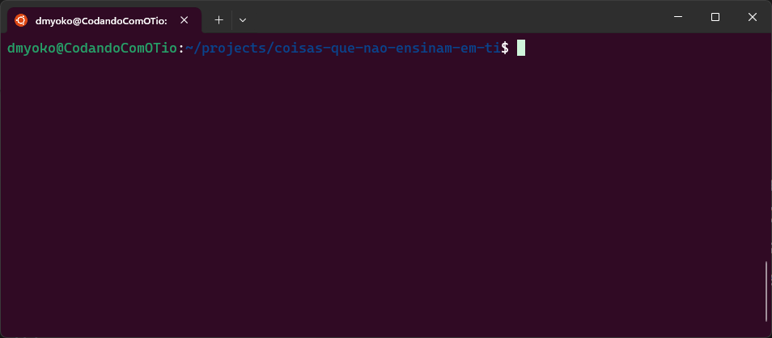

# Aula 1 - O _Shell_
Nesta primeira aula do nosso curso, apresentaremos o _Shell_ como uma ferramenta primária de produtividade das pessoas que trabalham em diversas áreas de TI.

Quando navegamos pela internet através do uso de um _Web Browser_, ou usamos algum _app_ ou qualquer aplicativo com uma interface gráfica, estamos limitados ao que esta interface suporta. Se existe um botão disponível para uma determinada funcionalidade, a visibilidade deste botão é o que determina se podemos nos beneficiar desta dela ou não. Se o botão não está visível, não podemos clicar nele.

Uma interface de linha de comando (_CLI_), como a que temos quando usamos um _Shell_, torna mais flexível o acesso que temos às funcionalidades disponíveis.

Saber usar o _Shell_ e navegar por ele potencialmente torna o trabalho cotidiano mais produtivo e, por isto, estamos dando o devido foco em apresentá-lo neste curso.

## 1. O que é o _Shell_
Quase todas as plataformas com as quais você pode trabalhar atualmente oferecem um _Shell_, e muitas oferecem diferentes opções de _Shell_ para você escolher. Apesar de que eles possam variar em seus detalhes, em sua essência são basicamente iguais: eles te permitem executar programas, manipular sua entrada (_input_) e inspecionar sua saída (_output_) de uma forma semi-estruturada.

### 1.1 _Shell_ vs _Terminal_
Para ter acesso a um Shell, você precisa de um _Terminal_. Um terminal é um programa capaz de receber um comando, encaminhar para o _Shell_, e exibir seu resultado.

O sistema que você usa em seu computador provavelmente possui um terminal disponível. Para os usuários de Windows (a partir do Windows 11), têm instalado em seu sistema o _Windows Terminal_. Para usuários de versões anteriores, o _Windows Terminal_ está disponível para download gratuito na Microsoft Store. Outras opções de terminal para os usuários Windows são o _ConEmu_ e o _Cmder_.

Já para os usuários de Linux/MacOS, existem diversas opções de terminal. Um dos terminais mais famosos para os usuários MacOS é o _iTerm2_. No Linux, entre os terminais mais usados estão o _Terminator_ e o _Guake_.

Escolher entre as diferentes opções de terminais normalmente depende das funcionalidades e conveniências que cada opção oferece. Painéis (_tiles_), Guias(_tabs_), Teclas de Atalho, Esquemas de Cores, e outras facilidades podem diferenciar as opções de terminais, mas de uma forma ou de outra, a maioria dos terminais disponíveis oferecem estas e outras funcionalides com algumas diferenças sutis de como elas funcionam.

### 1.2 Diferentes Shells
Além dos diferentes sabores de terminais, existem também diferentes opções de Shells. Cada Shell pode apresentar uma sintaxe diferente de comandos e da forma como você interage através do terminal, apesar de haver muitas semelhanças entre as principais opções.

Para os usuários Windows, as duas principais opções de Shell disponíveis são:

- _cmd_

O _cmd_ é o shell nativo do Windows, baseado no _Prompt de Comando_ do antigo _MS-DOS_ (sistema operacional da Microsoft anterior ao Windows). Ele suporta basicamente os comandos básicos do MS-DOS para navegar e manipular o sistema de arquivos.

- _Windows PowerShell_

O _PowerShell_ é um Shell moderno criado pela Microsoft, como uma alternativa mais poderosa que o _cmd_ para os usuários Windows.

No mundo Linux e MacOS, existem opções similares de Shell, dentre elas as mais comuns são:

- _Bash_

O _Bash_ (_Bourne Again Shell_) é uma opção de Shell disponível para Linux e MacOS baseado no _Bourne Shell_, que é um Shell popular para o sistema _Unix_.

- _Zsh_

O _Zsh_ (z-shell) é uma alternativa ao Bash que apresenta funcionalidades comuns, e acrescenta outras funcionalidades baseadas em outras famosas opções de Shell do sistema _Unix_ (como o _ksh_ e o _tcsh_), além de trazer funcionalidades únicas.

## 2. Bash (Bourne Again SHell)
_Bash_ é o shell mais popular atualmente, sendo a opção pré-instalada no Ubuntu, que é a distribuição do Linux mais baixada, além é claro de fazer parte de outras distribuições também. Por causa da sua relevância, toda a discussão relacioana a Shells ao longo deste curso, quando não abordada de uma forma generalista, usará como premissa o uso do _bash_.

Para acompanhar o conteúdo deste curso, certifique-se de ter instalado o _bash_ como uma das opções de Shell disponíveis no seus sistema. Usuários Linux e MacOS provavelmente já possuirão o bash instalado, caso contrário, provavelmente encontrarão uma fácil instalação a partir de algum dos gerenciadores de pacote que seus sistemas disponibilizam.

### 2.1 Bash para Usuários Windows

Para aqueles que acompanham este curso e são usuários do Microsoft Windows, existem opções de instalação do Bash. Vamos apresentar 3 delas para que você escolher a que melhor lhe for mais conveniente.

- MinGW64 / Cygwin

Das opções disponíveis para se instalar o Bash no Windows, o MinGW64 e o Cygwin se diferenciam por não precisar virtualizar um outro sistema (como Linux). Ambos os projetos podem ser instalados em qualquer versão do Windows e fornecem um conjunto de ferramentas para criar um ambiente compatível com um sistema semelhante ao Unix para pessoas que preferem trabalhar usando o Windows.

O Bash disponibilizado por estas ferramentas, não é totalmente compatível com o Bash que você usaria ao criar uma instalação do Ubuntu, por exemplo, mas pode ser o suficiente para quem prefere não virtualizar (ou não pode).

Para instalar o MinGW64, acesse o site: https://www.mingw-w64.org/downloads/

> [!TIP]
> Se você instalar o Git para Windows (haverão aulas neste curso que usarão o Git), ele inclui o MinGW64 para disponibilizar um shell chamado Git Bash.

Se você preferir instalar o Cygwin, o endereço no site para baixar o instalador é: https://cygwin.com/install.html

- Criar um Memory Stick Inicializável com uma distribuição do Linux

É possível ter uma distribuição do Linux disponível para uso sem precisar instalá-la no seu sistema, usando um Memory Stick (vulgo: Pen Drive) inicializável.

Existem diversos tutoriais na disponíveis na internet explicando com realizar o processo. Mas, resumidamente, você precisa baixar a imagem do sistema operacional (por exemplo, Ubuntu), e um programa capaz de configurar um Memory Stick com a imagem de forma inicializável.

> [!WARNING]
> Esta opção torna necessário que você reincie o seu computador, e durante o uso do sistema escolhido, você não terá acesso aos recursos do Windows.

- Dual Boot com Linux

Você pode criar uma instalação do Linux lado a lado com a instalação do Windows e ter a opção no seu dispositivo de qual dos sistemas você pretende usar no momento da inicialização.

> [!WARNING]
> Esta opção torna necessário que você reincie o seu computador, e durante o uso do sistema escolhido, você não terá acesso aos recursos do Windows.

> [!WARNING]
> Este método exige que alguns recursos (por exemplo, espaço em disco) se tornem exclusivos para o novo sistema, tornando-os indisponíveis para o Windows. Isto requer algum planejamento sobre como estes recursos serão distribuídos.

- Virtualização de Linux

Criar uma Máquina Virtual (_VM_) com uma instalação do Linux é uma opção acessível e, certamente, mais conveniente que a opção com Dual Boot. Uma VM é, basicamente, um computador virtual, com as mesmas funcionalidades que um dispositivo oferece, porém, emulado a partir de um Sistema Hospedeiro (no caso, o Windows).

Você pode criar VMs usando softwares gratuitos como o HyperV do Windows ou  [VirtualBox da Oracle](https://www.virtualbox.org/), e baixar uma imagem da distribuição Linux desejada (por exemplo, Ubuntu), para criar uma VM. Independente de qual plataforma você pretende usar, você vai precisar ativar o Hypervisor do Windows (que é parte integrante da instalação do HyperV). Para isto, no menu iniciar (pressionando a tecla Windows no teclado), digite "Ativar ou Desativar Recursos do Windows", e ao abrir a janela dos Recursos do Windows, procure na lista o ítem "Hyper-V" e certifique-se de que ele esteja selecionado. **Ativar este recurso, irá exigir que você reinicialize seu computador**.

> [!WARNING]
> Este método exige que alguns recursos (por exemplo, espaço em disco) sejam compartilhados com a VM, podendo ter um impacto na performance do sistema hospedeiro.

- Windows Subsystem for Linux (WSL)

Para usuários de versões mais recentes do Windows (a partir do Windows 10), é possível virtualizar uma distribuição Linux usando um Kernel disponível pelo próprios Windows. Este é, inclusive, o método que eu estou usando. É um método melhor do que criar uma VM, pois o WSL suporta uma integração transparente entre os sistemas (compartilhando portas e programas).

Este método também exige que você ative o _HyperV_, além de ativar também o "Subsistema do Windows para Linux", e instalar a distribuição escolhida (por exemplo, Ubuntu), a partir das opções disponíveis na Microsoft Store.

### 2.2 Apresentando o ambiente de Shell com Bash

Ao abrir o terminal de sua escolha para acessar um Shell, invariavelmente você irá encontrar algo muito parecido com a imagem a seguir.



Uma janela vazia (normalmente com fundo escuro), mostrando no topo um texto com algumas informações úties e um cursor piscando, esperando que você digite algo.

As informações exibidas podem variar de um computador para o outro já que elas se baseiam nas configurações do usuário. No caso do meu shell, exibido acima, as informações exibidas são:

> [!IMPORTANT]
> `dmyoko@CodandoComOTio:~/projects/coisas-que-nao-ensinam-em-ti$`
> - Nome do usuário logado na sessão
> - O `@` (arroba) separa o nome do usuário do nome do servidor da sessão
>- O nome do servidor da sessão
>- Os dois pontos (`:`) separam os dados da sessão do caminho do diretório atual onde >o shell irá aplicar os comandos
>    - No Bash, o caractere que separa os segmentos do caminho é `/`, diferente do >Windows que usa `\` (barra invertida)
>- O cifrão (`$`) no final, indica que o shell não está no modo super user.

O nome desta linha, contendo estas ou quaisquer outras informações de acordo com a configuração do shell, e o cursor esperando a entrada de um comando, é `Prompt`.

A partir daqui, qualquer texto digitado será interpretado como um comando dado ao shell. Este comando pode servir para executar programas, rodar scripts ou executar comandos nativos do próprio shell.

A partir do momento em que algo é digitado e enviado para o shell (normalmente através do pressionamento da tecla Enter ou Return), o shell executa a linha digitada e o terminal imprime qualquer que seja o resultado (output) da execução.

Por exmeplo, uma instrução simples como `pwd` (que imprime o diretório atual do shell), pode demonstrar este fluxo. Ao inserir esta instrução e pressionar Enter (ou Return), o diretório é exibido na linha abaixo da linha onde o comando foi dado, e na linha seguinte, um novo `prompt` é exibido.

O modo como trabalhamos no ambiente de Shell é um ciclo:
- Um prompt é exibido indicando que o shell está pronto para receber comandos através do terminal
- Um comando é digitado no terminal e enviado ao shell
- O shell interpreta o comando enviado e o executa
- Qualquer resultado direcionado para a saída (`output`) do shell é exibido pelo terminal

Com isto, podemos agora explorar um pouco alguns comandos que o Bash nos fornece.

### 2.3 Navegando com o Shell

Vamos começar a explorar os comandos do Bash, aprendendo primeiro a navegar pelo sistema de arquivos.

- Exibindo o diretório atual: `pwd`

Como vimos agora há poudo, o comando `pwd` (_Print Working Directory_), imprime no terminal o caminho do diretório atual onde o Shell irá executar o próximo comando. Saber qual é o diretório atual é importante, por que isto pode afetar diretamente o resultado do próximo comando.

Por exemplo, se o próximo comando resultar na criação de um arquivo, o arquivo será criado no diretório atual, exceto se algum parâmetro específico seja usado para mudar este comportamento (salvo, é claro, se o programa executado tiver instruções específicas do caminho do arquivo).

- Mudando o diretório atual: `cd`

Para mudar o diretório atual da sessão do Shell, o comando usado é o `cd` (_Change Directory_). Se você digitar apenas `cd` e pressionar Enter, ele vai mudar o diretório atual para `~` (falaremos logo a seguir sobre que diretório é este). Ele não imprime nenhuma saída, e imediatamente um novo prompt é apresentado. Para informar o comando `cd` para que ele mude para um diretório diferente, um `argumento` precisa ser usado.

> [!NOTE]
> **Argumentos**: são complementos que damos aos comandos, normalmente digitando-os a seguir do comando propriamente dito. Por exemplo, no comando `cd teste`, `teste` é o argumento passado para o comando `cd`. Neste caso, o comando `cd` vai mudar mudar o diretório atual para o diretório `teste`.

```bash
cd teste
```

No meu caso, uma mensagem de erro é exibida:

```
bash: cd: teste: No such file or directory
```

Ela diz que não existe um arquivo ou diretório chamado `teste`. Note, executando o comando `pwd` novamente, que o diretório atual permanece o mesmo.

Para mudar o diretório atual, precisamos passar como argumento, o endereço de um diretório existente. Por exemplo, um diretório que com certeza existe no sistema de arquivos é o diretório raiz, que fica no endereço `/`.

```
cd /
```

No meu caso, como você pode ver, o meu prompt mudou, agora dizendo que o diretório atual é `/` (o diretório raiz). Se o seu prompt não exibe esta informação como o meu, você pode confirmar usando o comando `pwd`.

Outro diretório comum para quem usa o Bash, é o diretório _Home_, representado pelo caractere `~`. Você pode testar o comando:

```
cd ~
```

Como pode ver, no meu prompt, agora ele exibe `~` como diretório atual, e não mais o diretório raiz (`/`).

Ao contrário do diretório raiz, se você usar o comando `pwd` agora você vai notar que o diretório _Home_ (`~`), na verdade, aponta para um diretório específico a partir da raiz. No meu caso, `/home/dmyoko` (no seu caso, vai apontar para um diretório com o nome do seu usuário dentro do diretório `/home`).

Você pode navegar manualmente por estes diretórios, usando o caminho que os leva até eles. Por exemplo:

```
cd /
cd home
cd dmyoko
```

Uma vez no diretório `/` (raiz), você tem acesso ao diretório `home`, e uma vez que você entra no diretório `home`, você tem acesso ao diretório do seu usuário, no meu caso `dmyoko`.

Você também pode navegar direto para o diretório específico, usando o caminho completo absoluto que leva até ele, começando pelo diretório raiz.

```
cd /
cd /home/dmyoko
```

> [!NOTE]
> **Caminho absoluto** é o caminho completo que leva até um diretório ou arquivo no sistema de arquivos. Ele sempre começa pelo diretório `/` (raiz), e segue toda a hierarquia de segmentos necessários até chegar no diretório ou arquivo desejado.

- Listar informações sobre o conteúdo de um diretório: `ls`

O comando `ls` é útil quando você deseja entender o conteúdo de um determinado diretório. Se você digitar somente `ls`, o Bash imprimirá no terminal o conteúdo do diretório atual.

Se você quiser listar o conteúdo de outro diretório sem necessariamente sair do diretório atual, basta usar como argumento o caminho para o diretório do qual você pretende listar o conteúdo desejado.

```
ls /
```

O comando acima, lista o conteúdo do diretório `/` (raiz). Você pode também listar o conteúdo de um dos subdiretórios do diretório raiz, informando o endereço dele. Por exemplo:

```
ls /bin
ls /lib
ls /sys/devices/cpu
```

O comando `ls` também suporta opções, que podem influenciar no resultado do comando. Por exemplo, a opção `-l` exibe o resultado do comando `ls` no formato de lista, trazendo informações adicionais a respeito do conteúdo do diretório, que antes não estavam sendo exibidas, como as permissões de acesso ao diretório/arquivo listado, informações de quem é o usuário dono deste diretório/arquivo e a que grupo ele pertence (usuário `dmyoko` do grupo `dmyoko`, por exemplo), o tamanho do arquivo/diretório em bytes, e a data da última vez que o arquivo/diretório foi modificado.

```
ls -l
```

Outra opçõa útil é o `-h`, que faz com que os tamanhos dos arquivos exibidos sejam impressos num formato _humanamente legível_ (human readable).

```bash
ls -h # sem efeito, pois os tamanhos não são exibidos
ls -l -h # agora é possível ver o efeito.
ls -lh # é possível unir todas as opções em uma única cláusula
```

Existem outras diversas opções disponíveis para o comando `ls`. Para ter acesso a uma lista completa delas, você pode digitar `ls --help`.

> [!TIP]
> `--help` é uma opção disponível na vasta maioria dos comandos que você pode executar no shell. E, invariavelmente, imprime informações sobre o que o comando faz e como utilizá-lo, inclusive, mostrando possíveis opções que afetam a forma como este comando se comporta.

### 2.4 Manipulação do sistema de arquivos

Agora que sabemos como navegar e obter informações sobre o conteúdo do sistema de arquivos, vamos aprender como manipular o conteúdo dos diretórios, criando, usando e excluindo arquivos e diretórios usando comandos do Shell.

- `mkdir`
    - Caminho Relativo
        - `.`, `..`

- `touch`
- `cp`
- `mv`
- `rm`
### 2.5 Programas Básicos
- `echo`
- `cat`
- `find`
### 2.6 Conectando Programas
- Standard Input/Output
- Redirecionamento de Streams
    - Output (`>`)
    - Append (`>>`)
    - Input (`<`)
    - Pipe (`|`)
### 2.7 Outros Programas úteis
- `tee`
- `grep`
- `tail`
- `head`
- `less`

### 3. Conclusão