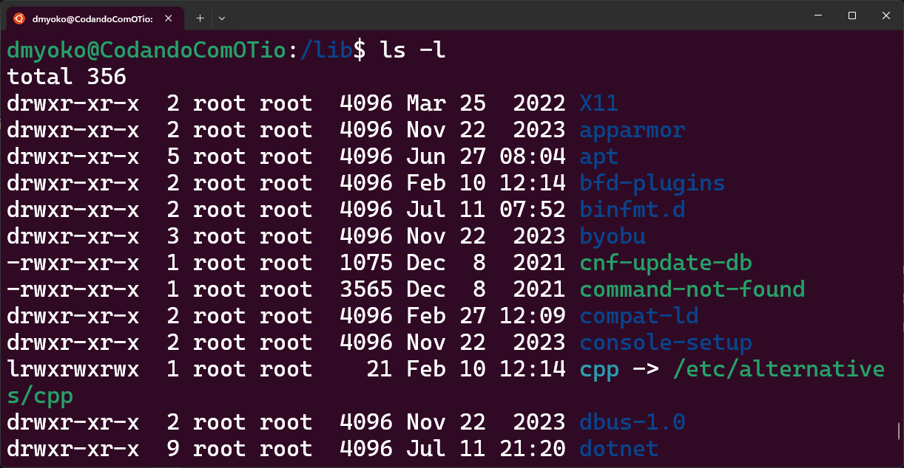

# Aula 1 - O _Shell_
Nesta primeira aula do nosso curso, apresentaremos o _Shell_ como uma ferramenta primária de produtividade das pessoas que trabalham em diversas áreas de TI.

Quando navegamos pela internet através do uso de um _Web Browser_, ou usamos algum _app_ ou qualquer aplicativo com uma interface gráfica, estamos limitados ao que esta interface suporta. Se existe um botão disponível para uma determinada funcionalidade, a visibilidade deste botão é o que determina se podemos nos beneficiar desta dela ou não. Se o botão não está visível, não podemos clicar nele.

Uma interface de linha de comando (_CLI_), como a que temos quando usamos um _Shell_, torna mais flexível o acesso que temos às funcionalidades disponíveis.

Saber usar o _Shell_ e navegar por ele potencialmente torna o trabalho cotidiano mais produtivo e, por isto, estamos dando o devido foco em apresentá-lo neste curso.

## 1. O que é o _Shell_
Quase todas as plataformas com as quais você pode trabalhar atualmente oferecem um _Shell_, e muitas oferecem diferentes opções de _Shell_ para você escolher. Apesar de que eles possam variar em seus detalhes, em sua essência são basicamente iguais: eles te permitem executar programas, manipular sua entrada (_input_) e inspecionar sua saída (_output_) de uma forma semi-estruturada.

### 1.1 _Shell_ vs _Terminal_
Para ter acesso a um Shell, você precisa de um _Terminal_. Um terminal é um programa capaz de receber um comando, encaminhar para o _Shell_, e exibir seu resultado.

O sistema que você usa em seu computador provavelmente possui um terminal disponível. Para os usuários de Windows (a partir do Windows 11), têm instalado em seu sistema o _Windows Terminal_. Para usuários de versões anteriores, o _Windows Terminal_ está disponível para download gratuito na Microsoft Store. Outras opções de terminal para os usuários Windows são o _ConEmu_ e o _Cmder_.

Já para os usuários de Linux/MacOS, existem diversas opções de terminal. Um dos terminais mais famosos para os usuários MacOS é o _iTerm2_. No Linux, entre os terminais mais usados estão o _Terminator_ e o _Guake_.

Escolher entre as diferentes opções de terminais normalmente depende das funcionalidades e conveniências que cada opção oferece. Painéis (_tiles_), Guias(_tabs_), Teclas de Atalho, Esquemas de Cores, e outras facilidades podem diferenciar as opções de terminais, mas de uma forma ou de outra, a maioria dos terminais disponíveis oferecem estas e outras funcionalides com algumas diferenças sutis de como elas funcionam.

### 1.2 Diferentes Shells
Além dos diferentes sabores de terminais, existem também diferentes opções de Shells. Cada Shell pode apresentar uma sintaxe diferente de comandos e da forma como você interage através do terminal, apesar de haver muitas semelhanças entre as principais opções.

Para os usuários Windows, as duas principais opções de Shell disponíveis são:

- _cmd_

O _cmd_ é o shell nativo do Windows, baseado no _Prompt de Comando_ do antigo _MS-DOS_ (sistema operacional da Microsoft anterior ao Windows). Ele suporta basicamente os comandos básicos do MS-DOS para navegar e manipular o sistema de arquivos.

- _Windows PowerShell_

O _PowerShell_ é um Shell moderno criado pela Microsoft, como uma alternativa mais poderosa que o _cmd_ para os usuários Windows.

No mundo Linux e MacOS, existem opções similares de Shell, dentre elas as mais comuns são:

- _Bash_

O _Bash_ (_Bourne Again Shell_) é uma opção de Shell disponível para Linux e MacOS baseado no _Bourne Shell_, que é um Shell popular para o sistema _Unix_.

- _Zsh_

O _Zsh_ (z-shell) é uma alternativa ao Bash que apresenta funcionalidades comuns, e acrescenta outras funcionalidades baseadas em outras famosas opções de Shell do sistema _Unix_ (como o _ksh_ e o _tcsh_), além de trazer funcionalidades únicas.

## 2. Bash (Bourne Again SHell)
_Bash_ é o shell mais popular atualmente, sendo a opção pré-instalada no Ubuntu, que é a distribuição do Linux mais baixada, além é claro de fazer parte de outras distribuições também. Por causa da sua relevância, toda a discussão relacioana a Shells ao longo deste curso, quando não abordada de uma forma generalista, usará como premissa o uso do _bash_.

Para acompanhar o conteúdo deste curso, certifique-se de ter instalado o _bash_ como uma das opções de Shell disponíveis no seus sistema. Usuários Linux e MacOS provavelmente já possuirão o bash instalado, caso contrário, provavelmente encontrarão uma fácil instalação a partir de algum dos gerenciadores de pacote que seus sistemas disponibilizam.

### 2.1 Bash para Usuários Windows
Para aqueles que acompanham este curso e são usuários do Microsoft Windows, existem opções de instalação do Bash. Vamos apresentar 3 delas para que você escolher a que melhor lhe for mais conveniente.

- MinGW64 / Cygwin

Das opções disponíveis para se instalar o Bash no Windows, o MinGW64 e o Cygwin se diferenciam por não precisar virtualizar um outro sistema (como Linux). Ambos os projetos podem ser instalados em qualquer versão do Windows e fornecem um conjunto de ferramentas para criar um ambiente compatível com um sistema semelhante ao Unix para pessoas que preferem trabalhar usando o Windows.

O Bash disponibilizado por estas ferramentas, não é totalmente compatível com o Bash que você usaria ao criar uma instalação do Ubuntu, por exemplo, mas pode ser o suficiente para quem prefere não virtualizar (ou não pode).

Para instalar o MinGW64, acesse o site: https://www.mingw-w64.org/downloads/

!!! tip
    Se você instalar o Git para Windows (haverão aulas neste curso que usarão o Git), ele inclui o MinGW64 para disponibilizar um shell chamado Git Bash.

Se você preferir instalar o Cygwin, o endereço no site para baixar o instalador é: https://cygwin.com/install.html

- Criar um Memory Stick Inicializável com uma distribuição do Linux

É possível ter uma distribuição do Linux disponível para uso sem precisar instalá-la no seu sistema, usando um Memory Stick (vulgo: Pen Drive) inicializável.

Existem diversos tutoriais na disponíveis na internet explicando com realizar o processo. Mas, resumidamente, você precisa baixar a imagem do sistema operacional (por exemplo, Ubuntu), e um programa capaz de configurar um Memory Stick com a imagem de forma inicializável.

!!! info
    Esta opção torna necessário que você reincie o seu computador, e durante o uso do sistema escolhido, você não terá acesso aos recursos do Windows.

- Dual Boot com Linux

Você pode criar uma instalação do Linux lado a lado com a instalação do Windows e ter a opção no seu dispositivo de qual dos sistemas você pretende usar no momento da inicialização.

!!! info
    Esta opção torna necessário que você reincie o seu computador, e durante o uso do sistema escolhido, você não terá acesso aos recursos do Windows.

!!! warning
    Este método exige que alguns recursos (por exemplo, espaço em disco) se tornem exclusivos para o novo sistema, tornando-os indisponíveis para o Windows. Isto requer algum planejamento sobre como estes recursos serão distribuídos.

- Virtualização de Linux

Criar uma Máquina Virtual (_VM_) com uma instalação do Linux é uma opção acessível e, certamente, mais conveniente que a opção com Dual Boot. Uma VM é, basicamente, um computador virtual, com as mesmas funcionalidades que um dispositivo oferece, porém, emulado a partir de um Sistema Hospedeiro (no caso, o Windows).

Você pode criar VMs usando softwares gratuitos como o HyperV do Windows ou  [VirtualBox da Oracle](https://www.virtualbox.org/), e baixar uma imagem da distribuição Linux desejada (por exemplo, Ubuntu), para criar uma VM. Independente de qual plataforma você pretende usar, você vai precisar ativar o Hypervisor do Windows (que é parte integrante da instalação do HyperV). Para isto, no menu iniciar (pressionando a tecla Windows no teclado), digite "Ativar ou Desativar Recursos do Windows", e ao abrir a janela dos Recursos do Windows, procure na lista o ítem "Hyper-V" e certifique-se de que ele esteja selecionado. **Ativar este recurso, irá exigir que você reinicialize seu computador**.

!!! warning
    Este método exige que alguns recursos (por exemplo, espaço em disco) sejam compartilhados com a VM, podendo ter um impacto na performance do sistema hospedeiro.

- Windows Subsystem for Linux (WSL)

Para usuários de versões mais recentes do Windows (a partir do Windows 10), é possível virtualizar uma distribuição Linux usando um Kernel disponível pelo próprios Windows. Este é, inclusive, o método que eu estou usando. É um método melhor do que criar uma VM, pois o WSL suporta uma integração transparente entre os sistemas (compartilhando portas e programas).

Este método também exige que você ative o _HyperV_, além de ativar também o "Subsistema do Windows para Linux", e instalar a distribuição escolhida (por exemplo, Ubuntu), a partir das opções disponíveis na Microsoft Store.

### 2.2 Apresentando o ambiente de Shell com Bash
Ao abrir o terminal de sua escolha para acessar um Shell, invariavelmente você irá encontrar algo muito parecido com a imagem a seguir.


Uma janela vazia (normalmente com fundo escuro), mostrando no topo um texto com algumas informações úties e um cursor piscando, esperando que você digite algo.

As informações exibidas podem variar de um computador para o outro já que elas se baseiam nas configurações do usuário. No caso do meu shell, exibido acima, as informações exibidas são:

!!! info
    `dmyoko@CodandoComOTio:~/projects/coisas-que-nao-ensinam-em-ti$`
    - Nome do usuário logado na sessão
    - O `@` (arroba) separa o nome do usuário do nome do servidor da sessão
    - O nome do servidor da sessão
    - Os dois pontos (`:`) separam os dados da sessão do caminho do diretório atual onde >o shell irá aplicar os comandos
        - No Bash, o caractere que separa os segmentos do caminho é `/`, diferente do >Windows que usa `\` (barra invertida)
    - O cifrão (`$`) no final, indica que o shell não está no modo super user.

O nome desta linha, contendo estas ou quaisquer outras informações de acordo com a configuração do shell, e o cursor esperando a entrada de um comando, é `Prompt`.

A partir daqui, qualquer texto digitado será interpretado como um comando dado ao shell. Este comando pode servir para executar programas, rodar scripts ou executar comandos nativos do próprio shell.

A partir do momento em que algo é digitado e enviado para o shell (normalmente através do pressionamento da tecla Enter ou Return), o shell executa a linha digitada e o terminal imprime qualquer que seja o resultado (output) da execução.

Por exmeplo, uma instrução simples como `pwd` (que imprime o diretório atual do shell), pode demonstrar este fluxo. Ao inserir esta instrução e pressionar Enter (ou Return), o diretório é exibido na linha abaixo da linha onde o comando foi dado, e na linha seguinte, um novo `prompt` é exibido.

O modo como trabalhamos no ambiente de Shell é um ciclo:
- Um prompt é exibido indicando que o shell está pronto para receber comandos através do terminal
- Um comando é digitado no terminal e enviado ao shell
- O shell interpreta o comando enviado e o executa
- Qualquer resultado direcionado para a saída (`output`) do shell é exibido pelo terminal

Com isto, podemos agora explorar um pouco alguns comandos que o Bash nos fornece.

### 2.3 Navegando com o Shell
Vamos começar a explorar os comandos do Bash, aprendendo primeiro a navegar pelo sistema de arquivos.

- Exibindo o diretório atual: `pwd`

Como vimos agora há poudo, o comando `pwd` (_Print Working Directory_), imprime no terminal o caminho do diretório atual onde o Shell irá executar o próximo comando. Saber qual é o diretório atual é importante, por que isto pode afetar diretamente o resultado do próximo comando.

Por exemplo, se o próximo comando resultar na criação de um arquivo, o arquivo será criado no diretório atual, exceto se algum parâmetro específico seja usado para mudar este comportamento (salvo, é claro, se o programa executado tiver instruções específicas do caminho do arquivo).

- Mudando o diretório atual: `cd`

Para mudar o diretório atual da sessão do Shell, o comando usado é o `cd` (_Change Directory_). Se você digitar apenas `cd` e pressionar Enter, ele vai mudar o diretório atual para `~` (falaremos logo a seguir sobre que diretório é este). Ele não imprime nenhuma saída, e imediatamente um novo prompt é apresentado. Para informar o comando `cd` para que ele mude para um diretório diferente, um `argumento` precisa ser usado.

!!! note
    **Argumentos**: são complementos que damos aos comandos, normalmente digitando-os a seguir do comando propriamente dito. Por exemplo, no comando `cd teste`, `teste` é o argumento passado para o comando `cd`. Neste caso, o comando `cd` vai mudar mudar o diretório atual para o diretório `teste`.

```bash
cd teste
```

No meu caso, uma mensagem de erro é exibida:

```
bash: cd: teste: No such file or directory
```

Ela diz que não existe um arquivo ou diretório chamado `teste`. Note, executando o comando `pwd` novamente, que o diretório atual permanece o mesmo.

Para mudar o diretório atual, precisamos passar como argumento, o endereço de um diretório existente. Por exemplo, um diretório que com certeza existe no sistema de arquivos é o diretório raiz, que fica no endereço `/`.

```bash
cd /
```

No meu caso, como você pode ver, o meu prompt mudou, agora dizendo que o diretório atual é `/` (o diretório raiz). Se o seu prompt não exibe esta informação como o meu, você pode confirmar usando o comando `pwd`.

Outro diretório comum para quem usa o Bash, é o diretório _Home_, representado pelo caractere `~`. Você pode testar o comando:

```bash
cd ~
```

Como pode ver, no meu prompt, agora ele exibe `~` como diretório atual, e não mais o diretório raiz (`/`).

Ao contrário do diretório raiz, se você usar o comando `pwd` agora você vai notar que o diretório _Home_ (`~`), na verdade, aponta para um diretório específico a partir da raiz. No meu caso, `/home/dmyoko` (no seu caso, vai apontar para um diretório com o nome do seu usuário dentro do diretório `/home`).

Você pode navegar manualmente por estes diretórios, usando o caminho que os leva até eles. Por exemplo:

```bash
cd /
cd home
cd dmyoko
```

Uma vez no diretório `/` (raiz), você tem acesso ao diretório `home`, e uma vez que você entra no diretório `home`, você tem acesso ao diretório do seu usuário, no meu caso `dmyoko`.

Você também pode navegar direto para o diretório específico, usando o caminho completo absoluto que leva até ele, começando pelo diretório raiz.

```bash
cd /
cd /home/dmyoko
```

!!! note
    **Caminho absoluto** é o caminho completo que leva até um diretório ou arquivo no sistema de arquivos. Ele sempre começa pelo diretório `/` (raiz), e segue toda a hierarquia de segmentos necessários até chegar no diretório ou arquivo desejado.

- Listar informações sobre o conteúdo de um diretório: `ls`

O comando `ls` é útil quando você deseja entender o conteúdo de um determinado diretório. Se você digitar somente `ls`, o Bash imprimirá no terminal o conteúdo do diretório atual.

Se você quiser listar o conteúdo de outro diretório sem necessariamente sair do diretório atual, basta usar como argumento o caminho para o diretório do qual você pretende listar o conteúdo desejado.

```bash
ls /
```

O comando acima, lista o conteúdo do diretório `/` (raiz). Você pode também listar o conteúdo de um dos subdiretórios do diretório raiz, informando o endereço dele. Por exemplo:

```bash
ls /bin
ls /lib
ls /sys/devices/cpu
```

O comando `ls` também suporta opções, que podem influenciar no resultado do comando. Por exemplo, a opção `-l` exibe o resultado do comando `ls` no formato de lista, trazendo informações adicionais a respeito do conteúdo do diretório, que antes não estavam sendo exibidas, como as [permissões de acesso](#24-permissoes-de-arquivos-e-diretorios) ao diretório/arquivo listado, informações de quem é o usuário dono deste diretório/arquivo e a que grupo ele pertence (usuário `dmyoko` do grupo `dmyoko`, por exemplo), o tamanho do arquivo/diretório em bytes, e a data da última vez que o arquivo/diretório foi modificado.

```bash
ls -l
```

Outra opçõa útil é o `-h`, que faz com que os tamanhos dos arquivos exibidos sejam impressos num formato _humanamente legível_ (human readable).

```bash
ls -h # sem efeito, pois os tamanhos não são exibidos
ls -l -h # agora é possível ver o efeito.
ls -lh # é possível unir todas as opções em uma única cláusula
```

Existem outras diversas opções disponíveis para o comando `ls`. Para ter acesso a uma lista completa delas, você pode digitar `ls --help`.

!!! tip
    `--help` é uma opção disponível na vasta maioria dos comandos que você pode executar no shell. E, invariavelmente, imprime informações sobre o que o comando faz e como utilizá-lo, inclusive, mostrando possíveis opções que afetam a forma como este comando se comporta.

### 2.4 Permissões de arquivos e diretórios


Eu mencionei que a primeira coluna exibida como resultado do `ls -l` são as permissões dos arquivos ou diretórios listados. Estas permissões indicam quem pode fazer o que com estes artefatos. Para dar uma breve  explicação, vamos entender como estas informações são exibidas:

Cada caractere exibido nesta coluna representa um atributo do artefato ao qual ele está ligado. O primeiro caractere, por exemplo, indica que tipo de artefato é o item da lista. Um simples `-` indica que ele é apenas um arquivo, e um `d` indica que ele é um diretório. Existem outros tipos, que podemos discutir no futuro.

Os demais caracteres são agrupamentos de 3 caracteres, cada caractere simbolizando uma permissão específica: `rwx`.
- `r`: representa a permissão para leitura
- `w`: representa a permissão para escrita
- `x`: representa a permissão para execução

Os 3 caracteres estão sempre nesta ordem, e podem ser substituídos por um `-`, indicando que a devida operação não é permitida.

Por exemplo:
`rwx`: Todas as operações são permitidas
`rw-`: É permitido ler e alterar o arquivo, mas não é permitido executá-lo
`r--`: Só se tem acesso para ler o conteúdo do arquivo, mas não é permitido alterá-lo.

Estas permissões são exibidas na seguinte ordem:
- Permissões para o dono do arquivo
- Permissões para os demais usuários do grupo dono do arquivo
- Permissões para todos os demais usuários

Por exemplo (retirado do screenshot acima):
`drwxr-xr-x  2 root root  4096 Mar 25  2022 X11`
Esta linha diz que `X11` é um diretório (`d`), o dono (que é o usuário `root`) possui permissão de leitura, escrita e execução, enquanto que os outros membros do grupo `root` podem apenas ler o conteúdo e executá-lo, bem como todos os outros usuários.

!!! important
    Em um **diretório**, a permissão de execução significa que o usuário é capaz de navegar por ele (através do comando `cd`). A permissão de leitura significa que o usuário é capaz de listar o conteúdo (através do comando `ls`) ou procurar por arquivos, etc. E a permissão de escrita significa que o usuário é capaz de criar novos artefatos (arquivos, diretórios, etc) dentro do diretório.

### 2.5 Manipulação do sistema de arquivos
Agora que sabemos como navegar e obter informações sobre o conteúdo do sistema de arquivos, vamos aprender como manipular o conteúdo dos diretórios, criando, modificando e excluindo arquivos e diretórios usando comandos do Shell.

- Criando diretórios: `mkdir`

Para criar novos diretórios, usamos o comando `mkdir` passando como argumento o nome  do diretório que queremos criar.

```bash
cd ~ #Certifique-se de estar no seu diretório `home`
mkdir teste
```

O diretório `teste` será criado no diretório atual, no caso, o diretório `home`. Você também pode criar um diretório em um lugar diferente do diretório atual, usando o endereço completo desejado.

```bash
mkdir /home/dmyoko/teste/tmp
```

!!! warning
    **Espaços importam!** Tome cuidado com o uso de espaços quando estiver executando operações no shell. Por exemplo, se você digitar o comando `mkdir minhas fotos`, ao invés de criar um diretório chamado `minhas fotos`, ele irá criar dois diretórios, um chamado `minhas` e um segundo chamado `fotos`. Para usar espaços você pode usar caracteres de escape. 

Para usar caracteres de escape, você usa a `\` (barra invertida). Por exemplo:
```bash
mkdir Minhas\ Fotos # Cria um diretório chamado `Minhas Fotos`
```

Você pode, também, delimitar o nome usando aspas (`"`) ou apóstrofos (`'`), como uma forma de indicar o nome sem usar caracteres de escape.

O comando `mkdir` possui uma opção `-p` que permite que você crie um caminho completo de diretórios:

```bash
mkdir -p /home/dmyoko/teste/a/b/c
```

Note que ele sabe lidar com o fato de que parte do caminho já existe (o diretório `/home/dmyoko/teste/`), e cria apenas os segmentos que não existem.

Uma outra conveniência desta opção é que ela não resulta em erro, caso você tente criar um diretório que já existe, mesmo que seja o caminho completo. Isto é útil, principalmente para automações.

```bash
mkdir /home/dmyoko/teste/a/b/c #Resulta em erro
mkdir -p /home/dmyoko/teste/a/b/c 
```

- Manipulando hora de acesso e modificação de arquivos: `touch`

O comando touch força uma alteração na data de modificação de arquivos.

Para entender o que isto significa, vamos rever o resultado do comando `ls` no screenshot anterior:


Observe a coluna imediatamente à esquerda do nome do arquivo nesta lista, é uma informação de Data/Hora. Esta coluna indica a data/hora da última modificação que este arquivo teve. Ao usar o comando `touch`, você força uma atualização desta informação para a data/hora atual do sistema.

Apesar disso parecer algo usado para um propósito muito específico, o comando `touch` é útil por que, ao ser usado para fazer isto em um arquivo inexistente, ele cria o arquivo. Por exemplo:

```bash
touch teste.txt
```

Se o arquivo teste.txt não existir, ele será criado. Caso ele exista, somente a data/hora da última modificação serão afetados. Isto é útil quando trabalhamos com scripts de automação, pois garante a existência do arquivo sem incorrer num erro ao tentar criá-lo novamente ou substituí-lo acidentalmente.

- Copiando arquivos com `cp`

O comando `cp` é usado para copiar arquivos. Ele funciona com dois argumentos:
- O primeiro argumento é o caminho do arquivo de origem, que se deseja copiar
- O segudno argumento é o caminho do arquivo de destino, para onde se deseja copiar o arquivo de origem

Por exemplo:

```bash
cp teste.txt teste2.txt
cp /home/dmyoko/teste /home/dmyoko/teste2 #Funciona com diretórios
```

- Movendo arquivos com `mv`

Por outro lado, se a intenção é apenas mover arquivos entre caminhos, em vez criar uma cópia (fazendo com que o arquivo deixe de existir no caminho de origem), o comando `mv` pode ser usado de forma semelhante ao `cp`, passando os mesmos argumentos.

```bash
mv teste2.txt teste3.txt #Funciona como se o arquivo fosse renomeado
mv teste3.txt /home/dmyoko/teste2
mv /home/dmyoko/teste2 /home/dmyoko/teste3
```

- Removendo arquivos com `rm`

Para remover arquivos, usamos o comando `rm`. Ao contrário dos comandos anteriores `cp` e `mv`, o comando `rm` não afeta diretórios por padrão. Sendo usado especificamente para arquivos.

Por exemplo:
```bash
rm /home/dmyoko/teste/teste3.txt
```

Para remover diretórios, existe o usando o comando `rmdir`, mas ele funciona apenas com diretórios vazios. Se houve qualquer arquivo dentro do diretório, ele se recusa a excluí-lo. Por exemplo:

```bash
rmdir /home/dmyoko/teste
```

Gera esta mensagem de erro:
```
rmdir: failed to remove 'teste': Directory not empty
```

Para remover um diretório não vazio (excluindo seu conteúdo em consequência), o comando `rm` disponibiliza opções que permitem fazer isto. O motivo de exigir o uso destas opções é evitar que se exclua arquivos por acidente, forçando o usuário a fazer o uso deliberado delas para se certificar do que está fazendo.

```bash
rm -r /home/dmyoko/teste
```

### 2.6 Caminho Absoluto, Caminho Relativo e Caracteres Coringa
Até aqui, temos usado o que chamamos de _Caminho Absoluto_ (Absolute Path) para endereçar os arquivos e diretórios que usamos. Mas existem atalhos especiais que nos ajudam a facilitar a descrição de caminhos baseados no diretório atual em que nos localizamos.

Uma das opções disponíveis no comando `ls` é a opção `-a` ou `--all`, que deixam de ignorar certos arquivos que normalmente não são exibidos. Por padrão, os arquivos que começam com `.` (ponto), ficam ocultos normalmente no comando `ls`. Vamos ver quais arquivos visualizamos ao usar esta opção:

```bash
ls -lha
```

Dentre os novos arquivos que antes não eram exibidos, existem dois diretórios especiais: `.` e `..`.

Estes diretórios são usados para nos referirmos a _Caminhos Relativos_ (Relative Paths). O diretório `.`, aponta para o diretório atual, onde a sessão do bash está localizada (o diretório onde você se encontra e que será exibido com o comando `pwd`).

Já o diretório `..`, aponta para o diretório pai do diretório atual, imediatamente superior na hierarquia de diretórios, o diretório que antecede o diretório atual na saída do comando `pwd`.

Ambos estes diretórios podem ser usados como atalho para execução de comandos, como os comandos que usamos até aqui:

```bash
# Criando alguns elementos para demonstrar caminhos relativos
cd ~ 
mkdir -p teste/a/b/c
cd teste/a/b
touch c/teste.txt

cp c/teste.txt .. # copia o arquivo dentro do diretório c para ~/teste/a
mv c/teste.txt . # move o arquivo dentro do diretório c para ~/teste/a/b
rm ../teste.txt # exclui o arquivo teste.txt do diretório ~/teste/a
cp teste.txt ../.. #copia o arquivo teste.txt do diretório atual para ~/teste
ls -lha ../.. # lista os arquivos do diretório ~/teste
```

Outro atalho útil para comandos usando o bash (e outros shells também costumam suportar), são _Caracteres Coringa_ (Wild Cards), usados para selecionar arquivos que correspondem com a alguns padrões em seus nomes. Para demonstrar isto, vamos antes criar alguns arquivos:
```bash
cd ~/teste
touch foo foo1 foo2 foo10 bar
```

Existem dois caracteres coringas: `?` e `*`.
- o `?` serve como uma forma de se referir a qualquer caractere que esteja em uma determinada posição no nome do arquivo. Por exemplo:
```bash
ls foo? # Lista todos os arquivos cujo nome começam com `foo` e que possuem qualquer outro caractere único em seguida
```

Note que, como resultado deste comando, os arquivos `foo1` e `foo2` foram os únicos exibidos. Os demais arquivos foram ignorados por não combinarem com o padrão, pois `foo` não possui nenhum caractere na posição onde o `?` se encontra, e `foo10` possui ainda um caractere a mais (já o arquivo `bar` não corresponde em absolutamente nada com o padrão usado).

- o `*` serve como uma forma de se referir a quaisquer combinação de zero ou mais caracteres que possam estar em uma determinada posição no nome dos arquivos. Por exemplo:
```bash
ls foo*
```

Desta vez, são listados todos os arquivos que começam com `foo`, independente de quantos caracteres a mais eles possuem ou não. O arquivo `bar`, como antes, é ignorado por não corresponder ao padrão.

Você pode usar os caracteres coringa para designar arquivos e diretórios como argumentos para qualquer comando do `Bash`. Por exemplo:
```bash
rm f?? # apaga somente o arquivo foo
cp foo* ./a # copia os arquivos foo1, foo2 e foo10 para ./a
mv foo? ./a/b # move somente os arquivos foo1 e foo2 para ./a/b
touch * # Atualiza a data/hora de modificação de todos os arquivos para a hora atual do sistema
```

### 2.7 Conectando Programas
Uma das capacidades mais incríveis do `Bash` é a forma como é possível manipular a entrada e saída dos programas e conectá-las de diversas formas para redefinir o comportamento padrão dos comandos. Me permita explicar melhor antes, como o Shell lida com a entrada e saída dos comandos.

#### 2.7.1 Streams de Entrada e Saída (Input/Output Streams)
No Shell, programas possuem dois _streams_ primários associados a eles: o stream de _entrada_ (input), e o stream de _saída_ (output). Quando o programa tenta ler a entrada, ele lê do stream de entrada, e quando ele imprime algo, ele imprime no stream de saída. Normalmente, os streams de entrada e saída de um programa são o seu terminal (quando rodando a partir do shell). Ou seja, seu teclado (à medida que você digita no shell) e a janela do terminal na sua tela. Contudo, nós podemos também religar estes streams de outras formas.

!!! important
     **Streams** em computação, é um termo comum usado para designar um fluxo de dados que não acontece de uma única vez, mas que é feito de forma contínua, ao longo do tempo, em pequenos lotes.

     Aqui estamos falando de Streams sendo usados para o fluxo contínuo de dados de entrada e de saída de um comando ou programa executado no shell. Mas o conceito é muito comum em diversas outras áreas da computação, como na leitura/escrita de arquivos no disco, ou obtendo/enviando dados através da rede/internet.

    O termo ficou ainda mais popular com a transmissão de conteúdo online como chamadas de vídeo ou transmissões audiovisuais em _lives_ na internet.

#### 2.7.2 Religamento de Streams
A forma mais simples de religar streams no `Bash` é através dos operadores `>` (para religar o stream de saída do programa) e `<` (para religar o stream de entrada do programa). Vamos ver alguns exemplos:

```bash
ls ~ -lha > ~/teste/ls.txt # Religa o stream de saída do comando ls para o arquivo ~/teste/ls.txt
```

Note que o comando `ls` acima não imprimiu a saída no terminal como de costume. Por outro lado, você pode conferir um novo arquivo criado no diretório `~/teste` chamando `ls.txt`. Você pode usar o comando `cat` (que imprime o conteúdo de um arquivo no terminal) e você irá notar que o seu conteúdo é a saída do comando `ls` que teria sido impressa no terminal se não a tivéssemos religado.

Uma forma de conferir o conteúdo do arquivo `~/teste/ls.txt`, é o utilizando como stream de entrada do comando `cat`, que imprime o stream de entrada no stream de saída. Ao religar o stream de entrada do comando `cat` usando o arquivo `~/teste/ls.txt` sem religar o stream de saída, ele irá imprimir o conteúdo no terminal.

```bash
cat < ~/teste/ls.txt
```

O comando `cat`, quando não especificado nenhum argumento, usa o terminal como stream de entrada (capturando tudo o que o usuário digitar) e as imprime no stream de saída (que também é o próprio terminal, imprimindo exatamente o que é digitado), à medida que os dados são enviados (normalmente, sempre que uma linha é finalizada). O resultado padrão do comando `cat`, é ter suas linhas repetidas, uma vindo pela entrada, e logo em seguida sendo impressa na saída.

```bash
cat # demonstrando os dados digitados no stream de entrada, e impressos na saída imediatamente depois
```

Por exemplo, é possível usar o cat como um editor de um novo arquivo, que será criado usando a religação do stream de saída, digitando o conteúdo a partir do stream de entrada.

```bash
cat > ~/teste/arquivo.txt # Ao digitar conteúdo na entrada, ele será direcionado para o arquivo.txt
```

!!! note
    Para encerrar a leitura da entrada, nós usamos o comando Ctrl+Z. Isto envia um sinal para o processo que está executando o comando `cat`, orientando-o a parar.

    Existem outras formas de enviar sinais aos processos quando estamos executando programas no bash, mas veremos isto no futuro.

Um outro operador útil é o operador `>>`. Ele tem, basicamente o mesmo efeito do operador `>`, que religa o stream de saída, com exceção de que, se a saída é redirecionada a um arquivo que já existe, ele concatena a saída do programa atual ao conteúdo original do arquivo, uma operação popularmente conhecida na computação como `append`. Ou seja, o conteúdo original do arquivo é mantido, e o novo conteúdo é enviado ao final dele.

```bash
ls -lha ~ >> ~/teste/arquivo.txt
```

Note que o conteúdo original do `arquivo.txt` foi mantido, e o resultado do comando `ls` foi inserido depois da última linha original.

Existe um operador que conecta a saída de um comando do bash à entrada de outro comando, criando uma cadeia de comandos, ou "esteira" (_pipeline_), de etapas pelas quais os dados resultantes de um programa são aplicados ao outro, sendo transformados até produzirem uma saída desejada. Este operador é o `|` (_pipe_).

```bash
ls -lha ~ | grep Jul | head -5 | tee /home/dmyoko/teste/pipeline.txt
```

Aqui temos uma pipeline que faz a seguinte sequência:
- `ls -lha ~` - lista todos os arquivos da pasta `home`, em formato de lista, com tamanhos humanamente legíveis, e inclindo os arquivos ocultos (que começam com `.`)
- `grep Jul` - o comando `grep` filtra as linhas vindas da entrada de acordo com algum padrão (no caso, `Jul`). Basicamente ele pega o resultado do `ls` e separa somente os arquivos modificados em Julho
- `head -5`- O comando `head` toma somente as primeiras linhas da entrada. Por padrão, ele toma somente as primeiras 10, mas a opção `-5` faz com que ele pegue somente as primeiras 5 e ignore as demais linhas.
- `tee /<caminho>` - O comando `tee` é um comando similar ao comando `cat`, com a diferença que, além de imprimir no stream de saída, ele também escreve o arquivo. No caso acima, ele escreve no terminal e no arquivo `/home/dmyoko/teste/pipeline.txt`.
    - Por exemplo, é possível criar dois arquivos a partir do comando `tee`:

```bash
ls -lha ~ | grep Jul | head -5 | tee /home/dmyoko/teste/pipeline.txt > /home/dmyoko/teste/pipeline2.txt
```

- A linha acima instrui instrui o `tee` a escrever a entrada no arquivo `/home/dmyoko/teste/pipeline.txt` e religa o stream de saída para o arquivo `/home/dmyoko/teste/pipeline2.txt` usando o operador `>`.
- Imagine talvez, usar o operador `>>` nesta linha, e qual será o resultado. Como isso iria diferir ambos os arquivos.

Nós iremos usar muito o operador de pipe (`|`) na aula em que iremos tratar de _Manipulação de Dados_ no Shell.

### 2.8 Comandos Úteis
- `man`
O comando `man` exibe um manual de diversos comandos do `bash`. Usa-se passando como argumento o nome do comando que se deseja consultar:
```bash
man mkdir
```

- `find`
O comando `find` ajuda a localizar arquivos, procurando não somente no diretório usado como argumento, mas automaticamente buscando em todos os seus subdiretórios. Se um diretório não for passado como argumento, o comando `find` usa o diretório atual por padrão. Ele aceita diversas opções para ajudar a encontrar arquivos de acordo com critérios específicos, como o nome do arquivo (opção `-name` seguido do nome que se busca, para usar coringas é necessário delimitar com apóstrofos), e muitas outras opções úteis.

Consulte o manual (`man find`) para ler sobre todas as opções disponíveis.

- `date`
Imprime a data/hora atual do sistema. Existem diversas opções de formatação em que a Data/Hora serão impressas, para saber mais consulte as páginas do Manual (`man date`)

- `diff`
Imprime as diferenças entre o conteúdo de dois caminhos, que precisam ser especificados via argumentos. Podendo ser ambos diretórios ou arquivos, mas não compara se forem de tipos diferentes.

- `history`
Imprime no terminal o histórico de comandos usados nesta sessão do `Bash`.

- `tail`
O comando `tail` é parecido com o comando `head`, com a diferença de que, em vez de tomar somente as primeiras x linhas da entrada e ignorar as demais, ele toma somente as últimas x linhas e ignora as primeiras.

- `less`
O comando `less` é ótimo para ser usado com comandos que resultam em um número elevado de linhas. Ele exibe o resultado de forma paginada e interativa, te permitindo controlar a navegação pelos dados.

### 3. Conclusão

Nesta aula tivemos um contato bastante profundo com o `Bash` e a abordagem de trabalhar a partir de um `Shell`. Ainda temos muito o que explorar pra explorarmos o shell e conseguir fazer dele um lugar onde possamos nos sentir mais confortáveis e produtivos o suficiente para fazer dele nosso lugar de trabalho. Mas nas próximas aulas, ficaremos cada vez mais próximos disto.

Com esta introdução, podemos explorar outras ferramentas, como a construção de scripts, manipular dados e aprender as convenções de como é a vida na interface de linha de comando (_Command Line Interface_ ou, simplesmente, _CLI_).

Bem-vindo a esta jornada, e espero que este primeiro passeio tenha despertado o interesse em prosseguir com as próximas aulas.

[Próxima Aula: Aula 2 - Criando Scripts com Bash](./02-scripting.md)