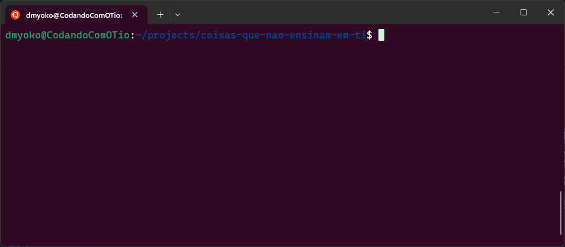

_Bash_ é o shell mais popular atualmente, sendo a opção pré-instalada no Ubuntu, que é a distribuição do Linux mais baixada, além é claro de fazer parte de outras distribuições também. Por causa da sua relevância, toda a discussão relacioana a Shells ao longo deste curso, quando não abordada de uma forma generalista, usará como premissa o uso do _bash_.

Para acompanhar o conteúdo deste curso, certifique-se de ter instalado o _bash_ como uma das opções de Shell disponíveis no seus sistema. Usuários Linux e MacOS provavelmente já possuirão o bash instalado, caso contrário, provavelmente encontrarão uma fácil instalação a partir de algum dos gerenciadores de pacote que seus sistemas disponibilizam.

## 1.2.1 Bash para Usuários Windows
Para aqueles que acompanham este curso e são usuários do Microsoft Windows, existem opções de instalação do Bash. Vamos apresentar 3 delas para que você escolher a que melhor lhe for mais conveniente.

- MinGW64 / Cygwin

Das opções disponíveis para se instalar o Bash no Windows, o MinGW64 e o Cygwin se diferenciam por não precisar virtualizar um outro sistema (como Linux). Ambos os projetos podem ser instalados em qualquer versão do Windows e fornecem um conjunto de ferramentas para criar um ambiente compatível com um sistema semelhante ao Unix para pessoas que preferem trabalhar usando o Windows.

O Bash disponibilizado por estas ferramentas, não é totalmente compatível com o Bash que você usaria ao criar uma instalação do Ubuntu, por exemplo, mas pode ser o suficiente para quem prefere não virtualizar (ou não pode).

Para instalar o MinGW64, acesse o site: https://www.mingw-w64.org/downloads/

!!! tip
	Se você instalar o Git para Windows (haverão aulas neste curso que usarão o Git), ele inclui o MinGW64 para disponibilizar um shell chamado Git Bash.

Se você preferir instalar o Cygwin, o endereço no site para baixar o instalador é: https://cygwin.com/install.html

- Criar um Memory Stick Inicializável com uma distribuição do Linux

É possível ter uma distribuição do Linux disponível para uso sem precisar instalá-la no seu sistema, usando um Memory Stick (vulgo: Pen Drive) inicializável.

Existem diversos tutoriais na disponíveis na internet explicando com realizar o processo. Mas, resumidamente, você precisa baixar a imagem do sistema operacional (por exemplo, Ubuntu), e um programa capaz de configurar um Memory Stick com a imagem de forma inicializável.

!!! info
	Esta opção torna necessário que você reincie o seu computador, e durante o uso do sistema escolhido, você não terá acesso aos recursos do Windows.

- Dual Boot com Linux

Você pode criar uma instalação do Linux lado a lado com a instalação do Windows e ter a opção no seu dispositivo de qual dos sistemas você pretende usar no momento da inicialização.

!!! info
	Esta opção torna necessário que você reincie o seu computador, e durante o uso do sistema escolhido, você não terá acesso aos recursos do Windows.

!!! warning
	Este método exige que alguns recursos (por exemplo, espaço em disco) se tornem exclusivos para o novo sistema, tornando-os indisponíveis para o Windows. Isto requer algum planejamento sobre como estes recursos serão distribuídos.

- Virtualização de Linux

Criar uma Máquina Virtual (_VM_) com uma instalação do Linux é uma opção acessível e, certamente, mais conveniente que a opção com Dual Boot. Uma VM é, basicamente, um computador virtual, com as mesmas funcionalidades que um dispositivo oferece, porém, emulado a partir de um Sistema Hospedeiro (no caso, o Windows).

Você pode criar VMs usando softwares gratuitos como o HyperV do Windows ou  [VirtualBox da Oracle](https://www.virtualbox.org/), e baixar uma imagem da distribuição Linux desejada (por exemplo, Ubuntu), para criar uma VM. Independente de qual plataforma você pretende usar, você vai precisar ativar o Hypervisor do Windows (que é parte integrante da instalação do HyperV). Para isto, no menu iniciar (pressionando a tecla Windows no teclado), digite "Ativar ou Desativar Recursos do Windows", e ao abrir a janela dos Recursos do Windows, procure na lista o ítem "Hyper-V" e certifique-se de que ele esteja selecionado. **Ativar este recurso, irá exigir que você reinicialize seu computador**.

!!! warning
	Este método exige que alguns recursos (por exemplo, espaço em disco) sejam compartilhados com a VM, podendo ter um impacto na performance do sistema hospedeiro.

- Windows Subsystem for Linux (WSL)

Para usuários de versões mais recentes do Windows (a partir do Windows 10), é possível virtualizar uma distribuição Linux usando um Kernel disponível pelo próprios Windows. Este é, inclusive, o método que eu estou usando. É um método melhor do que criar uma VM, pois o WSL suporta uma integração transparente entre os sistemas (compartilhando portas e programas).

Este método também exige que você ative o _HyperV_, além de ativar também o "Subsistema do Windows para Linux", e instalar a distribuição escolhida (por exemplo, Ubuntu), a partir das opções disponíveis na Microsoft Store.

## 1.2.2 Apresentando o ambiente de Shell com Bash
Ao abrir o terminal de sua escolha para acessar um Shell, invariavelmente você irá encontrar algo muito parecido com a imagem a seguir.

Uma janela vazia (normalmente com fundo escuro), mostrando no topo um texto com algumas informações úties e um cursor piscando, esperando que você digite algo.

As informações exibidas podem variar de um computador para o outro já que elas se baseiam nas configurações do usuário. No caso do meu shell, exibido acima, as informações exibidas são:

!!! info
	`dmyoko@CodandoComOTio:~/projects/coisas-que-nao-ensinam-em-ti$`
	- Nome do usuário logado na sessão
	- O `@` (arroba) separa o nome do usuário do nome do servidor da sessão
	- O nome do servidor da sessão
	- Os dois pontos (`:`) separam os dados da sessão do caminho do diretório atual onde >o shell irá aplicar os comandos
		- No Bash, o caractere que separa os segmentos do caminho é `/`, diferente do >Windows que usa `\` (barra invertida)
	- O cifrão (`$`) no final, indica que o shell não está no modo super user.

O nome desta linha, contendo estas ou quaisquer outras informações de acordo com a configuração do shell, e o cursor esperando a entrada de um comando, é `Prompt`.

A partir daqui, qualquer texto digitado será interpretado como um comando dado ao shell. Este comando pode servir para executar programas, rodar scripts ou executar comandos nativos do próprio shell.

A partir do momento em que algo é digitado e enviado para o shell (normalmente através do pressionamento da tecla Enter ou Return), o shell executa a linha digitada e o terminal imprime qualquer que seja o resultado (output) da execução.

Por exmeplo, uma instrução simples como `pwd` (que imprime o diretório atual do shell), pode demonstrar este fluxo. Ao inserir esta instrução e pressionar Enter (ou Return), o diretório é exibido na linha abaixo da linha onde o comando foi dado, e na linha seguinte, um novo `prompt` é exibido.

O modo como trabalhamos no ambiente de Shell é um ciclo:
- Um prompt é exibido indicando que o shell está pronto para receber comandos através do terminal
- Um comando é digitado no terminal e enviado ao shell
- O shell interpreta o comando enviado e o executa
- Qualquer resultado direcionado para a saída (`output`) do shell é exibido pelo terminal

Com isto, podemos agora explorar um pouco alguns comandos que o Bash nos fornece.
