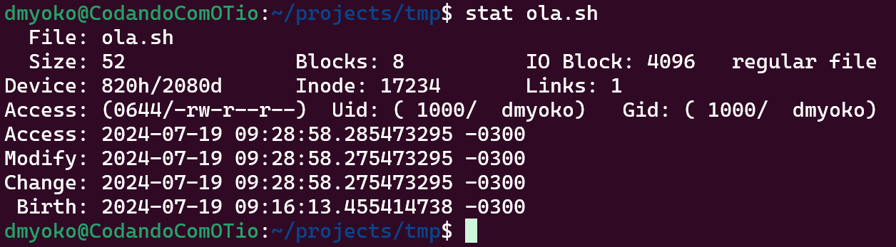
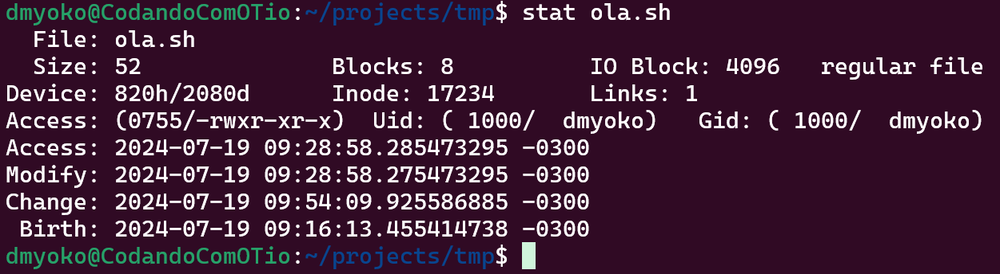
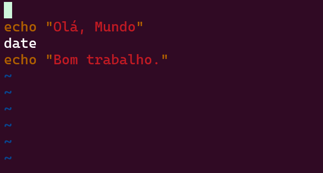

# Aula 2 - Introdução a Criação Scripts com Bash
Na aula passada fomos apresentados ao ambiente do Shell e começamos a nos familiarizar com a vida no terminal usando Bash. Apesar de termos explorado muitas ferramentas que nos permitem interagir com o sistema de arquivos, o uso do Shell não está relegado somente a manipular arquivos e diretórios. É possível usar o Shell como um ambiente produtivo para lidar com as mais diversas tarefas e, inclusive, automatizá-las.

Nesta aula iremos explorar as capacidades de automação do Bash e criar scripts que expandem a sua utilidade na execução de tarefas rotineiras, que o tornam, basicamente, uma linguagem de programação não muito diferente das muitas linguagens disponíveis.

## 2.1 - Imprimindo Valores (Hello world)
A operação mais básica que as linguagens de programação apresentam é a capacidade de imprimir um valor para o usuário. O ritual de iniciação padrão para todos os que estudam uma linguagem de programação é imprimir a mensagem universal "Hello, world" (_Olá mundo_). Usando Bash, o comando que usamos para imprimir mensagens para o usuário é o comando `echo`.

```bash
echo "Hello world"
```

Como vimos na aula passada, as aspas (`"`) são necessárias quando queremos usar espaços nos argumentos dos comandos que usamos no Bash, de outra forma o Bash iria interpretar os espaços como separadores de argumentos, possibilitando resultados inesperados. No caso do comando `echo`, independente de quantos argumentos você usa, o comportamento dele será o mesmo.

```bash
echo Hello world
```

Mas, é de bom tom seguir a convenção e usar delimitadores (`"` ou `'`) para garantir a consistência dos argumentos. Ao longo desta aula, manter esta consistência fará mais sentido, à medida que veremos como argumentos podem ser transformados ou reutilizados.

## 2.2 - Expressões e Expansões do Shell
O uso de delimitadores, como o que usamos para definir o argumento `"Hello world"` para o comando `echo`, é um exemplo de uma _expressão_. Expressões são formas de criar valores em uma linguagem de programação, e em Bash não é diferente. Expressões de textos são as mais simples que podemos usar, mas existem outros tipos de expressões, e falaremos um pouco sobre alguns deles.

Um tipo de expressão comum em Bash, são expressões que expandem seu conteúdo baseado em algumas operações disponíveis. Existem vários tipos de expansões que podemos utilizar quando escrevemos expressões em Bash. Uma delas é, por exemplo, expandir o resultado da execução de um comando para utilizá-lo em uma instrução. Para criar expressões deste tipo, usamos a expansão `$(<comando-bash>)`.

```bash
echo $(ls)
```

A linha acima executa o comando `ls` e usa a saída como uma expressão que é então passada para o comando `echo`. O resultado é semelhante à execução do comando `ls` no shell (a exibição da lista de arquivos). A diferença é que podemos usar esta expansão em outras operações, não apenas para exibí-las (usando o comando `echo`), mas também, por exemplo, atribuir este valor a variáveis e reutilizá-las para outros fins, como veremos em breve.

É possível, também, expandir expressões aritméticas e exibir seu resultado. Para criarmos uma expressão aritmética, usamos a expansão `$(( <expressão-aritmética> ))`. Desta forma, o shell não tentará interpretar a expressão como se fosse um comando.

```bash
echo $((7 + 8))
echo $((7 * 8))
echo $(((7 - 3) / (8 % 3)))
```

## 2.3 - Definindo variáveis
Como em qualquer linguagem de programação, em Bash nós podemos definir variáveis para guardar valores que precisam ser reutilizados. Para definir variáveis em Bash, tudo o que precisamos fazer é uma atribuição de um valor a um nome, usando o operador `=`. O único cuidado que devemos ao fazermos uma atribuição é redobrar nossa atenção ao fato de que, em Bash, espaços contam. Por exemplo:

```bash
foo=bar # Atribuição do valor `bar` a uma nova variável chamada `foo`
foo = bar # Erro. O Bash tenta executar um comando chamado `foo` com 2 argumentos (`-` e `bar`).
```

Para usarmos as variáveis que criamos, nós nos referimos a elas usando o sinal `$` como prefixo. Por exemplo:

```bash
echo $foo
```

Qualquer resultado de uma expressão pode ser atribuído a uma variável:

```bash
soma=$((7 + 8))

```

### 2.3.1 - Interpolação de Valores
Interpolação de valores é a capacidade que o Bash tem de identificar marcadores em valores de texto para substituir por valores computados durante a execução do comando. Por exemplo:

```bash
echo "o conteúdo da variável foo é $foo"
```

No código acima, o Bash vai identificar o uso da variável foo (usada com o `$`), e vai substituir este marcador pelo valor da variável.

A interpolação de valores só funciona com textos delimitados por `"` (aspas). Se o texto for delimitado por `'` (apóstrofos), o bash trata o texto como literal e não faz a interpolação. Esta distinção tem suas vantagens, como por exemplo, quando você quer que a interpolação aconteça em um momento diferente do da execução do script, delegando a interpolação para outra etapa da automação, ou outro processo que será executado.

Podemos, também, interpolar valores resultantes de quaisquer tipos expressões suportadas pelo Bash.

```bash
echo "Interpolando o valor de uma variável: $foo"
echo "Interpolando o resultado de um comando: $(ls -lha ~ | grep Jul)"
echo "Interpolando o resultado de uma expressão aritmética: $((2 + 3 - 4 * 5 / 6 % 7))"
```

### 2.3.2 - Variáveis de ambiente
Variáveis de ambiente são valores que são carregados na sessão do shell e que ficam disponíveis para os programas e comandos que usamos ao longo desta sessão. Elas funcionam como qualquer outra variável definida no shell, com a diferença de que elas já estão criadas e disponíveis para serem usadas.

Uma forma de listar as variáveis de ambiente carregadas na sessão do shell é através do comando `export`.

```bash
export # Lista as variáveis de ambiente da sessão atual
```

Qualquer uma dessas variáveis podem ser usadas a partir de comandos no shell da mesma forma como as variáveis que definimos até aqui.

```bash
echo $HOME
echo $HOSTTYPE
echo "O diretório atual da sessão é $PWD, o diretório anterior é $OLDPWD"
```

Dentre as variáveis de ambiente, uma variável muito importante que afeta a forma como usamos o shell é a variável $PATH. Esta variável orienta o shell sobre em quais diretórios ele precisa buscar os programas que usamos. Por exemplo, quando usamos o programa `echo`, ou `grep`, ou outros programas que temos usado até aqui, o shell precisa saber como localizá-los e, para isto, usa a variável `$PATH`.

```bash
echo $PATH
```

Uma forma de saber onde está um dado programa que usamos é através do comando `which`.

```bash
which echo # imprime o endereço do programa echo
```

Com certeza, você irá encontrar o diretório exibido no caminho do comando `echo` como parte da variável `$PATH`, do contrário não seria possível usá-lo.

Para definir variáveis de ambiente na sessão do shell, também usamos o comando `export`, porém atribuindo o valor à variável que desejamos criar:

```bash
export foo=bar
x=y
export
```

Note que agora, entre as variáveis listadas, encontra-se a variável `foo` e seu valor. Por outro lado, a variável `x` não faz parte do ambiente, ela está carregada no shell, mas não é tratada como parte do ambiente.

### 2.3.3 O Ambiente
O _ambiente_ é uma lista de pares de `nome=valor` carregados na sessão do shell e que são fornecidos para os programas executados a partir daquela sessão. Isso é uma forma útil de fazer com que programas e scripts que executamos possam receber valores sem a necessidade de informá-los através de argumentos.

Veremos com mais detalhes como o ambiente funciona na [aula sobre o ambiente de linha de comando](05-command-line-environment.md), quando discutiremos a execução de programas a partir do ambiente de linha de comando.

### 2.3.4 Sessões
Como acabamos de descrever, as variáveis de ambiente ficam disponíveis na sessão do Shell. A sessão do shell dura enquanto o shell estiver aberto. Se você sair do Bash, você encerra a sessão, e o ambiente daquela sessão deixa de existir.

Faça este teste, encerre o shell no terminal atual (fechando o terminal) e abra novamente o terminal. Uma nova sessão será criada e, se você executar o comando `export`, notará que a variável `foo` que acabamos de criar não está mais disponível.

As variáveis que você vê listadas através do comando `export` quando inicia uma nova sessão do shell são atribuídas ao ambiente durante a inicialização da sessão. Isto acontece graças a alguns scripts que são invocados no momento em que a sessão é iniciada.

Por exemplo, o script `~/.bashrc` possui a definição de diversas variáveis de ambiente. Outro arquivo útil é o `~/.profile` ou o `~/.profile_bash` (podem não existir no seu sistema, mas também são formas de definir o ambiente da sessão).

```bash
cat ~/.bashrc
cat ~/.profile
cat ~/.profile_bash
```

É interessante saber como o ambiente é criado na inicialização da sessão (através de arquivos como estes), para entendermos que todo o ambiente é facilmente configurável no shell, e que as coisas não acontecem como mágica.

## 2.4 - Composição de Comandos e Operações Lógicas
Bash suporta uma forma de criar uma composição de comandos em uma única instrução usando o separador `;`. Por exemplo:

```bash
echo "Olá mundo"; date ; echo "Bom trabalho."
```

Instruções como esta acima executam cada comando na ordem em que eles são escritos, mas sem conectá-los de forma alguma (como vimos na aula anterior na seção [Conectando Programas](./01-shell.md#27-conectando-programas)).

Usar este tipo de composição executa todos os comandos independente do resultado de qualquer um deles. Se houver um erro em algum comando desta cadeia, isso não fará com que o bash deixe de executar os demais comandos.

Existem cenários onde a execução de alguns comandos da composição pode gerar resultados que afetem o funcionamento dos demais comandos. Para estes cenários, usamos operações lógicas.

Bash, como qualquer outra linguagem de programação suporta certos tipos de operações lógicas. Operações lógicas são operações que geram resultados binários (_verdadeiro_ ou _falso_), e que podem ser usadas para criar uma composição de comandos baseada no resultado dos comandos usados.

Os operadores lógicos que usaremos aqui são o `||` (operador _OU_) e o `&&` (operador _E_). E os valores lógicos em Bash são `true` (representa o valor _verdadeiro_) e `false` (que representa o valor _falso_).

Vamos ver alguns exemplos básicos de expressões lógicas:
```bash
echo true
echo false

echo true || true
echo true || false
echo false || true
echo false || false

echo true && true
echo true && false
echo false && true
echo false && false
```

Os operadores lógicos possuem a capacidade de garantir certos resultados baseados no valor dos operandos: O operador `||` (_OU_) resulta em `true` (_verdadeiro_) quando qualquer um dos operandos, ou ambos, são verdadeiros, e só resulta em `false`(_falso_) quando ambos os operandos são falsos. Por outro lado, o operador `&&` (_E_), só resulta em true quando ambos os operandos são verdadeiros, mas resulta em false quando qualquer um deles, ou ambos, são false.

Ambos os operadores também possuem a propriedade de descartar o segundo operando de acordo com certos critérios sobre o primeiro. Por exemplo, por que o operador `||` resulta em `true` caso qualquer operando seja verdadeiro, se o primeiro operando (à esquerda do operador) resultar em `true`, o operador descarta qualquer que seja o valor do segundo operando (à direita do operador) e resulta imediatamente em `true`.

Já o operador `&&`, que resulta `false` caso qualquer um dos operandos seja falso, descarta o segundo operando quando o primeiro já resultou em `false`, antecipando o resultado da operação.

Estas propriedades são úteis, principalmente quando consideramos que um comando executado sem resultar em erros é considerado como resultando em `true`, mas caso resulte em qualquer erro tem sua execução resultando como valor `false`. Por exemplo:

```bash
true || echo "Este comando NÃO SERÁ executado"
false || echo "Este comando SERÁ executado"
true && echo "Este comando SERÁ executado"
false && echo "Este comando NÃO SERÁ executado"
```

Isto torna possível criarmos uma composição mais sofisticada de comandos, fazendo com que o resultado de alguns comandos influenciem a execução ou não dos demais.

```bash
echo "Olá mundo" || echo "Este comando NÃO SERÁ executado"
mv xpto.txt ~ || echo "Houve algum problema no comando anterior"
echo "Esta linha será exibida" && echo "Esta também"
mv xpto.txt ~ || (echo "Houve algum problema no comando anterior, criando o arquivo vazio" && touch ~/xpto.txt)
```

Desta forma podemos decidir se queremos apenas que os comandos sejam executados de forma independente (usando o separador `;`), ou se queremos usar o resultado dos comandos intermediários na composição para definirmos se os comandos posteriores serão ou não executados.

## 2.5 - Expansões de Chave
_Expansões de Chave_ são um tipo específico de expansão do shell, como os que vimos anteriormente (`$()` e `$(())`), que usa expressões cercadas por chaves (`{}`) para expandir para um conjunto de valores. Por exemplo:

 ```bash
 echo a{b,c,d}e
 ```
 A linha acima vai expandir a expressão `a{b,c,d}e` para `abe ace ade`. Note algumas coisas:
 - Cada elemento dentro das chaves foi usado para materializar um elemento no resultado final
 - O resultado foi a expansão dos elementos separados por espaço, na ordem em que eles estão dentro das chaves

É possível combinar mais de uma expansão de chaves na mesma expressão:
```bash
echo ab{c,d}{e,f}gh
```

Não precisamos nos limitar a apenas conjuntos de elementos formados por uma única letra, mas podemos usar valores de tamanhos variados.

```bash
echo ab{cde,fghi}j 
```

O exemplo acima mostra uma expansão com apenas dois elementos, cada um com um tamanho diferente.

Também podemos expandir os elementos dentro das chaves para o intervalo de uma sequência ncremental usando a expansão `..`. Por exemplo:
```bash
echo {1..9}
echo {a..z} # podemos usar letras no lugar de números
echo a{1..5}{b..f}g
```

Podemos também controlar a forma como estas sequências são incrementadas:
```bash
echo {1..9..2} # Incrementa de dois em dois
echo {1..9..3} # ou de três em três
echo {a..z..3} # também funciona com letras
```

O fato de expansões deste tipo serem formadas com os elementos separados por espaço as tornam úteis quando usamos estas expansões com comandos que recebem múltiplos argumentos e que podem ser usados de forma mais produtiva. Por exemplo:

```bash
mkdir {foo,bar} # cria dois diretórios
touch {foo,bar}/{a..h}.{txt,sh} # cria nos dois diretórios um conjunto arquivos .txt
mkdir baz
cp foo/{a..h..2}.txt baz
cp bar/{a..h..2}.sh baz
```

## 2.6 - Stream de Erro
Na aula passada nós falamos um pouco sobre os _streams_ que os programas recebem: o _stream de entrada_ e o _stream de saída_. Existe um terceiro stream que não mencionamos, que é o _stream de erro_. Ele designa ao programa que está sendo executado para onde as mensagens de erro serão enviadas.

Por padrão, o stream erro é o próprio terminal, como também é o padrão para o stream de saída.

```bash
mv zaz ~
```

Considerando que não exista um arquivo ou diretório chamado `zaz`, o comando acima irá gerar uma mensagem de erro e imprimir no terminal. Esta mensagem de erro foi escrita no stream de erro. Para observar isto, podemos religar o stream de saída a um arquivo e observar o comportamento do comando:

```bash
mv zaz ~ > zaz.out
cat zaz.out
```

Observer que, apesar de termos religado o stream de saída para o arquivo `zaz.out`, a mensagem de erro continua sendo exibida e o arquivo gerado está vazio. Isto demonstra como a mensagem gerada não foi produzida no stream de saída. Mas, como podemos religar o stream de erro a um arquivo? Podemos fazer isto através do operador `2>`:

```bash
mv zaz ~ > zaz.out 2> zaz.err
cat zaz.out
```

Desta vez a mensagem de erro não foi impressa no terminal, e o arquivo `zaz.err` foi criado, e ele contém a mensagem de erro que antes víamos impressa nos comandos anteriores. Desta forma podemos separar tanto o conteúdo escrito no stream de saída quanto o conteúdo escrito no stream de erro do terminal.

## 2.7 - Shell Script
A capacidade de usar comandos de forma produtiva no Bash nos habilita a elevar esta produtividade através de scripts.

Scripts são arquivos contendo comandos que serão executados pelo shell em sequência, podendo servir como uma ferramenta de automação, ou até mesmo programação.

O uso de scripts usando Bash para automação é tão comum que existem profissionais em posições que se apoiam em Shell Script, como principal atividade no seu dia-a-dia.

Para criar um script, tudo o que precisamos fazer é criar um arquivo texto contendo a lista de comandos que queremos executar (convencionalmente, usando a extensão `.sh`) e o executamos religando o stream de entrada do comando `bash` ao arquivo do script.

!!! important
    O comando `bash` é, na realidade, o executável do shell que temos usado até agora. Ao invocarmos o comando `bash` passando o nosso script como argumento, não estamos fazendo nada diferente do que seria abrir o shell e executarmos os comandos manualmente. A única dirença é que estamos fazendo de forma automatizada.

Vamos ver como isto funciona.

### 2.7.1 - Executando Scripts
Vamos criar o nosso primeiro Script executando o famoso rito de iniciação que discutimos no início desta aula, `Olá, mundo`.

```bash
cat > ola.sh
echo "Olá, mundo"
```

Para executar nosso script, usamos o comando `sh`.
```bash
bash < ./ola.sh
```

O comando `sh` lê o conteúdo do arquivo `olá.sh` e o interpreta, executando seus comandos. Podemos, incrementar este script com mais comandos:

```bash
cat >> ola.sh
date
echo "Bom trabalho"
bash < ./ola.sh
```

Note como, desta vez, ele executou todos os comandos do nosso script.

Na verdade, o comando `bash` é capaz de receber um arquivo de script como argumento e interpretá-lo sem que precisemos religar seu stream de entrada.

```bash
bash ./ola.sh
```

Outra forma de executarmos um script, é transformando-o em um executável. Para isto, precisamos forncecer privilégios de execução para o usuário que pretende fazer este uso. Fazemos isto através do comando `chmod`

```bash
stat ./ola.sh
```


!!! note
    O comando `stat` imprime o _status_ do arquivo no sistema. Informações úteis, como tamanho, permissões, data de criação, data da última modificação, quem é o _owner_ e outras.

Note, a sessão de acesso (_access_), que ele não possui permissões de execução para nenhum usuário (`-rw-r--r--`). Para conceder permissão de execução para o arquivo `ola.sh`, nós usamos o comando `chmod`. A permissão para execução é representada pelo caractere `x`.

```bash
chmod +x ola.sh
```

Agora, podemos conferir as permissões novamente através do comando `stat`.

```bash
stat ola.sh
```


Finalmente, com a devida permissão, somos capazes de executar o script.

```bash
./ola.sh
```

!!! note
    O motivo de precisarmos usar o endereço do nosso escript para executá-lo (`./`) é que, no _bash_ (bem como em diversos shells compatíveis com o _Unix_), o shell somente procura por executáveis que estão nos diretórios presentes n variável $PATH. O shell não procura por executáveis no diretório atual, como faz, por exemplo, o shell `cmd` do Windows. 

    Portanto, no _Bash_ (e em outros shells compatíveis com unix, como o _dash_ ou o _zsh_), devemos apontar onde está o executável que pretendemos rodar, mesmo que ele esteja no diretório atual do shell, passando o caminho completo ou relativo do mesmo.

Mas, antes de prosseguirmos, vamos seguir a convenção de orientar ao shell sobre qual interpretador deverá usar ao executar nosso script, usando a notação chamada de _shebang_. O _shebang_ é a sequência dos caracteres `#!`, usada para sistemas compatíveis com _Unix_ (como o linux) para apontar ao shell qual é o interpretador do executável. No nosso caso, até aqui, estamos usando o próprio _bash_ como interpretador (`/bin/bash`), e será ele mesmo que usaremos no nosso _shebang_, mas este processo é importante, pois outros interpretadores estão disponíveis.

Então, precisamos colocar o `shebang` na primeira linha do arquivo e, para isto, precisamos editá-lo, e faremos isto usando o editor `vi`. Você pode usar outro editor de sua preferência. Falaremos de `Vim` e do `vscode` em aulas futuras. Para usuários Windows que não possuem interesse em usar o `vi`, é possível usar o _Bloco de Notas_. Basta executar o `notepad.exe`, passando como argumento o nome do arquivo.

```bash
vi ola.sh
```

O `vi` é um editor de textos _modal_ básico, disponível no _bash_. Modal significa que ele funciona em diferentes modos. No momento em que o abrimos, ele está no _modo de comando_ (command mode). Para editá-lo, precisamos alternar para o _modo de digitação_ (type mode).

Existem diferentes formas para alternarmos para o modo de digitação, mas a que iremos usar aqui aplica um comando antes: O comando shift+O cria uma linha acima da linha onde estamos posicionados (que é a primeira linha), e posiciona o cursor na nova linha em branco, mudando para o modo de digitação.


Agora podemos digitar a nossa linha do _shebang_:
```bash
#!/bin/bash
```

Para concluir a edição, precisamos antes voltar para o modo de comando, usando a tecla ESC. De volta ao modo de comando, usamos o `:w` para salvar o arquivo (pressionando ENTER/RETURN logo em seguida). Para sair do editor _vi_, usamos o comando `:q` e pressionamos ENTER/RETURN.

Isto não afeta em nada o funcionamento do nosso script atual. Mas à medida que você aprende a viver no shell, você poderá criar outros tipos de script. Como, por exemplo, scripts em _Python_, que você poderá transformar em executáveis e usar um _shebang_ adequado para que o shell saiba como executá-los.

O exemplo a seguir pode não funcionar no seu sistema se você não possuir o interpretador do Python instalado.

```bash
which python
cat > ola.py
#!/usr/bin/python
print("Olá, mundo")
^C
chmod +x ola.py
./ola.py
```

Agora que vimos como podemos executar nossos scripts, vamos aprender como fazer melhor uso deles.

### 2.7.2 - Recebendo argumentos em Scripts
Ao longo destas aulas temos usado diversos comandos que recebem argumentos como forma de ter algum controle sobre o seu comportamento, e não é diferente com os scripts que podemos construir. O Bash nos permite receber argumentos em nossos scripts através de parâmetros numerados.

Para ler estes parâmetros, podemos usar variáveis especiais usando a notação com o sinal `$` e o número dos parâmetros de 1 a 9. Por exemplo:

!!! warning
    Não se esqueça de dar permissão de execução para os arquivos de script antes de testá-los

```bash
cat > params.sh
echo "Início da execução"
echo $1
echo "Fim da execução"
```

Uma variação do famoso "Olá, mundo", mas que consegue saudar uma pessoa:
```bash
cat > saudar.sh
echo "Olá, " $1
```

Um script de exemplo pra fazer um cálculo aritmético:
```bash
cat > soma.sh
echo $(($1 + $2))
```

Existem, também, outros parâmetros especiais para tornar o script mais dinâmico:
- `$@`: lista todos os parâmetros, não limitados a 9.
- `$#`: retorna o número de argumentos usados na execução do script
- `$0`: retorna o nome do script que está sendo executado
- `$$`: retorna o número do processo que executa o script
- `$?`: retorna o código de saída do programa anterior

```bash
echo "Iniciando a execução de $0 no processo $$"
echo "Usando $# parâmetros: $@"
ls -lha
echo "Resultado do comando: $?"
```

## 2.8 - Conclusão
Nesta aula aprendemos o básico a respeito da criação de scripts usando o Bash. Técnicas mais complexas e sofisticadas serão apresentadas na aula de Scripts Avançados, que veremos no futuro. Por ora, podemos mudar o nosso foco para o uso de Editores de Texto como ferramentas produtivas para profissionais de TI.

Nos vemos na próxima aula.
