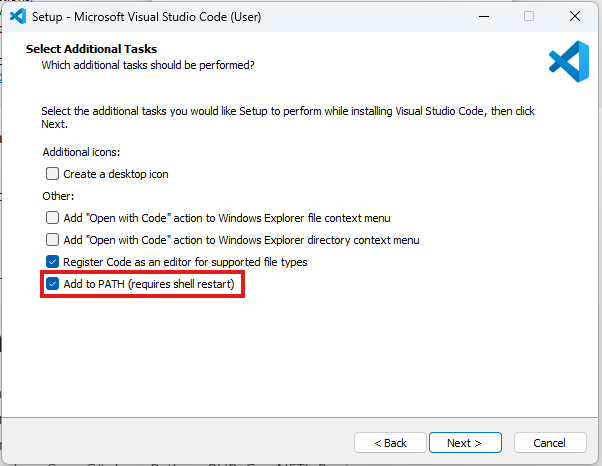

Para instalar o vscode, que roda na maioria das plataformas disponíveis, basta visitar o [site oficial](https://code.visualstudio.com), se dirigir à página de downloads e clicar no link adequado de acordo com o seu sistema.

A partir daí, basta seguir as [instruções](https://code.visualstudio.com/docs/setup/setup-overview).

!!! Important
	Para instalações no Windows, é importante lembrar-se de manter marcado a opção "Add to PATH" (Adicionar para o PATH). Isso torna o vscode fácil de iniciar a partir do _shell_, inclusive para quem usa o WSL, como recomendado neste curso.

	
