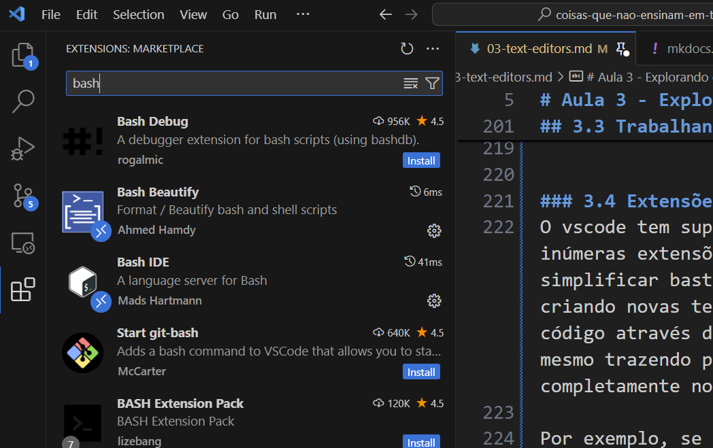

O vscode tem suporte à extensões, e possui um repositório com inúmeras extensões úteis para serem instaladas. Elas podem simplificar bastante o nosso trabalho de diversas formas, criando novas teclas de atalho, auxiliando na legibilidade do código através do uso de cores e padrões de formatação, e até mesmo trazendo para dentro da ferramenta funcionalidades completamente novas.

Por exemplo, se fizermos uma busca por `bash`, veremos quantas extensões disponíveis podem ser usadas para, de alguma forma, facilitar a vida de quem trabalha Shell Scripts em Bash.

Ao longo deste curso, iremos recomendar extensões que podem ser usadas para facilitar certos aspectos do uso do vscode. Por ora, fique à vontade para navegar pelas extensões e, se achar alguma útil, tente experimentá-la.
