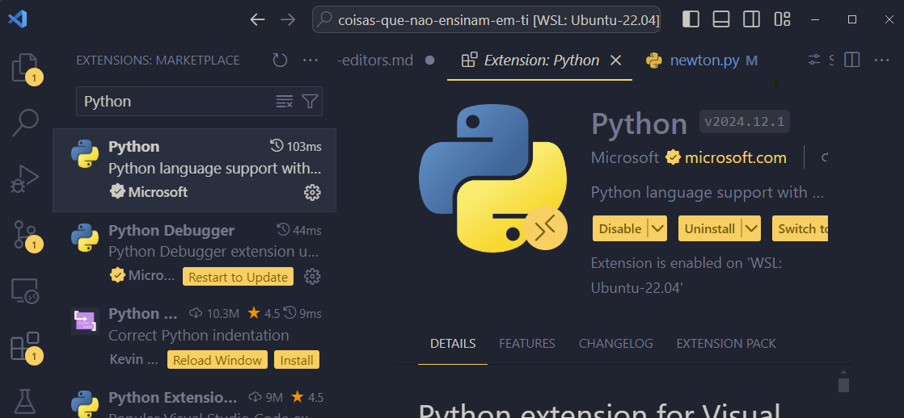
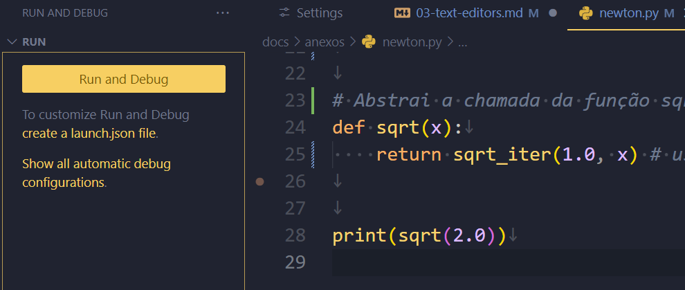

Vamos agora discutir um pouco sobre o uso do vscode com código, no dia-a-dia de pessoas que trabalham com programação de software ou scripts de automação. Para isto iremos usar um programa de exemplo em Python que usa o método de Newton para calcular a raiz quadrada de um número.

!!! warning
	Se você não conhece Python, ou não entende sobre programação, tenha em mente que os exemplos usados aqui tem um caráter meramente ilustrativo para facilitar a compreensão do uso do vscode.

	Contudo, se você quiser acompanhar os exemplos em seu dispositivo, você vai precisar ter instalado um interpretador de Python.

	Acesse [este link](https://python.org.br/instalacao-windows/) para instruções de como instalar o Interpretador Python no Windows, ou [este link](https://python.org.br/instalacao-linux/) para instalar no linux. Para usuários do MacOs, [este link](https://python.org.br/instalacao-mac/) fornece as instruções necessárias.

!!! note
	O exemplo a seguir foi extraído do livro [_Structure and Interpretation of Computer Programs_](https://mitp-content-server.mit.edu/books/content/sectbyfn/books_pres_0/6515/sicp.zip/full-text/book/book.html), de Hal Abelson, Jerry Sussman e Julie Sussman, pela MIT Press.

	No livro, os autores implementam o código usando a linguagem LISP. Aqui, usaremos Python.

## 3.4.1 - Instalando suporte à linguagem
A primeira coisa que iremos fazer para trabalhar com uma linguagem no vscode, é procurar uma extensão que instale o suporte a esta linguagem no editor.

Para isto, vamos abrir o Painel de Extensões do vscode através do atalho _Ctrl+Shift+X_, e digitar `Python` no campo de busca.



Note como existem inúmeras extensões que auxiliam o uso de Python no resultado da busca. Para os fins deste curso, irei instalar o suporte oficial da Microsoft, que é a extensão mais baixada. Ela também instala duas outras extensões como parte de suas dependências:
- `Pylance` (para suporte do _IntelliSense_)
- `Python Debugger`(para suporte ao Depurador)

A extensão _Python_ da Microsoft, instala alguns comandos úteis, como, por exemplo, Iniciar um Terminal REPL de Python:
1. Entre na Paleta de Comandos com _Ctrl+Shift+P_
2. Digite `Python` para listar todos os comandos que a extensão adicionou
3. Procure o comando `Python: Start Terminal REPL`
4. Clique no comando para ver o Terminal REPL ser iniciado

!!! note
	Um _Terminal REPL_ é uma ferramenta disponível em Python (e em algumas outras linguagens) que criam uma experiência de Shell para usar a linguagem no terminal.

	_REPL_ é a sigla para _Read-Eval-Print Loop_, que significa uma repetição do processo de Ler->Interpretar->Imprimir do interpretador de uma linguagem.

	Por exemplo, se você digitar no REPL a expressão `1 + 1` e pressionar _Enter_, o terminal executará a leitura do texto digitado, fará a interpretação de acordo com a linguagem Python, e imprimirá o resultado. Depois disto, ele habilitará o terminal para que uma nova expressão seja digitada, e executará tudo novamente.

Para sair do REPL, basta digitar `quit()` e pressionar _Enter_

## 3.4.2 - Codificando no vscode

Para criar um pequeno programa em Python, vamos criar um novo arquivo e salvá-lo como `newton.py`. Ao criar o arquivo e ter ele aberto no seu editor, olhe barra de status e observe o _Modo de Linguagem_ selecionado (Python). Isto se deve ao fato de termos associado a extensão `.py` ao nome do arquivo, fazendo o vscode atribuir automaticamente o modo de linguagem correspondente. Logo ao lado do seletor do Modo de Linguagem, há também o seletor do interpretador da linguagem e o seletor de configurações de Análise da linguagem, instalado pela extensão _Pylance_.


Podemos começar a digitar código no nosso arquivo. O primeiro passo, seguindo o [exemplo do livro](https://mitp-content-server.mit.edu/books/content/sectbyfn/books_pres_0/6515/sicp.zip/full-text/book/book-Z-H-10.html#%_sec_1.1.7), é criar uma função  chamada `sqrt-iter`.

```python
def sqrt-iter(guess, x):
	if good_enough(guess, x):
		return guess
	else:
		return sqrt_iter(improve(guess, x), x)
```

Note como, à medida que digitamos o código, os termos que digitamos recebem diferentes cores, que são usadas de acordo com o uso da sintaxe da linguagem. Esta funcionalidade é chamada de _Syntax Highlight_, basicamente se baseia em usar as regras de sintaxe da linguagem para associar um código de cores baseado nelas.


Observe como o código que digitamos possui diversas marcações em vermelho e amarelo. São problemas que o suporte à linguagem Python identificou no código que digitamos. Podemos compreender melhor os problemas de diversas formas:

- Posicionando o mouse sobre uma das áreas marcadas, e uma caixa flutuante será exibida descrevendo o problema
- Abrindo o painel _Problems_, através do atalho _Ctrl+Shift+M_
- Navegando pelos problemas usando o atalho _F8_ para ir para o próximo problema, e _Shift+F8_ para voltar para o problema anterior.

As marcações em vermelho representam _Errors_ (erros), enquanto que as marcações em amarelo representam _Warnings_ (avisos). É possível ter um relatório de erros e avisos na barra de status do vscode, no grupo à esquerda. O número de erros é representado por um ícone com a letra `x`, enquanto que o número de avisos é representado por um ícone com o ponto-de-exclamação.


Ao clicar neste relatório, o Painel Problems será aberto. Ele também pode ser aberto através do atalho _Ctrl+Shift+M_. Este painel exibe todos os problemas encontrados no código: erros e avisos, usando o mesmo código de cores: vermelho para erros e amarelos para avisos. Ao clicar em qualquer um dos problemas, ele posiciona o cursor do editor no código onde o problema está sendo reportado.

O primeiro problema encontra-se no nome da função. Existe um erro aqui, e a extensão _Pylance_ diz que era esperado `(` (uma abertura de parênteses) no lugar onde está o caractere `-` (traço). Isso ocorre por que, em Python, quando definimos um nome para uma função, ele aceita apenas letras, números e o caractere `_`. O traço não é um caractere válido. Então vamos substituí-lo pelo `_`.

Note como, só por fazer esta correção, diversos outros problemas foram corrigidos, sobrando apenas agora 2 avisos relacionados às chamadas para as funções `good_enough` e `improve`. O problema é que elas ainda não existem, então precisamos implementá-las.

```python
def good_enough(guess, x):
	return abs((guess * guess) - x) < 0.001


def improve(guess, x):
	return average(guess, x / guess)
```

Note agora que, ambos os avisos não existem mais, mas um novo aviso passou a existir nos apontando a chamada da função `average`, que ainda não existe. A chamada para a função `abs` não foi marcada por que ela existe, estamos usando uma função pronta fornecida pelo interpretador da linguagem Python.

Seguindo o livro, implementemos a função `average`:

```python
def average(x, y):
	return (x + y) / 2
```

Por fim, para facilitar o uso da função iterativa `sqrt_iter`, o livro propõe a definição de uma última função chamada `sqrt`, que abstrai a chamada inicial da função `sqrt_iter`, passando como primeiro palpite o valor `1.0`.

```python
def sqrt(x):
	return sqrt_iter(1.0, x)
```

Agora, tudo o que precisamos fazer no nosso programa é usar as funções que criamos, a partir da chamada à função `sqrt` passando como argumento um número para o qual queiramos obter a raiz quadrada:

```python
print(sqrt(2.0))
```

- Comentários

	Uma das conveniências de usar um editor adequado quando estamos trabalhando com código, é que ele suporta algumas tarefas comuns, como por exemplo, transformar uma linha de código em um comentário no formato adequado para o Modo de Linguagem que estamos usando. No vscode, o comando para comentarmos uma linha do código (ou remover o comentário dela) é através do atalho _Ctrl+;_, ou no menu _Edit_, na opção _Toggle Line Comment_. Também existe a opção de comentar/remover comentário em blocos, para linguagens que suportam blocos de comentário.

## 3.4.3 - Execução de código

Para executarmos o código, podemos usar o Depurador (_Debug_) do vscode, que pode ser aberto através do atalho _Ctrl+Shift+D_. Nele podemos clicar no botão _Run and Debug_.

Ao clicar pela primeira vez em _Run and Debug_, um menu suspenso será aberto perguntando em que contexto você deseja usar o depurador. Isto se dá por que podemos usar o vscode em um projeto completo de desenvolvimento (com inúmeros arquivos de código). Para este exercício, basta optarmos por _Run Python File_.



O depurador irá abrir um terminal chamado `Python Debug Console`, onde o programa será executado e o valor resultante da chamada da função `sqrt` será impressa.


Pode-se iniciar uma execução através do atalho _F5_. Nós iremos explorar melhor as capacidades de depuração do vscode em uma aula futura dedicada à _Debugging_ e _Profiling_.

## 3.4.4 - Navegação do código
O vscode possui capacidades de navegação específicas para serem usadas quando estamos trabalhando com código. Ao clicar com o botão direito do mouse no nome de algum artefato de código, algumas opções de navegação serão exibidas no menu suspenso:
- _Go to Definition_: Navega até o código em que este artefato foi definido
- _Go to Declaration_: Navega até o código em que este artefato foi declarado (em _Python_ o efeito é o mesmo, mas existem linguagens que distinguem a declaração da definição)
- _Go to Type Definition_: Para linguagens que suportam um sistema de tipos, navega até a definição de um tipo
- _Go to References_: Navega pelas referências ao artefato (os lugares no código onde ele é usado)

Existem dois atalhos úteis:
	- _F12_: é a tecla de atalho para a navegação _Go to Definition_
	- _Shift+F12_: são as teclas de atalho para a navegação _Go to References_

- Peek

Às vezes, você só quer ter uma ideia de como os artefatos foram definidos ou estão sendo usados, sem necessariamente navegar pelo código. _Peek_ é uma forma de espiar os trechos de código onde tais coisas acontecem, sem navegar até eles, mantendo o cursor na posição atual. Para isto, o vscode exibe uma caixa flutuante onde o código correspondente é exibido.

Para usá-lo, em vez de acessar as opções de navegação no menu suspenso, escolha o submenu _Peek_ e a opção desejada: _Peek Definition_ ou _Peek References_.

O atalho _Alt+f12_ executa o _Peek Definition_

- Outline
O _Outline_ é uma forma de visualizar as estruturas de código presentes no arquivo e navegar por elas. O Outline fica na mesma janela do _Explorer_, abaixo, ou pode ser visto através do atalho _Ctrl+Shift+O_.


## 3.4.5 - Refatoração de código
Dentre as capacidades com código do vscode, existem opções de refatoração disponíveis. Por exemplo, renomear um artefato (atualizando todas as referências a ele com o novo nome), mover um artefato para outro arquivo, transformar uma expressão em variável ou extrair um novo método a partir de um trecho de código, além de outras capacidades disponíveis de acordo com a linguagem.

- Renomear: para renomear um artefato (variável, função, etc), basta posicionar o cursor sobre o seu nome e pressionar _F2_. Uma caixa de texto será exibida para que você possa entrar com o novo nome e, ao pressionar _Enter_, ele aplicará o novo nome para todas as referências conhecidas.
- Extrair Variável: para transformar uma expressão em uma variável, você pode selecionar a expressão desejada e pressionar _Ctrl+Shift+R_ e, no menu suspenso, escolher _Extract Variable_. Ao digitar o nome da variável, o vscode fará a refatoração adequada.
- Extrair Método: Extrair Método, de forma semelhante à _Extrair Variável_, baseado em uma expressão selecionada, a transforma em uma chamada de função, para onde ele a move. Para isto, basta usar o atalho de refatoração _Ctrl+Shift+R_ e clicar em _Extract Method_.

## 3.4.6 - Intellisense
O _IntelliSense_ é um conjunto de capacidades do vscode que interagem com o usuário ao trabalhar com código. Estas capacidades são principalmente:
- Auto completar: à medida que se digita o código, o IntelliSense dá sugestões sobre possíveis formas de completar a expressão baseadas no que está sendo digitado e nos artefatos que existem disponíveis no código.
- Informações Rápidas e Detalhes sobre Parâmetros: Quando se digita uma chamada para uma função, o IntelliSense é capaz de obter informações sobre a função e seus parâmetros e exibí-las, durante a digitação, para que o usuário possa entender como preenchê-los.
- Lista de Membros: O IntelliSense também verifica os membros de classes, structs, etc, e exibe informações durante a codificação para te ajudar a preenchê-las.

## 3.4.7 - Snippets
_Snippets_ são templates para pequenos trechos de código que o vscode mantém disponíveis para facilitar a digitação de certas estruturas enquanto estamos codificando.

Por exemplo, quando queremos usar alguma estrutura de controle, criar uma função, ou uma classe, pode ser que existam snippets diponíveis para isto, ou podem haver extensões que os disponibilizem.

Alguns snippets são exibidos pelo _IntelliSense_, à medida que você digita código. Mas é possível, também acessar snippets a partir da Paleta de Comandos usando _Ctrl+Shift+P_ e buscando pelo comando `Snippets: Insert Snippet`.

Você também pode criar seus próprios Snippets, usando a Paleta de Comandos e buscando pelo comando `Snippets: Configure Snippets`. A criação de snippets está fora do escopo deste curso, mas você pode consultar a [documentação oficial do vscode](https://code.visualstudio.com/docs/editor/userdefinedsnippets#_creating-your-own-snippets) para obter instruções de como fazê-lo.
