# Aula 3 - Explorando o Editor de Textos (Visual Studio Code)
Escrever um texto (como um documento, ou uma dissertação) e escrever código são atividades distintas. Quando se trabalha com código, você passa mais tempo navegando pelo texto, ou entre arquivos, lendo e interpretando código e, claro, escrevendo código também. Não é à toa que existem ferramentas diferentes para este fim do que aquelas usadas para redigir um texto, como um processador de textos (por exemplo, o Microsoft Word do pacote Office). Processadores de Texto precisam suportar diversas opções de formatação (formatação de fonte, parágrafo, página, etc) que acabam sendo tão importantes quanto o prório texto sendo redigido.

Para trabalhar com código, usamos Editores de Texto. A diferença é que, em código, somente o texto importa. O arquivo mantido no sistema não possui informações de formatação. Não apenas esta informação não é relevante, como ainda não é suportada pelo código em si. Pense nos scripts que fizemos na aula passada, suando o comando `cat > foo.sh`, capturando os comandos que digitávamos no terminal e gravando no arquivo. Imagine se tivéssemos "comprometido" estes comandos com informações como "qual fonte usar", "qual recuo da margem", etc.

Normalmente, quando trabalhamos com código, trabalhamos com arquivos de textos simples. Para ilustrar o que isso significa olhe para a imagem a seguir.

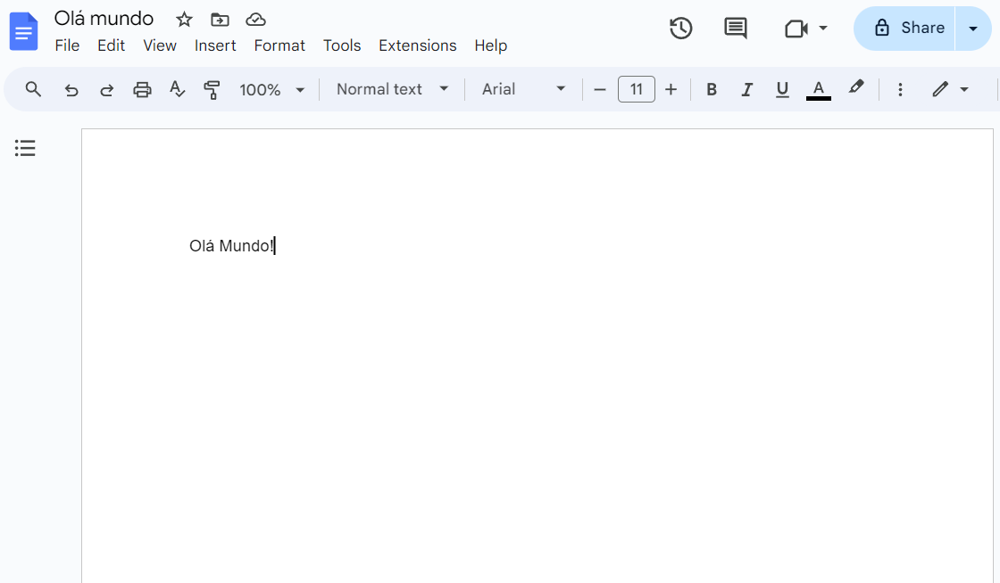

Este é um Processador de Textos (Google Docs, similar ao Microsoft Word), com um texto  simples escrito (o famoso "Olá Mundo!"). Mas se você tentar abrir o conteúdo salvo por este arquivo (no format .doc) em um editor de textos, notará que existem muitas outras informações, a maior parte delas ilegível para um ser humano.

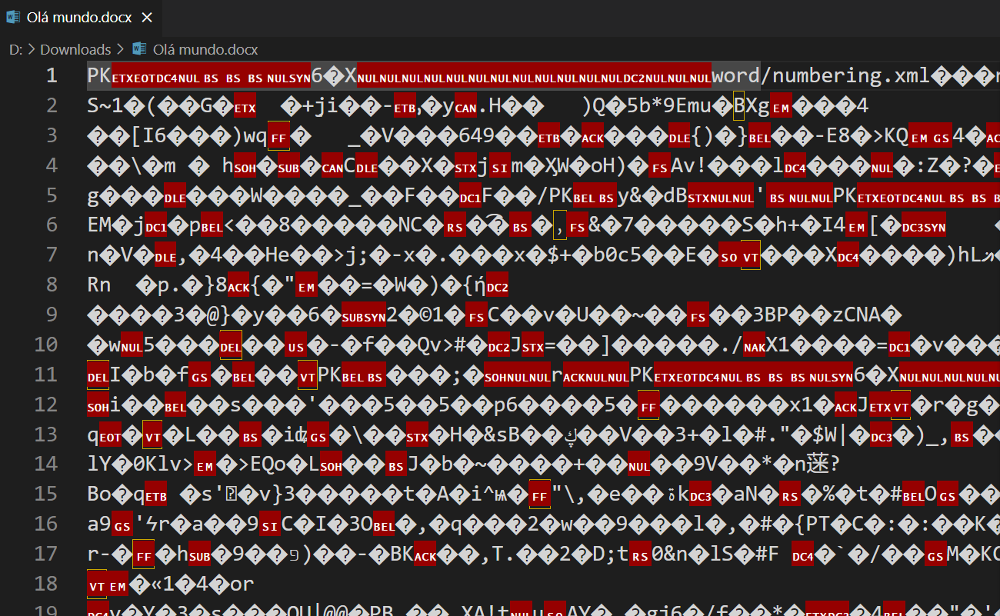

Existe uma forma mais amigável de visualizar este arquivo, usando um decodificador Hexadecimal, mas isto não necessariamente o torna tão legível quanto um arquivo de código.

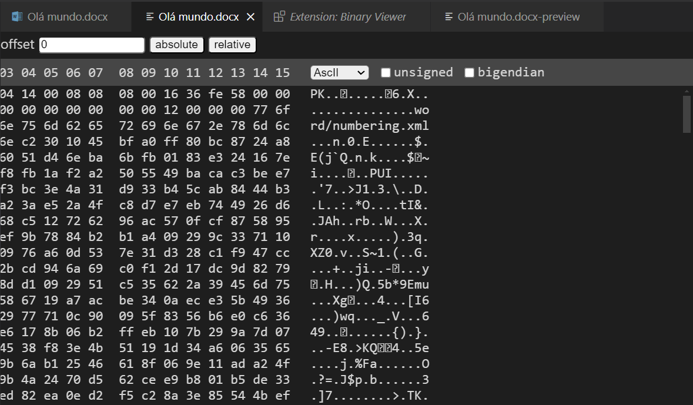

Editores de texto, por outro lado, não interferem no conteúdo salvo pelo arquivo. Você pode escrever código direto no terminal como fizemos usando o comando `cat`, mas isto provavelmente vai ser pouco produtivo à medida que seus scripts começam a ficar mais complexos, já que o comando `cat` te dá poucas opções de edição.

Existem diversos editores de texto disponíveis. De fato, se você usa o sistema operacional Windows, você provavelmente possui instalado o Bloco de Notas (`notepad.exe`). Este é um editor de textos bastante rudimentar, que te permite criar arquivos de texto como os que usamos para manter código. Mas, justamente por que trabalhamos com código, existem opções ainda mais produtivas.

Existem diversos editores de texto feitos especificamente para trabalhar com código. Você vai encontrar profissionais que gostam de usar `Sublime Text`, ou o `Notepad ++` (que tem a proposta de ser um substituto para o Bloco de Notas do Windows com capacidades de produtividade com código), outros que vão preferir opções de editores de texto que rodam no terminal, como o `vim`, ou o `emacs`. E existem ainda ferramentas mais robustas, chamadas de _IDE_'s (_Integrated Development Environment_, ou, em português, Ambiente de Desenvolvimento Integrado), como o _Visual Studio_ da Microsoft, ou o _IntelliJ_ da JetBrains. Contudo, um editor específico mantém uma relevância significativa no mercado e, por que precisamos falar de alguma ferramenta, eu achei que a relevância do vscode não poderia ser ignorada.

De acordo com a pesquisa [_Stackoverflow Developer Survey_ de 2024](https://survey.stackoverflow.co/2024/technology#1-integrated-development-environment), de um total de mais de 58 mil entrevistados, 73,6% responderam que usam _vscode_ como o editor de código no dia-a-dia. Destes, mais de 44 mil usam profissionalmente, e mais de 6 mil o usam enquanto estão aprendendo a programar. Em ambos os casos, ele destaca sua adoção por mais do que o dobro do segundo colocado.

O vscode é mantido pela Microsoft, mas é um projeto de código aberto, mantido sob a licença MIT, e que recebe contribuição da comunidade.

!!! important
    É importante dizer que, na indústria, existe uma discussão acalorada sobre opções de editores de código, e vários grupos (principalmente entre as pessoas de programação) são muito opinativos a respeito da escolha por editores. A famosa discussão entre os usuários de _emacs_ e _vim_, tentando estabelecer um como superior ao outro, é um bom exemplo de como as pessoas defendem sua opção na indústria.

    Este curso não pretende estabeler o vscode como uma opção superior aos demais editores disponíveis. Apesar de ter capacidades de edição de código que não deixam a desejar (e em muitos casos, chega a ter uma excelente experiência de uso), a escolha pelo vscode se dá somente pela sua adoção e a presença que ele tem no mercado atualmente.

    Editores como Vim ou Emacs, além de não terem a mesma presença que o vscode tem na indústria, apesar de terem uma comunidade forte de usuários e mantenedores, também possuem uma curva de aprendizado (devido à natureza de como funcionam) que, na minha opinião, ainda que possuam suas vantagens, torna sua adoção uma opção indivudual de quem pretende explorá-los e, eventualmente, adotá-los como preferência.

## 3.0 Instalando o vscode

Para instalar o vscode, que roda na maioria das plataformas disponíveis, basta visitar o [site oficial](https://code.visualstudio.com), e se dirigir à página de downloads e clicar no link adequado de acordo com o seu sistema.


A partir daí, basta seguir as [instruções](https://code.visualstudio.com/docs/setup/setup-overview).

!!! Important
    Para instalações no Windows, é importante lembrar-se de manter marcado a opção "Add to PATH" (Adicionar para o PATH). Isso torna o vscode fácil de iniciar a partir do _shell_, inclusive para quem usa o WSL, como recomendado neste curso.

    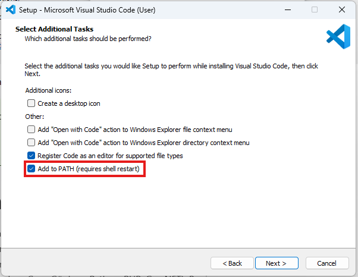

## 3.1 Explorando a interface
Para abrir o vscode, você pode iniciá-lo a partir da interface gráfica do seu sistema operacional (_Menu Iniciar_ no Windows), ou, se você tiver adicionado o vscode ao PATH durante a instalação, basta digitar `code` a partir do shell.

Ao abrir o vscode, uma página de boas-vindas é exibida como uma aba aberta na janela do editor, muito semelhante a que você pode enxergar abaixo, com algumas diferenças de acordo com o seu uso (na minha, é possível ver alguns dos meus projetos recentes listados, prontos para serem abertos).

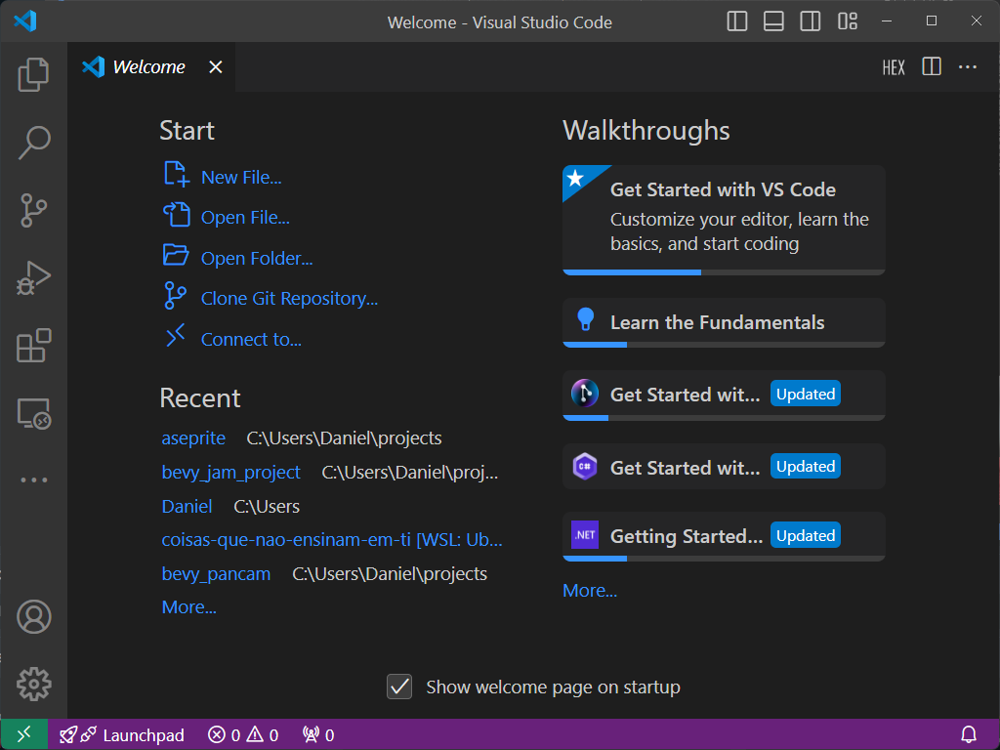

A partir desta página, algumas tarefas comuns já estão acessíveis, como criar um novo arquivo, abrir um arquivo existente, abrir um diretório, e até mesmo clonar um repositório _git_. É possível, também, se conectar a outros ambientes, como o WSL, ou remotamente via SSH e outras opções.

Do lado direito, você pode ver alguns guias (_Walkthroughs_), que podem te ajudar a se familiarizar com a interface e o uso do vscode.

No topo da interface, como já é típico de aplicações que rodam em interface gráfica, temos uma barra de menus, com alguns dos menus mais conhecidos, como _Arquivo_, _Editar_ e _Ajuda_. Como esperado, o menu _Arquivo_ exibe mais opções relacionadas a manipulação de arquivos, _Editar_ tem opções úties como _Copiar_, _Colar_, além de outras conveniências de edição, e o menu _Ajuda_, sem nenhuma surpresa, trás informações úteis para quem precisa de algum suporte.

À esquerda, temos a Barra Lateral, com algumas funcionalidades dispostas de forma conveniente, como _Explorador de Arquivos_, _Busca_, _Controle de Código_, o _Depurador_ e o painel de _Extensões_.

Mais abaixo, ainda na _Barra Lateral_, existem os botões de Contas (_Accounts_) e Gerenciamento (_Management_). O botão de Contas permite você usar algum serviço de contas (Microsoft ou Github) para se autenticar e ter a possibilidade, por exemplo, de guardar as configurações do vscode em um repositório da internet, tornando possível resgatar estas configurações em outro dispositivo, por exemplo, e sincronizá-lo com as suas preferências configuradas previamente.

Já no menu de Gerenciamento, você consegue acessar a Paleta de Comandos (também usando _Ctrl+Shift+P_), alternar entre diferentes Perfis (_Profiles_), personalizar as configurações do vscode, definir associações de teclas de atalho (_Keyboard Shortcuts_), templates de trechos de código (_snippets_), definier Tarefas (_Tasks_), escolher um tema de cores ou de ícone de arquivos, sincronizar suas configurações e atualizar a instalação do vscode no seu dispositivo.

A _Paleta de Comandos_ é um dos recursos mais ricos do vscode, pois ela lista inúmeros comandos disponíveis no editor, alguns deles acessíveis somente através dela. Já a escolha por diferentes Perfis permite que você mantenha configurações diferentes do vscode agrupadas, como um perfil para uso quando usando projetos de uma organização, e outro para projetos open source ou de uso pessoal, por exemplo.

A janela de configurações do vscode mostra outras formas de agrupar as configurações:
- configurações globais no sistema onde ele está rodando
- configurações no escopo do usuário que está usando o editor (sobrepõem as configurações globais)
- configurações do Espaço de Trabalho (_Workspace_) aberto (sobrepõem as configurações do usuário)

Falaremos sobre Espaços de Trabalho mais adiante.

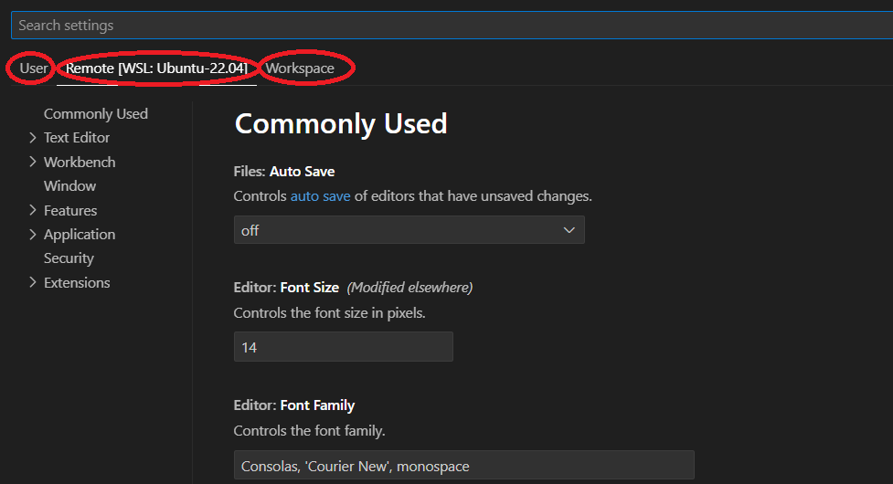

Em qualquer um dos três escopos, há uma extensa lista para configurar o editor, as extensões instaladas e diversos outros aspectos de uso. Você pode navegar por elas através dos menus colapsáveis à esquerda, ou buscando as configurações desejadas no campo de busca.

Para escolher entre temas, o vscode oferece alguns temas de cores e ícones de arquivos pré-instalados, mas outros podem ser inseridos a partir de extensões. Por exemplo, você pode baixar a extensão _Ayu_, que instala temas de cores e ícones minimalistas para trabalhar com vscode.

Por último, a opção de Teclas de Atalho abre a janela _Keyboard Shortcuts_, que lista todos os mapeamentos de teclas de atalho para comandos do vscode. É possível pesquisar pelos atalhos disponíveis, editar as configurações e reassociar teclas de acordo com a sua preferência.

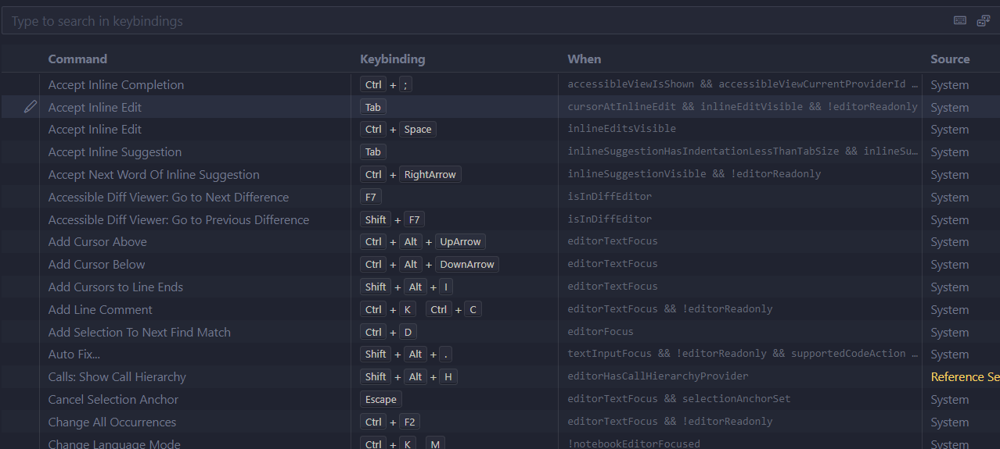

Falaremos sobre Tarefas (_Tasks_) e Trechos de Código (_Snippets_) mais adiante.

Na barra de status, que fica no rodapé da janela, é possível ver alguns outros atalhos, como o indicador de em que ambiente esta instância está conectada (à esquerda no rodapé) no qual você pode clicar para se conectar (no WSL ou em um computador remoto via _SSH_ ou _Tunnel_), e do outro lado, à direita, existe o indicador de notificações (um ícono no formato de sino), que também pode ser clicado para visualizar as notificações pendentes (como novas atualizações disponíveis, sugestões de extensão, etc.).

Ao lado do indicador de notificações temos o seletor de Modo de Linguagem (que veremos a seguir), temos três outros seletores, sendo eles, da esquerda para a direita:
- Seletor do tipo de quebra de linha
- Seletor do tipo de Encoding
- Seletor do tipo de Indentação (recuo da margem no código)

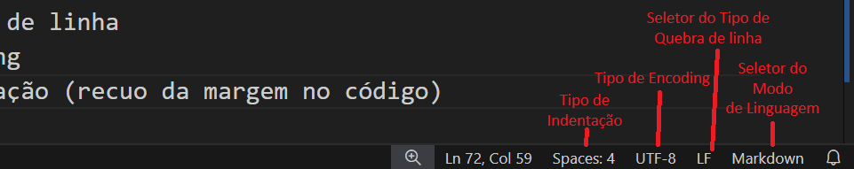

!!! important
    O _Seletor do Tipo de Linha_ diz respeito a uma característia específica na diferença entre os sistemas operacionais baseados em UNIX (Linux, FreeBSD, MacOS, etc) e os sistemas operacionais da Microsoft (Windows 11, Windows 10, etc.)

    Em sistemas legados, para manter a compatibilidade, a quebra de linha deveria ser _CRLF_ (_Carriage Return and Line Feed_). Mas hoje em dia, onde a portabilidade acaba sendo prioridade, usar somente _LF_ é, via de regra, considerado uma boa prática.

    Se você quiser saber mais sobre este assunto, o vídeo a seguir, do Scott Hanselman, da série [_Computer Stuff They Didn't Teach You_](https://www.youtube.com/playlist?list=PL0M0zPgJ3HSesuPIObeUVQNbKqlw5U2Vr) (Coisas de Computador que não te ensinaram"), fala um pouco mais sobre isto num contexto histórico (em inglês).

    

Para o tipo de _encoding_, o _UTF8_ atualmente é usado como padrão internacional. Iremos abordar Encoding em algum momento do curso, mas não vamos detalhar isto agora. Por padrão, a menos que você esteja lidando com alguma tarefa que exija um tipo de encoding específico, mantenha sempre _UTF8_ selecionado.

No caso da indentação, isto orienta o vscode a quantos espaços ele precisa exibir sempre que a tecla _TAB_ for pressionada. O seletor também permite usar Espaços no lugar de Tabs, o que é configurado como padrão. Ou seja, sempre que você usar a tecla _TAB_ para adicionar um espaço, ela será substituída pelo número de espaços usados no seletor de indentação (4 por padrão). Você pode mudar isto a qualquer momento, ajustando o seletor para usar TAB em vez de espaços.

## 3.2 O Editor
Sem mais delongas vamos explorar o uso do vscode para o que ele se propõe: Editar arquivos.

Vamos começar criando um novo arquivo. Isto pode ser feito de diversas formas:
- Clicando em "Novo Arquivo..." na página de boas-vindas
- Clicando no Menu Arquivo, e escolhendo a opção "Novo Arquivo de Texto"
- Usando as teclas de atalho _Ctrl+N_

Um novo arquivo, sem título, será aberto em uma nova Aba dentro da janela do editor. Um texto é exibido como conteúdo deste arquivo, dizendo que você pode "Selecionar uma Linguagem", "Preencher um Template" ou "Abrir um Editor Diferente". Logo abaixo, o texto também explica que, se você começar a digitar algum conteúdo, esta mensagem irá sumir, e você pode também optar por não exibí-la novamente nas próximas vezes em que criar um novo arquivo.

Selecionar uma linguagem, significa mudar o modo de linguagem do arquivo no qual estamos trabalhando. É possível fazer isto clicando no link do texto, ou também no seletor do modo de linguagem, que fica na barra de status (na borda inferior da janela do vscode), à direita. Ela começa com a opção "Plain Text" selecionada, mas é possível mudá-la clicando sobre ela, e um menu suspenso será exibido nos permitindo selecionar a linguagem que pretendemos usar. Vamos selecionar "Shell Script", que é o tipo de arquivo com o qual estamos trabalhando atualmente.

Note que o ícone exibido ao lado do nome do arquivo, no título da Aba, mudou para `$`, representando que estamos agora editando um arquivo de Shell Script. Você também vai notar que, à medida que você digita o script no conteúdo do arquivo, o vscode, que agora está informado de que estamos editando um arquivo no modo Shell Script, vai formatar o conteúdo de acordo com a sintaxe de Shell Script.

Podemos, também, abrir um dos scripts que já escrevemos na aula anterior. Para fazer isto, temos algumas opções:
- Voltar à aba com a página Welcome e clicar no link "Open File..."
- Clicar no menu File e selecionar a opção "Open File..."
- Usar as teclas de atalho _Ctrl+O_

Em qualquer uma destas formas, uma caixa de diálogo será exibida para que você possa selecionar o arquivo que deseja abrir. Selecione o arquivo `fancy.sh` que criamos no final da última aula.

Note que o vscode já identificou o modo de linguagem do arquivo e selecionou "Shell Script". Normalmente o vscode tenta fazer isto automaticamente quando abrimos um arquivo, baseado na extensão do arquivo aberto. Ou quando salvamos o arquivo em disco (no caso de um arquivo novo), e finalmente atribuímos uma extensão quando lhe damos um nome e, normalmente, ele consegue determinar o modo de linguagem com sucesso. Eventualmente ele pode inferir o modo de linguagem para uma linguagem que não está disponível, e pode sugerir que você procure uma extensão adequada para instalar o modo de linguagem apropriado.

### 3.2.1 Trabalhando com arquivos
Ao começarmos a editar o conteúdo de um arquivo, à medida que alteramos este conteúdo, o vscode nos indica que existem alterações pendentes através de um sinal de _bullet_ (um pequeno círculo) ao lado do nome do arquivo, no título da aba.

- Comentários
    
    Uma das conveniências de usar um editor adequado quando estamos trabalhando com código, é que ele suporta algumas tarefas comuns, como por exemplo, transformar uma linha de código em um comentário no formato adequado para o Modo de Linguagem que estamos usando. No vscode, o comando para comentarmos uma linha do código (ou remover o comentário dela) é através do atalho _Ctrl+;_, ou no menu _Edit_, na opção _Toggle Line Comment_. Também existe a opção de comentar/remover comentário em blocos, para linguagens que suportam blocos de comentário.

- Mover texto

    É muito comum, enquanto estamos codificando, tomarmos decisões que envolvem mover código para reordenar as instruções que estamos programando. No vscode, uma forma mais fácil de fazer este tipo de movimentação é, com o cursor posicionado na linha que gostaríamos de mover, usando _Alt_ mais as setas para cima ou para baixo, de acordo com a direção em que queremos mover o texto.

    Funciona também com múltiplas linhas do texto, contanto que você as selecione antes de movê-las.

- Copiar texto

    Da mesma forma que o vscode facilita que possamos mover o texto pelas linhas, para cima ou para baixo, podemos também copiar o conteúdo da linha onde o cursor está posicionado usando as teclas _Shift+Alt_ e a direção para onde queremos que a duplicação seja feita, para cima ou para baixo.

- Cursores

    Não é raro que, enquanto estamos trabalhando com código, nos deparamos com algumas situações em que precisamos aplicar alterações semelhantes em diversas linhas ou diversos lugares do código. O vscode suporta múltiplos cursores, o que significa que podemos posicionar diversos cursores de edição em lugares distintos do código, e editá-los simultaneamente.

    É possível espalhar cursores diferentes pressionando a tecla _Alt_ e posicionando-os com o mouse, clicando em cada um dos lugares em que queremos um novo cursor. Podemos também, usando as teclas _Ctrl+Alt_ e usando as setas para cima ou para baixo para criar novos cursores na mesma posição nas linhas de cima ou de baixo, de acordo com a direção selecionada.

    Uma vez posicionados, os cursores irão receber tudo o que você digitar, como se estivesse editando um por um, mas farão isto simultaneamente, o que torna isto uma forma mais produtiva de fazer este tipo de edição.

- Seleção de coluna

    Quando trabalhamos com dados tabulados em colunas, ou simplesmente quando precisamos selecionar uma área do texto considerando um alinhamento vertical no texto, sem selecionarmos o restante do conteúdo pelas linhas em que queremos trabalhar, usamos a combinação _Shift+Ctrl+Alt_ para fazer a seleção de colunas.

    Isto facilita a edição, não apenas para excluir colunas indesejadas, como também para editá-las de uma única vez (usando a funcionalidade dos múltiplos cursores).

- Busca/Substituição

    Com certa frequência, precisamos encontrar uma ou diversas ocurrências de certos termos no texto, seja para fazer referências a estes pontos específicos ou para fazer ajustes tardios.

    Para fazer uma busca por termos no conteúdo do arquivo aberto no editor atual, podemos acionar o Menu _Edit_ e clicar em _Find_, ou usar o atalho _Ctrl+F_.

    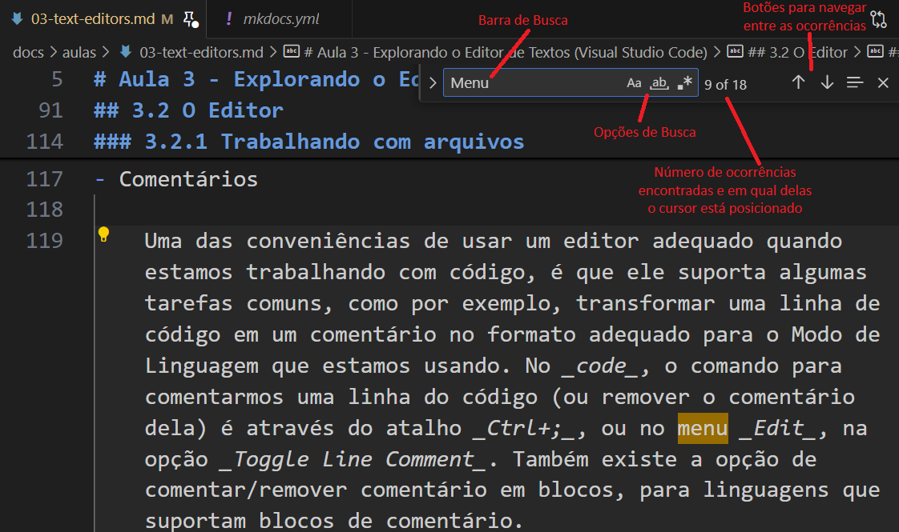

    Entre as opções de busca podemos ajustar:
    - `Match Case`: Combinação de Maiúsculas e minúsculas, indica se o texto procurado precisa corresponder ou não à caixa do texto.
    - `Match Whole Word`: Combinação de palavras inteiras, encontra correspondências apenas em palavras completas
    - `Use Regular Expression`: Combinação de Expressões Regulares, é um mecanismo de busca mais avançado usando _RegEx_, algo que veremos mais pra frente neste curso.

    Para fazer substituições, podemos acionar o Menu _Edit_ e clicar em _Replace_, ou usar o atalho _Ctrl+H_.

    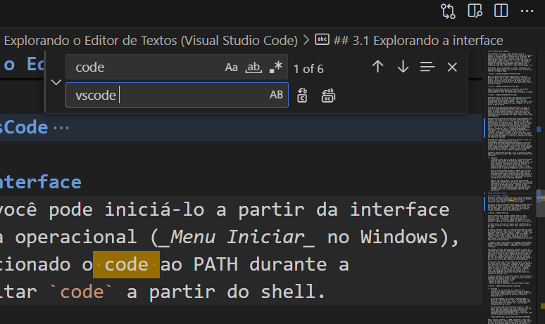

    As opções são bastante semelhantes às opções disponíveis na busca, mas apresentam duas novas opções:

    - `Replace`: Aplica a substituição na ocorrência selecionada (e automaticamente move para a próxima ocorrência)
    - `Replace All`: Aplica a substituição em todas as ocorrências

    Outra forma rápida para buscar e editar múltiplas ocorrências de texto é selecionando o texto desejado e pressionando _Ctrl+D_. Ele vai selecionar a próxima ocorrência do termo selecionado e manter o cursor em ambas. Pressionar _Ctrl+D_ novamente vai fazer o mesmo para a próxima ocorrência, e assim sucessivamente, para todas as ocorrências que você desejar editar.

- Salvamento e Restauração de Arquivos

    O vscode precisa de uma ação deliberada do usuário para salvar os arquivos:
    - Através do menu _File_, na opção _Save_ (ou _Ctrl+S_) para salvar o arquivo que está sendo editado na aba selecionada
    - Através do menu _File_, na opção _Save All_ (ou _Ctrl+K S_) para salvar todos os arquivos abertos

    Mas existe uma funcionalidade de Salvamento Automático disponível, que fica desligada como padrão. Para ajustá-la, caso seja do seu interesse, basta entrar em Settings e buscar pela configuração `files.autoSave`. Ela suporta os seguintes valores:
    - `off`: desligado (valor padrão)
    - `afterDelay`: Salva o arquivo depois que se passa um tempo (1000 milissegundos por padrão), para ajustar este valor, existe outra configuração chamada `files.autoSaveDelay`
    - `onFocusChange`: Salva o arquivo sempre que você mover para outro editor (outra Aba)
    - `onWindowsChange`: Salva o arquivo sempre que você mover para outra janela para fora da instância atual do vscode

    Independente disto, quando fechado, o vscode guarda as alterações pendentes nos arquivos abertos de forma que, quando você abre novamente o editor, ele recupera as alterações não salvas do arquivo, permitindo que você decida se quier mantê-las ou descartá-las.

- Prevenindo Escritas "Sujas" (_Dirty Writes_)

    O vscode é capaz de detectar se, durante a edição do arquivo, alguém tiver alterado seu conteúdo no disco, e vai te avisar disto exibindo uma mensagem de erro quando você tentar salvar o arquivo por cima da versão alterada.

    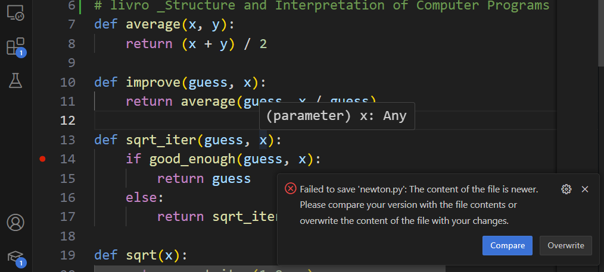

    Se você quiser ignorar as alterações que foram feitas fora do editor, e simplesmente salvar as suas alterações, você consegue fazer isto clicando no botão _Overwrite_. Se quiser, no entanto, tomar o cuidado de se conferir as alterações, você pode clicar em _Compare_. Isto irá abrir o editor de _diff_ do vscode, que mostra as diferenças entre os arquivos e te permite navegar por elas para decidiro o que pretende fazer.

    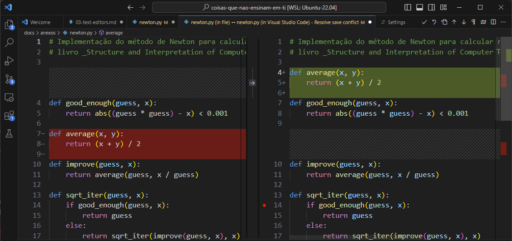

    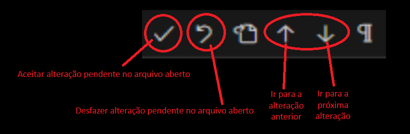

    Uma vez resolvidos conflitos gerados por causa das diferenças, o arquivo é salvo e o editor _diff_ é fechado.

- Rolagem

    No vscode, você pode exibir um minimapa do código no lugar da barra de rolagem. Para algumas pessoas, esta pode ser uma forma conveniente de ter uma visualização do arquivo de texto em miniatura, e ter uma ideia geral de como ele está ficando. Para isto, basta entrar em _Settings_ e na barra de busca digitiar `minimap`.

    E marcar a caixa de seleção com o texto `Editor: Minimap > Enabled`. Além disso, existem diversas opções quer personalizam a forma como o minimapa é exibido.

    Além disso, você pode rolar pelo texto rolando o botão do meio do mouse (Scroll). Se você fizer isto pressionando a tecla _Alt_, ele aumentará drasticamente a velocidade da navegação.

### 3.2.2 Abas

Assim com funciona nos browsers modernos, o vscode suporta abrir diversos arquivos em Abas diferentes (sim, o tio é velho o suficiente pra saber que, antigamente, os browsers não tinham Abas e era comum ter que lidar com dezenas de janelas abertas em vez de dezenas de abas). A capacidade de manter diversos _buffers_ abertos para manipular um número de arquivos simultaneamente não é, obviamente, uma exclusividade do vscode. Diversos outros editores, como o Atom e o Sublime possuem a mesma funcionalidade, enquanto que editores de terminal, como o Emacs e o Vim, oferecem a mesma capacidade através de outros meios.

No vscode, as Abas mostram o nome do arquivo, um ícone representando em que modo de linguagem ele está sendo usado, e um botão que te permite fechar aquela Aba facilmente, também possível através do atalho _Ctrl+F4_.

Ao clicar com o botão direito do mouse em uma determinada Aba, diversas opções se tornam disponíveis. Vamos tentar destacar as principais:
- Fechamento de Abas
    - Close others: Fecha todas as outras Abas exceto a Aba que recebeu o clique
    - Close to the Right: Fecha todas as Abas à direita dela
    - Close Saved: Fecha todas as Abas que estão salvas
- Pin: Fixa a Aba selecionada, não aplicando sobre ela os comandos que fecham as outras abas.
- Opções de divisão de painéis (_Split_)
    - Split Up: Divide o editor atual em um novo painel acima
    - Split Down: Divide o editor atual em um novo painel abaixo
    - Split Left: Divide o editor em um novo painel à esquerda
    - Split Right: Divide o editor em um novo painel à direita

### 3.2.3 Painéis do Editor

Um editor (entenda isto como uma Aba editando um arquivo) pode ser dividido em painéis, como destacamos nas opções do menu suspenso quando clicamos com o botão direito no título da Aba. Painéis do Editor nos permitem criar formas de navegar pelo conteúdo do arquivo que estamos editando, ao mesmo tempo que mantemos o cursor na posição em que queremos fazer uma edição, sem deixar de visualizar o que estamos digitando.

O tipo mais comum de painéis de editor é criar um painel à direita. Isto pode ser feito no menu suspenso da Aba, ou através do atalho _Ctrl+K_ e, logo em seguida, _Ctrl+Shift+]_. Mas os outros tipos de painéis também estão disponíveis, como vimos nas opções do menu.

### 3.2.4 Navegação
O vscode suporta diversas funcionalidades de navegação que podem ser convenientes quando estamos trabalhando com código. Vamos falar agora de algumas delas disponíveis no Menu _Go_.

- `Back`: Posiciona o cursor de volta onde estava posicionado anteriormente de acordo com o histórico de posições (_Ctrl+Seta Esquerda_)
- `Forward`: Semelhantemente ao anterior, faz o cursor ser posicionado avançando no histórico de posições (_Ctrl+Seta Direita_)
- `Switch Editor > Next Editor`: Avança para o editor que está na Aba à direita (_Ctrl+Page Down_)
- `Switch Editor > Previous Editor`: Avança para o editor que está na Aba à esquerda (_Ctrl+Page Up_)
- `Go to Line/Column...`: Posiciona o cursor em uma linha/coluna específicas (_Ctrl+G_). A notação é `:<número-da-linha>[:<número-da-coluna>]` (os colchetes `[` e `]` indica que o número da coluna é opcional)
- `Go to Bracket`: Posiciona o cursor no fechamento do grupo atual (colchetes, parênteses, chaves, markups, etc). O atalho para este comando é _Ctrl+Shift+]_.

### 3.2.5 Formatação
    

## 3.3 Extensões
O vscode tem suporte à extensões, e possui um repositório com inúmeras extensões úteis para serem instaladas. Elas podem simplificar bastante o nosso trabalho de diversas formas, criando novas teclas de atalho, auxiliando na legibilidade do código através do uso de cores e padrões de formatação, e até mesmo trazendo para dentro da ferramenta funcionalidades completamente novas.

Por exemplo, se fizermos uma busca por `bash`, veremos quantas extensões disponíveis podem ser usadas para, de alguma forma, facilitar a vida de quem trabalha Shell Scripts em Bash.

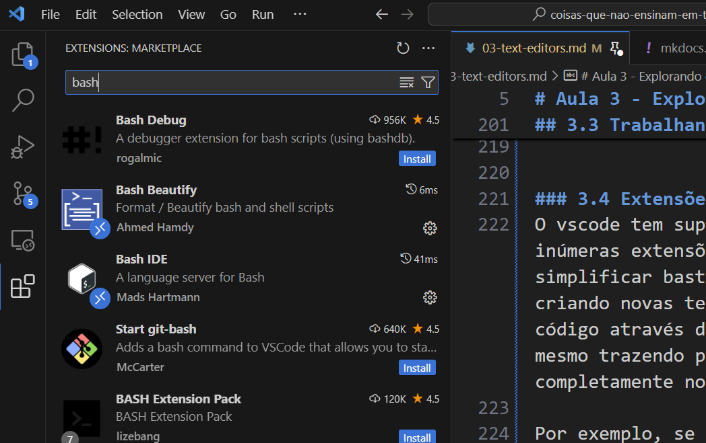

Ao longo deste curso, iremos recomendar extensões que possam ser usadas para facilitar certos aspectos do uso do vscode. Por ora, fique à vontade para navegar pelas extensões e, se achar alguma útil, tente experimentá-la.

## 3.4 Trabalhando com Código
Vamos agora discutir um pouco sobre o uso do vscode com código, no dia-a-dia de pessoas que trabalham com programação de software ou scripts de automação. Para isto iremos usar um programa de exemplo em Python que usa o método de Newton para calcular a raiz quadrada de um número.

!!! warning
    Se você não conhece Python, ou não entende sobre programação, tenha em mente que os exemplos usados aqui tem um caráter meramente ilustrativo para facilitar a compreensão do uso do vscode.

    Contudo, se você quiser acompanhar os exemplos em seu dispositivo, você vai precisar ter instalado um interpretador de Python.
    
    Acesse [este link](https://python.org.br/instalacao-windows/) para instruções de como instalar o Interpretador Python no Windows, ou [este link](https://python.org.br/instalacao-linux/) para instalar no linux. Para usuários do MacOs, [este link](https://python.org.br/instalacao-mac/) forncesse as instruções necessárias.

!!! note
    O exemplo a seguir foi extraído do livro [_Structure and Interpretation of Computer Programs_](https://mitp-content-server.mit.edu/books/content/sectbyfn/books_pres_0/6515/sicp.zip/full-text/book/book.html), de Hal Abelson, Jerry Sussman e Julie Sussman, pela MIT Press.

    No livro, os autores implementam o código usando a linguagem LISP. Aqui, usaremos Python.

### 3.4.1 Instalando suporte à linguagem
A primeira coisa que iremos fazer para trabalhar com uma linguagem no vscode, é procurar uma extensão que instale o suporte a esta linguagem no editor.

Para isto, vamos abrir o Painel de Extensões do vscode através do atalho _Ctrl+Shift+X_, e digitar `Python` no campo de busca.

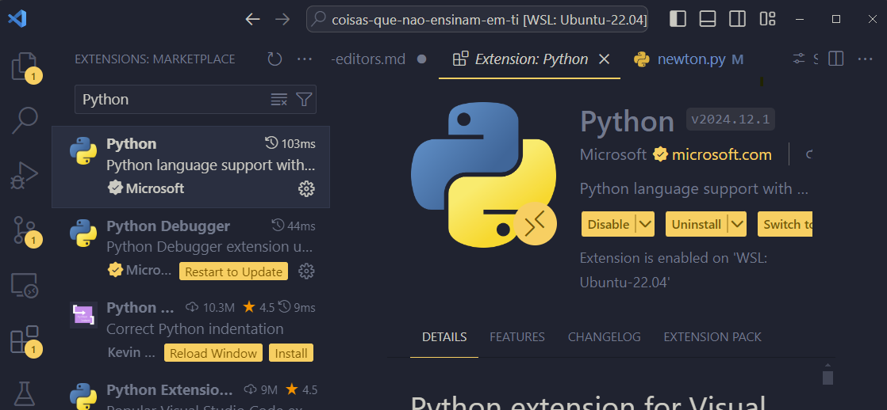

Note como existem inúmeras extensões que auxiliam o uso de Python no resultado da busca. Para os fins deste curso, irei instalar o suporte oficial da Microsoft, que é a extensão mais baixada. Ela também instala duas outras extensões como parte de suas dependências:
- `Pylance` (para suporte do _IntelliSense_)
- `Python Debugger`(para suporte ao Depurador)

A extensão _Python_ da Microsoft, instala alguns comandos úteis, como, por exemplo, Iniciar um Terminal REPL de Python:
1. Entre na Paleta de Comandos com _Ctrl+Shift+P_
2. Digite `Python` para listar todos os comandos que a extensão adicionou
3. Procure o comando `Python: Start Terminal REPL`
4. Clique no comando para ver o Terminal REPL ser iniciado

!!! note
    Um _Terminal REPL_ é uma ferramenta disponível em Python (e em algumas outras linguagens) que criam uma experiência de Shell para usar a linguagem no terminal.

    _REPL_ é a sigla para _Read-Eval-Print Loop_, que significa uma repetição do processo de Ler->Interpretar->Imprimir do interpretador de uma linguagem.

    Por exemplo, se você digitar no REPL a expressão `1 + 1` e pressionar _Enter_, o terminal executará a leitura do texto digitado, fará a interpretação de acordo com a linguagem Python, e imprimirá o resultado. Depois disto, ele habilitará o terminal para que uma nova expressão seja digitada, e executará tudo novamente.

Para sair do REPL, basta digitar `quit()`

### 3.4.2 Codificando no vscode

Para criar um pequeno programa em Python, vamos criar um novo arquivo e salvá-lo como `newton.py`. Ao criar o arquivo e ter ele aberto no seu editor, olhe barra de status e observe o _Modo de Linguagem_ selecionado (Python). Logo ao lado do seletor do Modo de Linguagem, há também o seletor do interpretador da linguagem.

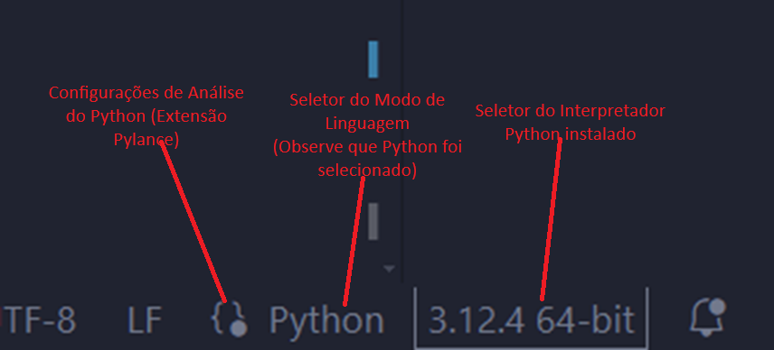

Podemos começar a digitar código no nosso arquivo. O primeiro passo, seguindo o [exemplo do livro](https://mitp-content-server.mit.edu/books/content/sectbyfn/books_pres_0/6515/sicp.zip/full-text/book/book-Z-H-10.html#%_sec_1.1.7), é criar uma função  chamada `sqrt-iter`.

```python
def sqrt-iter(guess, x):
    if good_enough(guess, x):
        return guess
    else:
        return sqrt_iter(improve(guess, x), x)
```

Observer como o código que digitamos possui diversas marcações em vermelho e amarelo. Isto são problemas que o suporte à linguagem Python identificou no código que digitamos. Podemos compreender melhor os problemas de diversas formas:

- Posicionando o mouse sobre uma das áreas marcadas, e uma caixa flutuante será exibida descrevendo o problema
- Abrindo o painel _Problems_, através do atalho _Ctrl+Shift+M_
- Navegandoi pelos problemas usando o atalho _F8_ para ir para o próximo problema, e _Shift+F8_ para voltar para o problema anterior.

As marcações em vermelho representam _Errors_ (erros), enquanto que as marcações em amarelo representam _Warnings_ (avisos). É possível ter um relatório de erros e avisos na barra de status do vscode, no grupo à esquerda. O número de erros é representado por um ícone com a letra `x`, enquanto que o número de avisos é representado por um ícone com o ponto-de-exclamação.

Ao clicar neste relatório, o Painel Problems será aberto. Ele também pode ser aberto através do atalho _Ctrl+Shift+M_. Este painel exibe todos os problemas encontrados no código: erros e avisos, usando o mesmo código de cores: vermelho para erros e amarelos para avisos. Ao clicar em qualquer um dos problemas, ele posiciona o cursor do editor no código onde o problema está sendo reportado.

O primeiro problema encontra-se no nome da função. Existe um erro aqui, e a extensão _Pylance_ diz que era esperado `(` (uma abertura de parênteses) no lugar onde está o caractere `-` (traço). Isso ocorre por que, em Python, quando definimos um nome para uma função, ele aceita apenas letras, números e o caractere `_`. O traço não é um caractere válido. Então vamos substituí-lo pelo `_`.

Note como, só por fazer esta correção, diversos outros problemas foram corrigidos, sobrando apenas agora 2 avisos relacionados às chamadas para as funções `good_enough` e `improve`. O problema é que elas ainda não existem, então precisamos implementá-las.

```python
def good_enough(guess, x):
    return abs((guess * guess) - x) < 0.001


def improve(guess, x):
    return average(guess, x / guess)
```

Note agora que, ambos os avisos não existem mais, mas um novo aviso passou a existir nos apontando a chamada da função `average`, que ainda não existe. A chamada para a função `abs` não foi marcada por que ela existe, estamos usando uma função pronta fornecida pelo interpretador.

Seguindo o livro, implementemos a função `average`:

```python
def average(x, y):
    return (x + y) / 2
```

Por fim, para facilitar o uso da função iterativa, o livro propõe a definição de uma última função chamada `sqrt`, que encapsula a chamada inicial da função `sqrt_iter`, passando como primeiro palpite o valor `1.0`.

```python
def sqrt(x):
    return sqrt_iter(1.0, x)
```

Agora, tudo o que precisamos fazer no nosso programa é usar as funções que criamos, a partir da chamada à função `sqrt` passando como argumento um número para o qual queiramos obter a raiz quadrada:

```python
print(sqrt(2.0))
```

### 3.4.3 Execução de código

Para executarmos o código, podemos usar o Depurador (_Debug_) do vscode, que pode ser aberto através do atalho _Ctrl+Shift+D_. Nele podemos clicar no botão _Run and Debug_.

O depurador irá abrir um terminal chamado `Python Debug Console`, onde o programa será executado e o valor resultante da chamada da função `sqrt` será impressa.

Pode-se iniciar uma execução através do atalho _F5_. Nós iremos explorar melhor as capacidades de depuração do vscode em uma aula futura dedicada à _Debugging_ e _Profiling_.

### 3.4.4 Navegação do código
O vscode possui capacidades de navegação específicas para serem usadas quando estamos trabalhando com código. Ao clicar com o botão direito do mouse no nome de algum artefato de código, algumas opções de navegação serão exibidas no menu suspenso:
- Go to Definition: Navega até o código em que este artefato foi definido
- Go to Declaration: Navega até o código em que este artefato foi declarado (em _Python_ o efeito é o mesmo, mas existem linguagens que distinguem a declaração da definição)
- Go to Type Definition: Para linguagens que suportam um sistema de tipos, navega até a definição de um tipo
- Go to References: Navega pelas referências ao artefato (os lugares no código onde ele é usado)

- Peek
Às vezes, você só quer ter uma ideia de como os artefatos foram definidos ou estão sendo usados, sem necessariamente navegar pelo código. _Peek_ é uma forma de enxergar os trechos de código onde tais coisas acontecem, sem navegar até eles, mantendo o cursor na posição atual. Para isto, o vscode exibe uma caixa flutuante onde se pode visualizar o que se deseja.

Para isto, em vez de acessar as opções de navegação no menu suspenso, escolha o submenu `Peek` e a opção desejada.

- Outline
O _Outline_ é uma forma de visualizar as estruturas de código presentes no arquivo e navegar por elas. O Outline fica na mesma janela do _Explorer_, abaixo, ou pode ser visto através do atalho _Ctrl+Shift+O_.


### 3.4.5 Refatoração de código
Dentre as capacidades com código do vscode, existem opções de refatoração disponíveis. Por exemplo, renomear um artefato (atualizando todas as referências a ele com o novo nome), mover um artefato para outro arquivo, transformar uma expressão em variável ou extrair um novo método a partir de um trecho de código, além de outras capacidades disponíveis de acordo com a linguagem.

- Renomear: para renomear um artefato (variável, função, etc), basta posicionar o cursor sobre o seu nome e pressionar _F2_. Uma caixa de texto será exibida para que você possa entrar com o novo nome e, ao pressionar _Enter_, ele aplicará o novo nome para todas as referências conhecidas.
- Extrair Variável: para transformar uma expressão em uma variável, você pode selecionar a expressão desejada e pressionar _Ctrl+Shift+R_ e, no menu suspenso, escolher _Extract Variable_. Ao digitar o nome da variável, o vscode fará a refatoração adequada.
- Extrair Método: Extrair Método, de forma semelhante à _Extrair Variável_, baseado em uma expressão selecionada, a transforma em uma chamada de função, para onde ele move a expressão selecionada. Para isto, basta usar o atalho de refatoração _Ctrl+Shift+R_ e clicar em `Extract Method`.

### 3.4.6 Intellisense
O _IntelliSense_ é um conjunto de capacidades do vscode que interagem com o usuário ao trabalhar com código. Estas capacidades são principalmente:
- Auto completar: à medida que se digita o código, o IntelliSense dá sugestões sobre possíveis formas de completar a expressão baseadas no que está sendo digitado e nos artefatos que existem disponíveis no código.
- Informações Rápidas e Detalhes sobre Parâmetros: Quando se digita uma chamada para uma função, o IntelliSense é capaz de obter informações sobre a função e seus parâmetros e exibí-las, durante a digitação, para que o usuário possa entender como preenchê-los.
- Lista de Membros: O IntelliSense também verifica os membros de classes, structs, etc, e exibe informações durante a codificação para te ajudar a preenchê-las.

### 3.4.7 Snippets
_Snippets_ são templates para pequenos trechos de código que o vscode mantém disponíveis para facilitar a digitação de certas estruturas enquanto estamos codificando.

Por exemplo, quando queremos usar alguma estrutura de controle, criar uma função, ou uma classe, pode ser que existam snippets diponíveis para isto, ou podem haver extensões que os disponibilizem.

Alguns snippets são exibidos pelo _IntelliSense_, à medida que você digita código. Mas é possível, também acessar snippets a partir da Paleta de Comandos usando _Ctrl+Shift+P_ e buscando pelo comando `Snippets: Insert Snippet`.

## 3.5 Tasks

## 3.6 Trabalhando com Diretórios
Um dos maiores benefícios de usar um editor de código para trabalhar com tarefas é que ele suporta abrir espaços de trabalho baseados em uma hierarquia de diretórios. E o vscode suporta esta funcionalidade. Você pode abrir um diretório a partir do Menu File, na opção `Open Folder...`, ou usando o atalho _Ctrl+K_ e, logo em seguida _Ctrl+O_. Mas, o mais comum para quem trabalha a partir do shell, é usar o CLI do vscode para abrir o editor e trabalhar no diretório. Para isto, basta usar o nome do ditetório como argumento:

```bash
code foo # abre o vscode com o diretório `foo`
```

O mais comum é chamar o code já a partir do diretório em que se está trabalhando:

 ```bash
 code .
 ```

A partir do momento em que se trabalha num ambiente de diretório, todos os arquivos com os quais trabalhamos são tratados usando o diretório aberto como referência. Podemos criar diretórios e posicionar arquivos em qualquer lugar da hierarquia.

A primeira funcionalidade útil que podemos verificar usando o modo de trabalho em diretório é o _Explorer_, uma visualização da hierarquia de diretórios a partir do diretório aberto, normalmente situado na Barra Lateral, à esquerda. Se o Explorer não estiver visível pra você neste momento, você pode abrí-lo usando o atalho _Ctrl+Shift+E_, ou acessando o menu _View_ e clicando na opção _Explorer_.

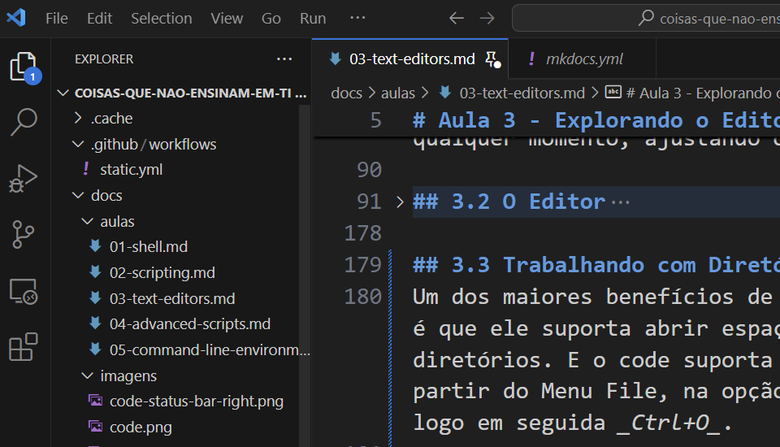

Você pode abrir novos arquivos através do explorer, ou através do atalho _Ctrl+P_, que abrirá um menu suspenso onde você pode selecionar entre os arquivos listados ou digitar o nome do arquivo que você pretende abrir.

Outra vantagem de usar o modo de trabalho em diretórios, é o _Search_ (Busca), também disponível na barra lateral, ou pelo atalho _Ctrl+Shift+F_, ou ainda pelo menu _View_ na opção _Search_.

Nesta barra, você pode digitar o que pretende buscar na caixa de textos, e o vscode irá pesquisar em todos os arquivos do diretório pelas ocorrências do texto que você pesquisou, listando os arquivos encontrados com as posições onde as ocorrências podem ser encontradas.

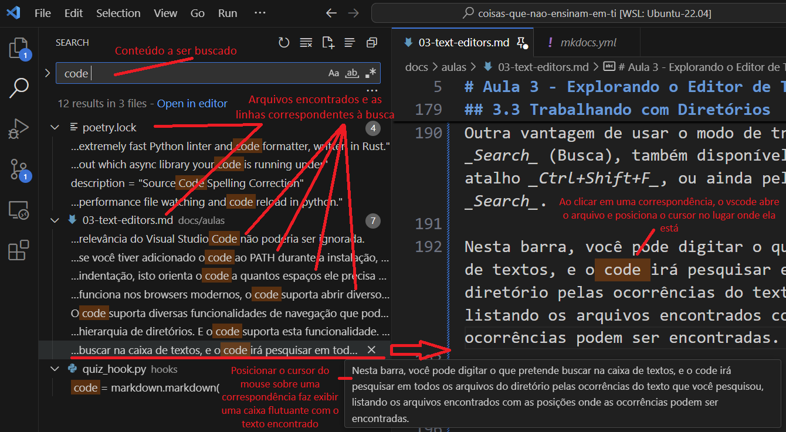

Além disso, esta barra permite fazer substituições, da mesma forma como é possível fazer usando a função Search/Replace no editor individual de um arquivo.

## 3.7 Workspaces

Quando trabalhamos com diretórios, podemos fazer uso de um recurso chamado _Workspace_ (Espaço de Trabalho). O vscode oferece esta funcionalidade para organizarmos configurações que são aplicadas e compartilhadas por todos os arquivos que pertencem a um espaço.

Ao trabalhar em um _Workspace_, o vscode memoriza o layout da janela (quais arquivos estão abertos, o estado dos painéis e barras laterais, etc), configurações específicas daquele _Workspace_ (para o editor, extensões, etc), definições de Tarefas (tasks) e Configurações de Depuração.

As configurações do _Workspace_, quando estamos trabalhando com um diretório, ficam armazenadas em um arquivo _json_ situado em `.vscode/settings.json`, a partir do endereço do diretório aberto.

### 3.7.1 Workspaces com Múltiplos Diretórios Raízes

É possível, também, organizar um Workspace composto por mais de um diretório raiz. A qualquer momento você pode adicionar novos diretórios ao Workspace atual através do menu `File`, clicando na opção `Add Folder to Workspace...`. Quando tiver o Workspace aberto, você pode salvar as configurações clicando no menu `File`, e escolhendo a opção `Save Workspace As...`. Isto irá criar um arquivo com a estensão `.code-workspace`, que é o arquivo que você irá usar quando quiser abrir o workspace novamente, além de ser onde serão mantidas as configurações correspondentes a este workspace.

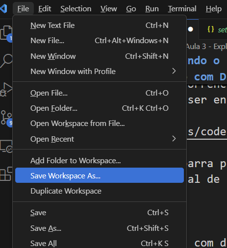

## 3.8 Terminal
O vscode também possui um terminal interno que pode ser usado de forma conveniente, sem que seja necessário sair do editor para executar tarefas no shell. É possível acessar o terminal acionando o menu _View_ e clicando em _Terminal_, ou pelo atalho _Ctrl+'_. O vscode suporta diversos shells em seu terminal, mas irá abrir inicialmente o shell padrão do ambiente em que está rodando.

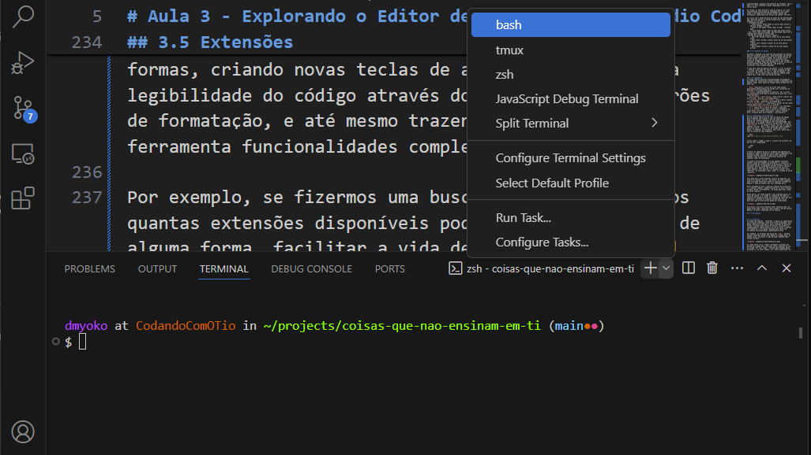

É possível abrir múltiplos terminais no painel _Terminal_, para isto basta clicar no botão `+` para iniciar uma nova instância com o shell padrão, ou clicar no menu suspenso para criar uma nova instância de um terminal usando outro shell. Uma barra lateral à direita do painel irá listar todos os terminais abertos, permitindo alternar entre eles através, clicando naquele que se pretende usar, ou fechá-los através do ícone da lixeira.

É possível também dividir o painel do terminal para visualizar múltiplos terminais simultaneamente. Por último, o botão `^` expande o painel do terminal para ocupar o espaço do editor de arquivos, dando mais espaço para trabalhar no shell.

No 

## 3.9 Layout
Como é o caso de diveras aplicações de produtividade no ambiente gráfico, o vscode suporta diversos 