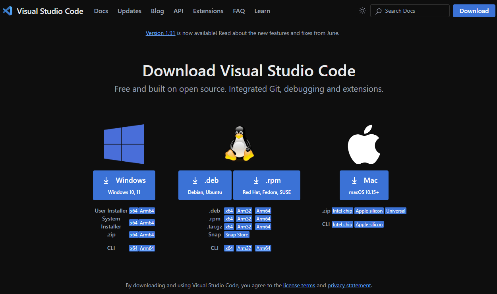

# Aula 3 - Explorando o Editor de Textos (Visual Studio Code)
Escrever um texto (como um documento, ou uma dissertação) e escrever código são atividades distintas. Quando se trabalha com código, você passa mais tempo navegando pelo texto, ou entre arquivos, lendo e interpretando código e, claro, escrevendo código também. Não é à toa que existem ferramentas diferentes para este fim do que aquelas usadas para redigir um texto, como um processador de textos (por exemplo, o Microsoft Word do pacote Office). Processadores de Texto precisam suportar diversas opções de formatação (formatação de fonte, parágrafo, página, etc) que acabam sendo tão importantes quanto o prório texto sendo redigido.

Para trabalhar com código, usamos Editores de Texto. A diferença é que, em código, somente o texto importa. O arquivo mantido no sistema não possui informações de formatação. Não apenas esta informação não é relevante, como ainda não é suportada pelo código em si. Pense nos scripts que fizemos na aula passada, suando o comando `cat > foo.sh`, capturando os comandos que digitávamos no terminal e gravando no arquivo. Imagine se tivéssemos "comprometido" estes comandos com informações como "qual fonte usar", "qual recuo da margem", etc.

Normalmente, quando trabalhamos com código, trabalhamos com arquivos de textos simples. Para ilustrar o que isso significa olhe para a imagem a seguir.

Este é um Processador de Textos (Google Docs, similar ao Microsoft Word), com um texto  simples escrito (o famoso "Olá Mundo!"). Mas se você tentar abrir o conteúdo salvo por este arquivo (no format .doc) em um editor de textos, notará que existem muitas outras informações, a maior parte delas ilegível para um ser humano.

Existe uma forma mais amigável de visualizar este arquivo, usando um decodificador Hexadecimal, mas isto não necessariamente o torna tão legível quanto um arquivo de código.

Editores de texto, por outro lado, não interferem no conteúdo salvo pelo arquivo. Você pode escrever código direto no terminal como fizemos usando o comando `cat`, mas isto provavelmente vai ser pouco produtivo à medida que seus scripts começam a ficar mais complexos, já que o comando `cat` te dá poucas opções de edição.

Existem diversos editores de texto disponíveis. De fato, se você usa o sistema operacional Windows, você provavelmente possui instalado o Bloco de Notas (`notepad.exe`). Este é um editor de textos bastante rudimentar, que te permite criar arquivos de texto como os que usamos para manter código. Mas, justamente por que trabalhamos com código, existem opções ainda mais produtivas.

Existem diversos editores de texto feitos especificamente para trabalhar com código. Você vai encontrar profissionais que gostam de usar `Sublime Text`, ou o `Notepad ++` (que tem a proposta de ser um substituto para o Bloco de Notas do Windows com capacidades de produtividade com código), outros que vão preferir opções de editores de texto que rodam no terminal, como o `vim`, ou o `emacs`. E existem ainda ferramentas mais robustas, chamadas de _IDE_'s (_Integrated Development Environment_, ou, em português, Ambiente de Desenvolvimento Integrado), como o _Visual Studio_ da Microsoft, ou o _IntelliJ_ da JetBrains. Contudo, um editor específico mantém uma relevância significativa no mercado e, por que precisamos falar de alguma ferramenta, eu achei que a relevância do Visual Studio Code não poderia ser ignorada.

De acordo com a pesquisa [_Stackoverflow Developer Survey_ de 2024](https://survey.stackoverflow.co/2024/technology#1-integrated-development-environment), de um total de mais de 58 mil entrevistados, 73,6% responderam que usam _VSCode_ como o editor de código no dia-a-dia. Destes, mais de 44 mil usam profissionalmente, e mais de 6 mil o usam enquanto estão aprendendo a programar. Em ambos os casos, ele destaca sua adoção por mais do que o dobro do segundo colocado.

O VSCode é mantido pela Microsoft, mas é um projeto de código aberto, mantido sob a licença MIT, e que recebe contribuição da comunidade.

!!! important
    É importante dizer que, na indústria, existe uma discussão acalorada sobre opções de editores de código, e vários grupos (principalmente entre as pessoas de programação) são muito opinativos a respeito da escolha por editores. A famosa discussão entre os usuários de _emacs_ e _vim_, tentando estabelecer um como superior ao outro, é um bom exemplo de como as pessoas defendem sua opção na indústria.

    Este curso não pretende estabeler o VSCode como uma opção superior aos demais editores disponíveis. Apesar de ter capacidades de edição de código que não deixam a desejar (e em muitos casos, chega a ter uma excelente experiência de uso), a escolha pelo VSCode se dá somente pela sua adoção e a presença que ele tem no mercado atualmente.

    Editores como Vim ou Emacs, além de não terem a mesma presença que o VSCode tem na indústria, apesar de terem uma comunidade forte de usuários e mantenedores, também possuem uma curva de aprendizado (devido à natureza de como funcionam) que, na minha opinião, ainda que possuam suas vantagens, torna sua adoção uma opção indivudual de quem pretende explorá-los e, eventualmente, adotá-los como preferência.

## 3.1 Instalando o VsCode

Para instalar o VSCode, que roda na maioria das plataformas disponíveis, basta visitar o [site oficial](https://code.visualstudio.com), e se dirigir à página de downloads e clicar no link adequado de acordo com o seu sistema.

A partir daí, basta seguir as [instruções](https://code.visualstudio.com/docs/setup/setup-overview).

!!! Important
    Para instalações no Windows, é importante lembrar-se de manter marcado a opção "Add to PATH" (Adicionar para o PATH). Isso torna o _code_ fácil de iniciar a partir do _shell_, inclusive para quem usa o WSL, como recomendado neste curso.

    

## 3.1 Explorando a interface
Ao abrir o Visual Studio Code, uma página de boas-vindas é exibida como uma aba aberta na janela do editor, muito semelhante a que você pode enxergar abaixo, com algumas diferenças de acordo com o seu uso (na minha, é possível ver alguns dos meus projetos recentes listados, prontos para serem abertos).

A partir desta página, algumas tarefas comuns já estão acessíveis, como criar um novo arquivo, abrir um arquivo existente, abrir um diretório, e até mesmo clonar um repositório _git_. É possível, também, se conectar a outros ambientes, como o WSL, ou remotamente via SSH e outras opções.

Do lado direito, você pode ver alguns guias (_Walkthroughs_), que podem te ajudar a se familiarizar com a interface e o uso do _code_.

No topo da interface, como já é típico de aplicações que rodam em interface gráfica, temos uma barra de menus, com alguns dos menus mais conhecidos, como _Arquivo_, _Editar_ e _Ajuda_. Como esperado, o menu _Arquivo_ exibe mais opções relacionadas a manipulação de arquivos, _Editar_ tem opções úties como _Copiar_, _Colar_, além de outras conveniências de edição, e o menu _Ajuda_, sem nenhuma surpresa, trás informações úteis para quem precisa de algum suporte.

À esquerda, temos a Barra Lateral, com algumas funcionalidades dispostas de forma conveniente, como _Explorador de Arquivos_, _Busca_, _Controle de Código_, o _Depurador_ e o painel de _Extensões_.

Mais abaixo, ainda na _Barra Lateral_, existem as opções de _Configurações_, onde você pode personalizar o _Code_ de acordo com as suas preferências, por exemplo, sua preferência por um tema claro ou escuro (e outras combinações de cores) pode ser ajustada ali. E também existe a opção de usar uma conta (na Microsoft ou no Github) para associar ao seu uso, o que pode ser útil, por exemplo, para manter suas configurações salvas e poder usá-las em um _Code_ instalado em outro computador.

Na barra de status, que fica no rodapé da janela, é possível ver alguns outros atalhos, como o indicador de em que ambiente esta instância está conectada (à esquerda no rodapé) no qual você pode clicar para se conectar (no WSL ou em um computador remoto via _SSH_ ou _Tunnel_), e do outro lado, à direita, existe o indicador de notificações (um ícono no formato de sino), que também pode ser clicado para visualizar as notificações pendentes (como novas atualizações disponíveis, sugestões de extensão, etc.).

Ao lado do indicador de notificações temos o seletor de Modo de Linguagem (que veremos a seguir), temos três outros seletores, sendo eles, da esquerda para a direita:
- Seletor do tipo de quebra de linha
- Seletor do tipo de Encoding
- Seletor do tipo de Indentação (recuo da margem no código)

!!! important
    O _Seletor do Tipo de Linha_ diz respeito a uma característia específica na diferença entre os sistemas operacionais baseados em UNIX (Linux, FreeBSD, MacOS, etc) e os sistemas operacionais da Microsoft (Windows 11, Windows 10, etc.)

    Em sistemas legados, para manter a compatibilidade, a quebra de linha deveria ser _CRLF_ (_Carriage Return and Line Feed_). Mas hoje em dia, onde a portabilidade acaba sendo prioridade, usar somente _LF_ é, via de regra, considerado uma boa prática.

    Se você quiser saber mais sobre este assunto, o vídeo a seguir, do Scott Hanselman, da série [_Computer Stuff They Didn't Teach You_](https://www.youtube.com/playlist?list=PL0M0zPgJ3HSesuPIObeUVQNbKqlw5U2Vr) (Coisas de Computador que não te ensinaram"), fala um pouco mais sobre isto num contexto histórico (em inglês).

    

Para o tipo de _encoding_, o _UTF8_ atualmente é usado como padrão internacional. Iremos abordar Encoding em algum momento do curso, mas não vamos detalhar isto agora. Por padrão, a menos que você esteja lidando com alguma tarefa que exija um tipo de encoding específico, mantenha sempre _UTF8_ selecionado.

No caso da indentação, isto orienta o code a quantos espaços ele precisa exibir sempre que a tecla _TAB_ for pressionada. O seletor também permite usar Espaços no lugar de Tabs, o que é configurado como padrão. Ou seja, sempre que você usar a tecla _TAB_ para adicionar um espaço, ela será substituída pelo número de espaços usados no seletor de indentação (4 por padrão). Você pode mudar isto a qualquer momento, ajustando o seletor para usar TAB em vez de espaços.

## 3.2 O Editor
Sem mais delongas vamos explorar o uso do _Code_ para o que ele se propõe: Editar arquivos.

Vamos começar criando um novo arquivo. Isto pode ser feito de diversas formas:
- Clicando em "Novo Arquivo..." na página de boas-vindas
- Clicando no Menu Arquivo, e escolhendo a opção "Novo Arquivo de Texto"
- Usando as teclas de atalho _Ctrl+N_

Um novo arquivo, sem título, será aberto em uma nova Aba dentro da janela do editor. Um texto é exibido como conteúdo deste arquivo, dizendo que você pode "Selecionar uma Linguagem", "Preencher um Template" ou "Abrir um Editor Diferente". Logo abaixo, o texto também explica que, se você começar a digitar algum conteúdo, esta mensagem irá sumir, e você pode também optar por não exibí-la novamente nas próximas vezes em que criar um novo arquivo.

Selecionar uma linguagem, significa mudar o modo de linguagem do arquivo no qual estamos trabalhando. É possível fazer isto clicando no link do texto, ou também no seletor do modo de linguagem, que fica na barra de status (na borda inferior da janela do code), à direita. Ela começa com a opção "Plain Text" selecionada, mas é possível mudá-la clicando sobre ela, e um menu suspenso será exibido nos permitindo selecionar a linguagem que pretendemos usar. Vamos selecionar "Shell Script", que é o tipo de arquivo com o qual estamos trabalhando atualmente.

Note que o ícone exibido ao lado do nome do arquivo, no título da Aba, mudou para `$`, representando que estamos agora editando um arquivo de Shell Script. Você também vai notar que, à medida que você digita o script no conteúdo do arquivo, o _code_, que agora está informado de que estamos editando um arquivo no modo Shell Script, vai formatar o conteúdo de acordo com a sintaxe de Shell Script.

Podemos, também, abrir um dos scripts que já escrevemos na aula anterior. Para fazer isto, temos algumas opções:
- Voltar à aba com a página Welcome e clicar no link "Open File..."
- Clicar no menu File e selecionar a opção "Open File..."
- Usar as teclas de atalho _Ctrl+O_

Em qualquer uma destas formas, uma caixa de diálogo será exibida para que você possa selecionar o arquivo que deseja abrir. Selecione o arquivo `fancy.sh` que criamos no final da última aula.

Note que o _code_ já identificou o modo de linguagem do arquivo e selecionou "Shell Script". Normalmente o _code_ tenta fazer isto automaticamente quando abrimos um arquivo, baseado na extensão do arquivo aberto. Ou quando salvamos o arquivo em disco (no caso de um arquivo novo), e finalmente atribuímos uma extensão quando lhe damos um nome e, normalmente, ele consegue determinar o modo de linguagem com sucesso. Eventualmente ele pode inferir o modo de linguagem para uma linguagem que não está disponível, e pode sugerir que você procure uma extensão adequada para instalar o modo de linguagem apropriado.

### 3.2.1 Trabalhando com arquivos
Ao começarmos a editar o conteúdo de um arquivo, à medida que alteramos este conteúdo, o _code_ nos indica que existem alterações pendentes através de um sinal de _bullet_ (um pequeno círculo) ao lado do nome do arquivo, no título da aba.

- Comentários
    
    Uma das conveniências de usar um editor adequado quando estamos trabalhando com código, é que ele suporta algumas tarefas comuns, como por exemplo, transformar uma linha de código em um comentário no formato adequado para o Modo de Linguagem que estamos usando. No _code_, o comando para comentarmos uma linha do código (ou remover o comentário dela) é através do atalho _Ctrl+;_, ou no menu _Edit_, na opção _Toggle Line Comment_. Também existe a opção de comentar/remover comentário em blocos, para linguagens que suportam blocos de comentário.

- Mover texto

    É muito comum, enquanto estamos codificando, tomarmos decisões que envolvem mover código para reordenar as instruções que estamos programando. No _code_, uma forma mais fácil de fazer este tipo de movimentação é, com o cursor posicionado na linha que gostaríamos de mover, usando _Alt_ mais as setas para cima ou para baixo, de acordo com a direção em que queremos mover o texto.

    Funciona também com múltiplas linhas do texto, contanto que você as selecione antes de movê-las.

- Copiar texto

    Da mesma forma que o _code_ facilita que possamos mover o texto pelas linhas, para cima ou para baixo, podemos também copiar o conteúdo da linha onde o cursor está posicionado usando as teclas _Shift+Alt_ e a direção para onde queremos que a duplicação seja feita, para cima ou para baixo.

- Cursores

    Não é raro que, enquanto estamos trabalhando com código, nos deparamos com algumas situações em que precisamos aplicar alterações semelhantes em diversas linhas ou diversos lugares do código. O _code_ suporta múltiplos cursores, o que significa que podemos posicionar diversos cursores de edição em lugares distintos do código, e editá-los simultaneamente.

    É possível espalhar cursores diferentes pressionando a tecla _Alt_ e posicionando-os com o mouse, clicando em cada um dos lugares em que queremos um novo cursor. Podemos também, usando as teclas _Ctrl+Alt_ e usando as setas para cima ou para baixo para criar novos cursores na mesma posição nas linhas de cima ou de baixo, de acordo com a direção selecionada.

    Uma vez posicionados, os cursores irão receber tudo o que vc digitar, como se estivesse editando um por um, mas farão isto simultaneamente, o que torna isto uma forma mais produtiva de fazer este tipo de edição. 

- Seleção de coluna

    Quando trabalhamos com dados tabulados em colunas, ou simplesmente quando precisamos selecionar uma área do texto considerando um alinhamento vertical no texto, sem selecionarmos o restante do conteúdo pelas linhas em que queremos trabalhar, usamos a combinação _Shift+Ctrl+Alt_ para fazer a seleção de colunas.

    Isto facilita a edição, não apenas para excluir colunas indesejadas, como também para editá-las de uma única vez (usando a funcionalidade dos múltiplos cursores).

### 3.2.2 Abas

Assim com funciona nos browsers modernos, o code suporta abrir diversos arquivos em Abas diferentes (sim, o tio é velho o suficiente pra saber que, antigamente, os browsers não tinham Abas e era comum ter que lidar com dezenas de janelas abertas em vez de dezenas de abas). A capacidade de manter diversos _buffers_ abertos para manipular um número de arquivos simultaneamente não é, obviamente, uma exclusividade do _code_. Diversos outros editores, como o Atom e o Sublime possuem a mesma funcionalidade, enquanto que editores de terminal, como o Emacs e o Vim, oferecem a mesma capacidade através de outros meios.

No code, as Abas mostram o nome do arquivo, um ícone representando em que modo de linguagem ele está sendo usado, e um botão que te permite fechar aquela Aba facilmente, também possível através do atalho _Ctrl+F4_.

Ao clicar com o botão direito do mouse em uma determinada Aba, diversas opções se tornam disponíveis. Vamos tentar destacar as principais:
- Fechamento de Abas
    - Close others: Fecha todas as outras Abas exceto a Aba que recebeu o clique
    - Close to the Right: Fecha todas as Abas à direita dela
    - Close Saved: Fecha todas as Abas que estão salvas
- Pin: Fixa a Aba selecionada, não aplicando sobre ela os comandos que fecham as outras abas.
- Opções de divisão de painéis (_Split_)
    - Split Up: Divide o editor atual em um novo painel acima
    - Split Down: Divide o editor atual em um novo painel abaixo
    - Split Left: Divide o editor em um novo painel à esquerda
    - Split Right: Divide o editor em um novo painel à direita

### 3.2.3 Painéis do Editor

Um editor (entenda isto como uma Aba editando um arquivo) pode ser dividido em painéis, como destacamos nas opções do menu suspenso quando clicamos com o botão direito no título da Aba. Painéis do Editor nos permitem criar formas de navegar pelo conteúdo do arquivo que estamos editando, ao mesmo tempo que mantemos o cursor na posição em que queremos fazer uma edição, sem deixar de visualizar o que estamos digitando.

O tipo mais comum de painéis de editor é criar um painel à direita. Isto pode ser feito no menu suspenso da Aba, ou através do atalho _Ctrl+K_ e, logo em seguida, _Ctrl+Shift+]_. Mas os outros tipos de painéis também estão disponíveis, como vimos nas opções do menu.

<!-- Menu Go -->
### 3.2.4 Navegação

## 3.3 Activity Bar
### 3.3.1 Explorador de Arquivos
### 3.3.2 Busca
### 3.3.3 Extensões
## 3.4 Painel
### 3.4.1 Problemas
### 3.4.2 Saída
### 3.4.3 Console de depuração
### 3.4.4 Terminal
## 3.5 Layout