Agora vamos explorar o uso do vscode para o que ele se propõe: Editar arquivos.

Vamos começar criando um novo arquivo. Isto pode ser feito de diversas formas:
- Clicando em _New File..._ na página de _Welcome_
- Clicando no Menu _File_, e escolhendo a opção _New Text File_
- Usando as teclas de atalho _Ctrl+N_

Um novo arquivo, sem título, será aberto em uma nova Aba dentro da janela do editor. Um texto é exibido como conteúdo deste arquivo, dizendo que você pode "Selecionar uma Linguagem" (_Select a language_), "Preencher um Template" (_fill with template_) ou "Abrir um Editor Diferente" (_open a different editor_). Logo abaixo, o texto também explica que, se você começar a digitar algum conteúdo, esta mensagem irá desaparecer, e você pode também optar por não exibí-la novamente nas próximas vezes em que criar um novo arquivo (_don't show this again_).

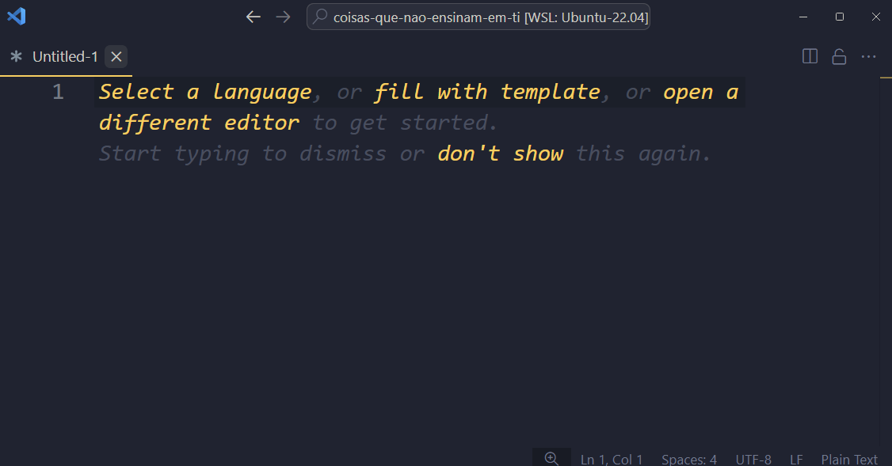

Selecionar uma linguagem, significa mudar o modo de linguagem do arquivo no qual estamos trabalhando. É possível fazer isto clicando no link do texto, ou também no seletor do modo de linguagem, que fica na barra de status (na borda inferior da janela do vscode), à direita. Ela começa com a opção "Plain Text" selecionada, mas é possível mudá-la clicando sobre ela, e um menu suspenso será exibido nos permitindo selecionar a linguagem que pretendemos usar. Vamos selecionar "Shell Script", que é o tipo de arquivo com o qual estamos trabalhando atualmente.

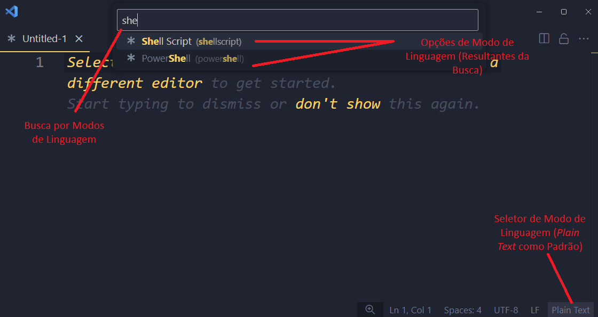

Note que o ícone exibido ao lado do nome do arquivo, no título da Aba, mudou, representando que estamos agora editando um arquivo de _Shell Script_. Você também vai notar que, à medida que você digita o script no conteúdo do arquivo, o vscode, que agora está informado de que estamos editando um arquivo no modo Shell Script, vai formatar o conteúdo de acordo com a sintaxe.

Podemos, também, abrir um dos scripts que já escrevemos na aula anterior. Para fazer isto, temos algumas opções:
- Voltar à aba com a página Welcome e clicar no link "Open File..."
- Clicar no menu File e selecionar a opção "Open File..."
- Usar as teclas de atalho _Ctrl+O_

Em qualquer uma destas formas, uma caixa de diálogo será exibida para que você possa selecionar o arquivo que deseja abrir. Selecione o arquivo `fancy.sh` (que criamos no final da última aula) para abrí-lo.

Note que o vscode já identificou o modo de linguagem do arquivo e selecionou "Shell Script". Normalmente o vscode tenta fazer isto automaticamente quando abrimos um arquivo, baseado na extensão do arquivo aberto. Ou quando salvamos o arquivo em disco (no caso de um arquivo novo), e finalmente atribuímos uma extensão quando lhe damos um nome. Normalmente, ele consegue determinar o modo de linguagem com sucesso. Eventualmente ele pode inferir o modo de linguagem para uma linguagem que ainda não é suportada, e pode sugerir que você procure uma extensão adequada para instalar o modo de linguagem apropriado.

!!! note
	Por padrão, o vscode suporta _JavaScript_, _TypeScript_, _HTML_, _CSS_, _SCSS_ e _JSON_, mas, como veremos adiante, é possível instalar suporte à inúmeras outras linguagens.

## 3.2.1 - Trabalhando com arquivos
Ao começarmos a editar o conteúdo de um arquivo, à medida que alteramos este conteúdo, o vscode nos indica que existem alterações pendentes através de um sinal de _bullet_ (um pequeno círculo) ao lado do nome do arquivo, no título da aba.

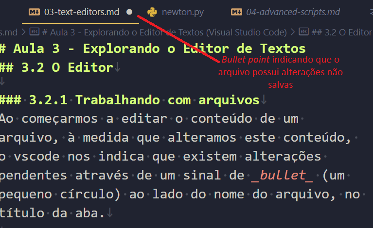

- Mover texto

    É muito comum, enquanto estamos codificando, tomarmos decisões que envolvem mover código para reordenar as instruções que estamos programando. No vscode, uma forma mais fácil de fazer este tipo de movimentação é, com o cursor posicionado na linha que gostaríamos de mover, usando _Alt_ mais as setas para cima ou para baixo, de acordo com a direção em que queremos mover o texto.

    Funciona também com múltiplas linhas do texto, contanto que você as selecione antes de movê-las.

- Copiar texto

    Da mesma forma que o vscode facilita que possamos mover o texto pelas linhas, para cima ou para baixo, podemos também copiar o conteúdo da linha onde o cursor está posicionado usando as teclas _Shift+Alt_ e a direção para onde queremos que a duplicação seja feita, para cima ou para baixo.

- Cursores

    Não é raro que, enquanto estamos trabalhando com código, nos deparamos com algumas situações em que precisamos aplicar alterações semelhantes em diversas linhas ou diversos lugares do código. O vscode suporta múltiplos cursores, o que significa que podemos posicionar diversos cursores de edição em lugares distintos do código, e editá-los simultaneamente.

    É possível espalhar cursores diferentes pressionando a tecla _Alt_ e posicionando-os com o mouse, clicando em cada um dos lugares em que queremos um novo cursor.
    
    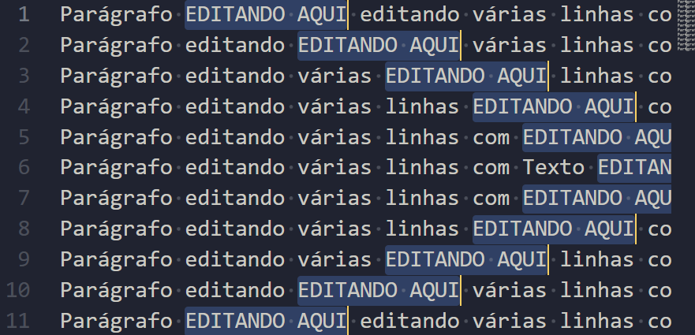
    
    Podemos fazer isto também, usando as teclas _Ctrl+Alt_ e usando as setas para cima ou para baixo para criar novos cursores na mesma posição nas linhas de cima ou de baixo, de acordo com a direção selecionada.
    
    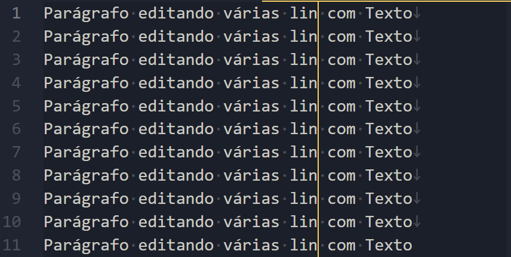

    Uma vez posicionados, os cursores irão receber tudo o que você digitar, como se estivesse editando um por um, mas farão isto simultaneamente, o que torna isto uma forma mais produtiva de fazer este tipo de edição.

- Seleção de coluna

    Quando trabalhamos com dados tabulados em colunas, ou simplesmente quando precisamos selecionar uma área do texto considerando um alinhamento vertical no texto, sem selecionarmos o restante do conteúdo pelas linhas em que queremos trabalhar, usamos a combinação _Shift+Ctrl+Alt_ para fazer a seleção de colunas.

    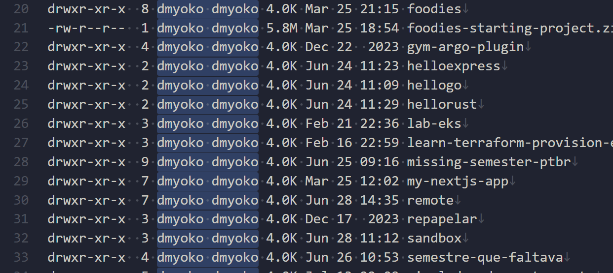

    Isto facilita a edição, não apenas para excluir colunas indesejadas, como também para editá-las de uma única vez (usando a funcionalidade dos múltiplos cursores).

- Busca/Substituição

    Com certa frequência, precisamos encontrar uma ou diversas ocurrências de certos termos no texto, seja para fazer referências a estes pontos específicos ou para fazer ajustes tardios.

    Para fazer uma busca por termos no conteúdo do arquivo aberto no editor atual, podemos acionar o Menu _Edit_ e clicar em _Find_, ou usar o atalho _Ctrl+F_.

    

    Entre as opções de busca podemos ajustar:
    - `Match Case`: Combinação de Maiúsculas e minúsculas, indica se o texto procurado precisa corresponder ou não à caixa do texto.
    - `Match Whole Word`: Combinação de palavras inteiras, encontra correspondências apenas em palavras completas
    - `Use Regular Expression`: Combinação de Expressões Regulares, é um mecanismo de busca mais avançado usando _RegEx_, algo que veremos mais pra frente neste curso.

    Para fazer substituições, podemos acionar o Menu _Edit_ e clicar em _Replace_, ou usar o atalho _Ctrl+H_.

    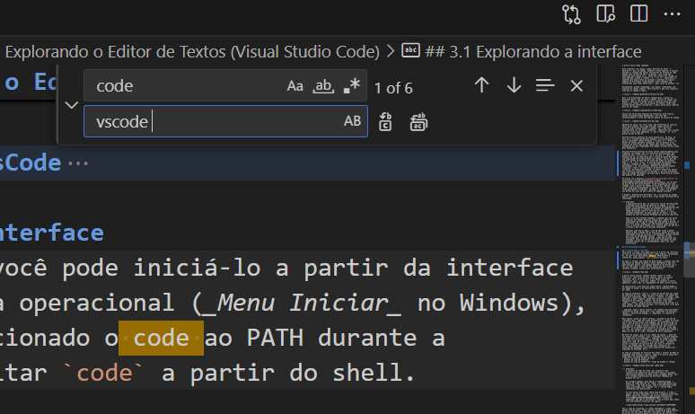

    As opções são bastante semelhantes às opções disponíveis na busca, mas apresenta uma segunda caixa de texto para entrar com o novo texto que será usado para substituir o termo buscado, e duas novas opções são apresentadas:

    - `Replace`: Aplica a substituição na ocorrência selecionada (e automaticamente move para a próxima ocorrência)
    - `Replace All`: Aplica a substituição em todas as ocorrências

    Outra forma rápida para buscar e editar múltiplas ocorrências de texto é selecionando o texto desejado e pressionando _Ctrl+D_. Ele vai selecionar a próxima ocorrência do termo selecionado e manter o cursor em ambas. Pressionar _Ctrl+D_ novamente vai fazer o mesmo para a próxima ocorrência, e assim sucessivamente, para todas as ocorrências que você desejar editar.

- Salvamento e Restauração de Arquivos

    O vscode precisa de uma ação deliberada do usuário para salvar os arquivos:
    - Através do menu _File_, na opção _Save_ (ou _Ctrl+S_) para salvar o arquivo que está sendo editado na aba selecionada
    - Através do menu _File_, na opção _Save All_ (ou _Ctrl+K S_) para salvar todos os arquivos abertos

    Mas existe uma funcionalidade de Salvamento Automático disponível, que fica desligada como padrão. Para ajustá-la, caso seja do seu interesse, basta entrar em Settings e buscar por `Auto Save`. Ela suporta os seguintes valores:
    - `off`: desligado (valor padrão)
    - `afterDelay`: Salva o arquivo depois que se passa um tempo (1000 milissegundos por padrão), para ajustar este valor, existe outra configuração chamada _Files: Auto Save Delay_
    - `onFocusChange`: Salva o arquivo sempre que você mover para outro editor (outra Aba)
    - `onWindowsChange`: Salva o arquivo sempre que você mover para outra janela para fora da instância atual do vscode

    Independente disto, quando fechado, o vscode guarda as alterações pendentes nos arquivos abertos de forma que, quando você abre novamente o editor, ele recupera as alterações não salvas do arquivo, permitindo que você decida se quer mantê-las ou descartá-las mesmo depois de tê-lo fechado.

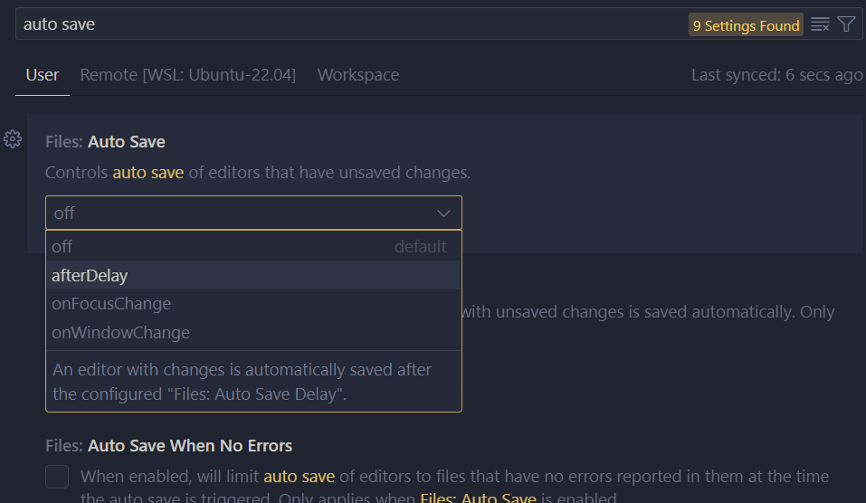

- Prevenindo Escritas "Sujas" (_Dirty Writes_)

    O vscode é capaz de detectar se, durante a edição do arquivo, seu conteúdo tiver alterado no disco, e vai te avisar disto exibindo uma mensagem de erro quando você tentar salvar o arquivo por cima da versão alterada.

    

    Se você quiser ignorar as alterações que foram feitas fora do editor, e simplesmente salvar as suas alterações, você consegue fazer isto clicando no botão _Overwrite_. Se quiser, no entanto, tomar o cuidado de conferir as alterações, você pode clicar em _Compare_. Isto irá abrir o editor de _diff_ do vscode, que mostra as diferenças entre os arquivos e te permite navegar por elas para decidir o que pretende fazer.

    

    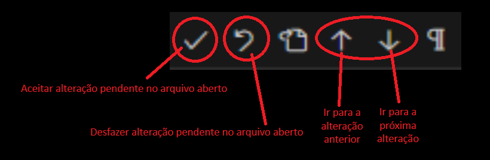

    Uma vez resolvidos conflitos gerados por causa das diferenças, o arquivo é salvo e o editor _diff_ é fechado.

- Rolagem

    No vscode, você pode exibir um minimapa do código no lugar da barra de rolagem. Para algumas pessoas, esta pode ser uma forma conveniente de ter uma visualização do arquivo de texto em miniatura, e ter uma ideia geral de como ele está ficando. Para isto, basta entrar em _Settings_, na barra de busca digitiar `minimap` e marcar a caixa de seleção com o texto `Editor: Minimap > Enabled`. Além disso, existem diversas opções quer personalizam a forma como o minimapa é exibido.
    
    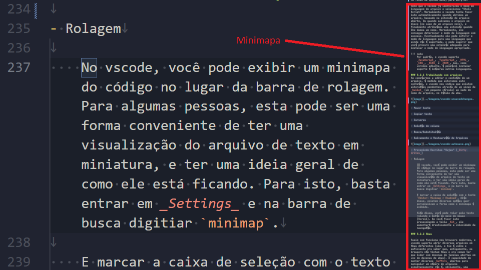

    Independente de você usar o Minimapa ou a barra de rolagem convencional, você também pode rolar pelo texto usando o botão do meio do mouse (Scroll) pressionando a tecla _Alt_, ele aumentará drasticamente a velocidade da navegação.

## 3.2.2 - Abas

Assim com funciona nos browsers modernos, o vscode suporta abrir diversos arquivos em Abas diferentes (sim, o tio é velho o suficiente pra saber que, antigamente, os browsers não tinham Abas e era comum ter que lidar com dezenas de janelas abertas em vez de dezenas de abas). A capacidade de manter diversos _buffers_ abertos para manipular um número de arquivos simultaneamente não é, obviamente, uma exclusividade do vscode. Diversos outros editores, como o Atom e o Sublime possuem a mesma funcionalidade, enquanto que editores de terminal, como o Emacs e o Vim, oferecem a mesma capacidade através de outros meios.

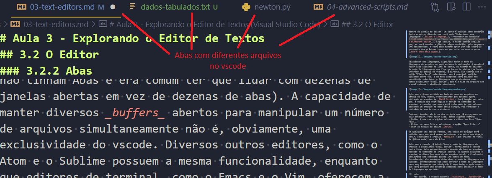

No vscode, as Abas mostram o nome do arquivo, um ícone representando em que modo de linguagem ele está sendo usado, e um botão que te permite fechar aquela Aba facilmente, também possível através do atalho _Ctrl+F4_.

Ao clicar com o botão direito do mouse em uma determinada Aba, diversas opções se tornam disponíveis. Vamos tentar destacar as principais:
- Fechamento de Abas
    - _Close others_: Fecha todas as outras Abas exceto a Aba que recebeu o clique
    - _Close to the Right_: Fecha todas as Abas à direita dela
    - _Close Saved_: Fecha todas as Abas que estão salvas
- _Pin_: Fixa a Aba selecionada, não aplicando sobre ela os comandos que fecham as outras abas.
- Opções de divisão de painéis do editor (_Split_)
    - _Split Up_: Divide o editor atual em um novo painel acima
    - _Split Down_: Divide o editor atual em um novo painel abaixo
    - _Split Left_: Divide o editor em um novo painel à esquerda
    - _Split Right_: Divide o editor em um novo painel à direita

A seguir, vamos discutir melhor o que são os painéis do editor.

## 3.2.3 - Painéis do Editor

Um editor (entenda isto como uma Aba editando um arquivo) pode ser dividido em painéis, como destacamos nas opções do menu suspenso quando clicamos com o botão direito no título da Aba. Painéis do Editor nos permitem criar formas de navegar pelo conteúdo do arquivo que estamos editando, ao mesmo tempo que mantemos o cursor na posição em que queremos fazer uma edição, sem deixar de visualizar o que estamos digitando.

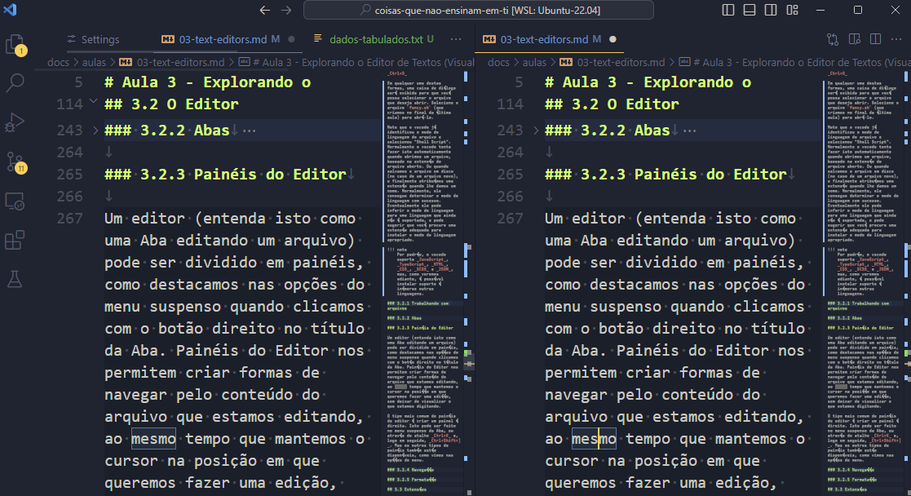

O tipo mais comum de painéis de editor é criar um painel à direita (como na imagem acima). Isto pode ser feito no menu suspenso da Aba, ou através do atalho _Ctrl+K_ e, logo em seguida, _Ctrl+Shift+]_ (este atalho cria um painel à direita _em grupo_, ou seja, na mesma aba). Mas os outros tipos de painéis também estão disponíveis, como vimos nas opções do menu.

## 3.2.4 - Navegação
O vscode suporta diversas funcionalidades de navegação que podem ser convenientes. Vamos falar agora de algumas delas disponíveis no Menu _Go_.

- `Back`: Posiciona o cursor de volta onde estava posicionado anteriormente de acordo com o histórico de posições (_Ctrl+Seta Esquerda_)
- `Forward`: Semelhantemente ao anterior, faz o cursor ser posicionado avançando no histórico de posições (_Ctrl+Seta Direita_)
- `Switch Editor > Next Editor`: Avança para o editor que está na Aba à direita (_Ctrl+Page Down_)
- `Switch Editor > Previous Editor`: Avança para o editor que está na Aba à esquerda (_Ctrl+Page Up_)
- `Go to Line/Column...`: Posiciona o cursor em uma linha/coluna específicas (_Ctrl+G_). A notação é `:<número-da-linha>[:<número-da-coluna>]` (os colchetes `[` e `]` indica que o número da coluna é opcional)
- `Go to Bracket`: Posiciona o cursor no fechamento do grupo atual (colchetes, parênteses, chaves, markups, etc). O atalho para este comando é _Ctrl+Shift+]_.

## 3.2.5 - Formatação
Diversas linguagens possuem padrões próprios de formatação. A forma como as linhas de código são organizadas, e certos estilos estéticos que são definidos pela comunidade que as mantém.

O vscode possui um comando para formatar o código do editor, disponível na Paleta de Comandos pelo atalho _Ctrl+Shift+P_, e buscando pelo comando _Format Document_, ou pelo atalho _Shift+Alt+F_.

Para formatar um documento qualquer, o vscode precisa ter informações de qual o formatador capaz de fazer a tarefa. Para isto, uma extensão contendo o devido formatador pode ser necessária. Para o caso de Python, eu usei a extensão _Black Formatter_.

Sem um formatador disponível, o vscode não é capaz de realizar a formatação.

Observe os efeitos da formatação no arquivo `newton.py` quando usamos o _Black Formatter_.
