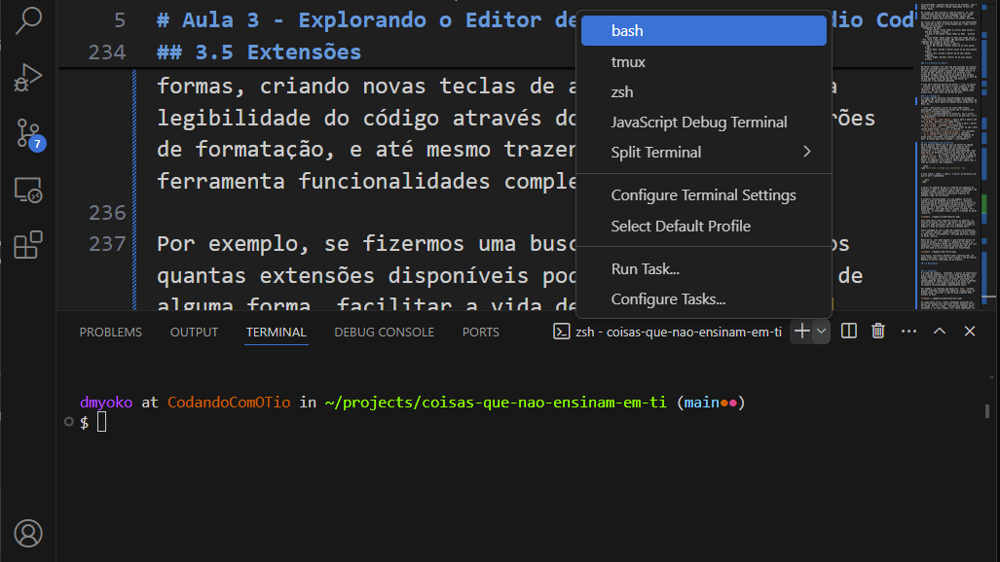

O vscode também possui um terminal interno que pode ser usado de forma conveniente, sem que seja necessário sair do editor para executar tarefas no shell. É possível acessar o terminal acionando o menu _View_ e clicando em _Terminal_, ou pelo atalho _Ctrl+'_. O vscode suporta diversos shells em seu terminal, mas irá abrir inicialmente o shell padrão do ambiente em que está rodando.

É possível abrir múltiplos terminais no painel _Terminal_, para isto basta clicar no botão `+` para iniciar uma nova instância com o shell padrão, ou clicar no menu suspenso para criar uma nova instância de um terminal usando outro shell. Uma barra lateral à direita do painel irá listar todos os terminais abertos, permitindo alternar entre eles, clicando naquele que se pretende usar, ou fechá-los através do ícone da lixeira.

É possível também dividir o painel do terminal para visualizar múltiplos terminais simultaneamente.

Por último, o botão `^` expande o painel do terminal para ocupar o espaço do editor de arquivos, dando mais espaço para trabalhar no shell.
