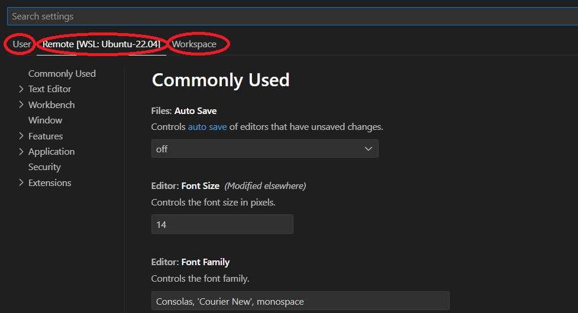
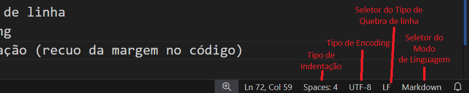

Para abrir o vscode, você pode iniciá-lo a partir da interface gráfica do seu sistema operacional (_Menu Iniciar_ no Windows), ou, se você tiver adicionado o vscode ao PATH durante a instalação, basta digitar `code` a partir do shell.

Ao abrir o vscode, a página de boas-vindas (_Welcome_) é exibida como uma aba aberta na janela do editor, muito semelhante a que você pode enxergar abaixo, com algumas diferenças de acordo com o seu uso (na minha, é possível ver alguns dos meus projetos recentes listados, prontos para serem abertos).

A partir desta página, algumas tarefas comuns já estão acessíveis, como criar um novo arquivo, abrir um arquivo existente, abrir um diretório, e até mesmo clonar um repositório _git_. É possível, também, se conectar a outros ambientes, como o WSL, ou remotamente via SSH e outras opções.

Do lado direito, você pode ver alguns guias (_Walkthroughs_), que podem te ajudar a se familiarizar com a interface e o uso do vscode.

No topo da interface, como já é típico de aplicações que rodam em interface gráfica, temos uma barra de menus, com alguns dos menus mais conhecidos, como _File_, _Edit_ e _Help_. Como esperado, o menu _File_ exibe mais opções relacionadas a manipulação de arquivos, _Edit_ tem opções úties como Copiar, Colar, além de outras conveniências de edição, e o menu _Help_, sem nenhuma surpresa, trás informações úteis para quem precisa de algum suporte.

À esquerda, temos a Barra Lateral, com algumas funcionalidades dispostas de forma conveniente, como Explorador de Arquivos, Busca, Controle de Código, o Depurador e o painel de Extensões.

Mais abaixo, ainda na Barra Lateral, existem os botões de Contas (_Accounts_) e Gerenciamento (_Management_). O botão de Contas permite você usar algum serviço de contas (Microsoft ou Github) para se autenticar e ter a possibilidade, por exemplo, de guardar as configurações do vscode em um repositório da internet, tornando possível resgatar estas configurações em outro dispositivo, por exemplo, e sincronizá-lo com as suas preferências configuradas previamente.

Já no menu de Gerenciamento, você consegue acessar a Paleta de Comandos (também usando _Ctrl+Shift+P_), alternar entre diferentes Perfis (_Profiles_), personalizar as configurações do vscode, definir associações de teclas de atalho (_Keyboard Shortcuts_), templates de trechos de código (_snippets_), definir Tarefas (_Tasks_), escolher um tema de cores ou de ícones de arquivos, sincronizar suas configurações e atualizar a instalação do vscode no seu dispositivo.

A Paleta de Comandos é um dos recursos mais ricos do vscode, pois ela lista inúmeros comandos disponíveis no editor, alguns deles acessíveis somente através dela. Já a escolha por diferentes Perfis permite que você mantenha configurações diferentes do vscode agrupadas, como um perfil para uso quando trabalhando em projetos de uma organização, e outro para projetos open source ou de uso pessoal, por exemplo.

A janela de configurações do vscode mostra outras formas de agrupar as configurações:
- configurações globais no sistema onde ele está rodando
- configurações no escopo do usuário que está usando o editor (sobrepõem as configurações globais)
- configurações do Espaço de Trabalho (_Workspace_) aberto (sobrepõem as configurações do usuário)

Falaremos sobre Espaços de Trabalho mais adiante.

Em qualquer um dos três escopos, há uma extensa lista para configurar o editor, as extensões instaladas e diversos outros aspectos de uso. Você pode navegar por elas através dos menus colapsáveis à esquerda, ou buscando as configurações desejadas no campo de busca.

Para escolher entre temas, o vscode oferece alguns temas de cores e ícones de arquivos pré-instalados, mas outros podem ser inseridos a partir de extensões. Por exemplo, você pode baixar a extensão _Ayu_, que instala temas de cores e ícones minimalistas para trabalhar com vscode.

Por último, a opção de Teclas de Atalho abre a janela _Keyboard Shortcuts_, que lista todos os mapeamentos de teclas de atalho para comandos do vscode. É possível pesquisar pelos atalhos disponíveis, editar as configurações e reassociar teclas de acordo com a sua preferência.

Falaremos sobre Tarefas (_Tasks_) e Trechos de Código (_Snippets_) mais adiante.

Na barra de status, que fica no rodapé da janela, é possível ver alguns outros atalhos, como o indicador de em que ambiente esta instância está conectada (à esquerda no rodapé) no qual você pode clicar para se conectar (no WSL ou em um computador remoto via _SSH_ ou _Tunnel_), e do outro lado, à direita, existe o indicador de notificações (um ícone no formato de sino), que também pode ser clicado para visualizar as notificações pendentes (como novas atualizações disponíveis, sugestões de extensão, etc.).

Ao lado do indicador de notificações temos o seletor de Modo de Linguagem (que veremos a seguir), temos três outros seletores, sendo eles, da direita para a esquerda:
- Seletor do tipo de quebra de linha
- Seletor do tipo de Encoding
- Seletor do tipo de Indentação (recuo da margem no código)

!!! important
	O _Seletor do Tipo de Linha_ diz respeito a uma característia específica na diferença entre os sistemas operacionais baseados em UNIX (Linux, FreeBSD, MacOS, etc) e os sistemas operacionais da Microsoft (Windows 11, Windows 10, etc.)

	Em sistemas legados, para manter a compatibilidade, a quebra de linha deveria ser _CRLF_ (_Carriage Return and Line Feed_). Mas hoje em dia, onde a portabilidade acaba sendo prioridade, usar somente _LF_ é, via de regra, considerado uma boa prática.

	Se você quiser saber mais sobre este assunto, o vídeo a seguir, do Scott Hanselman, da série [_Computer Stuff They Didn't Teach You_](https://www.youtube.com/playlist?list=PL0M0zPgJ3HSesuPIObeUVQNbKqlw5U2Vr) (Coisas de Computador que não te ensinaram"), fala um pouco mais sobre isto num contexto histórico (em inglês).

	

Para o tipo de _encoding_, o _UTF8_ atualmente é usado como padrão internacional. Iremos abordar Encoding em algum momento do curso, mas não vamos detalhar isto agora. Por padrão, a menos que você esteja lidando com alguma tarefa que exija um tipo de encoding específico, mantenha sempre _UTF8_ selecionado.

No caso da indentação, isto orienta o vscode a quantos espaços ele precisa exibir sempre que a tecla _TAB_ for pressionada. O seletor também permite usar Espaços no lugar de Tabs, o que é configurado como padrão. Ou seja, sempre que você usar a tecla _TAB_ para adicionar um espaço, ela será substituída pelo número de espaços usados no seletor de indentação (4 por padrão). Você pode mudar isto a qualquer momento, ajustando o seletor para usar TAB em vez de espaços.
