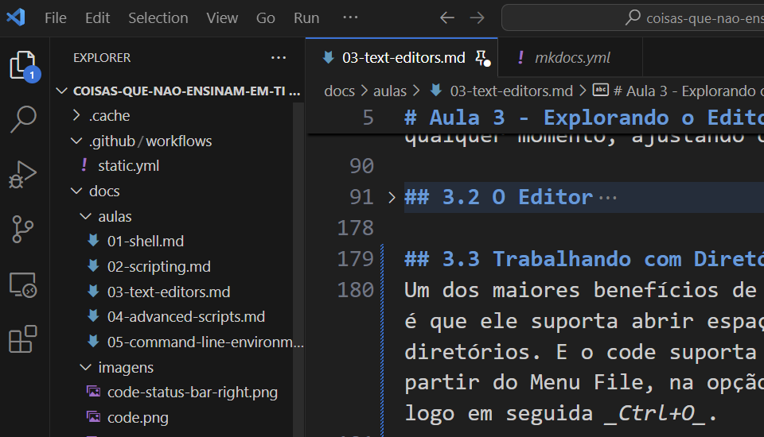
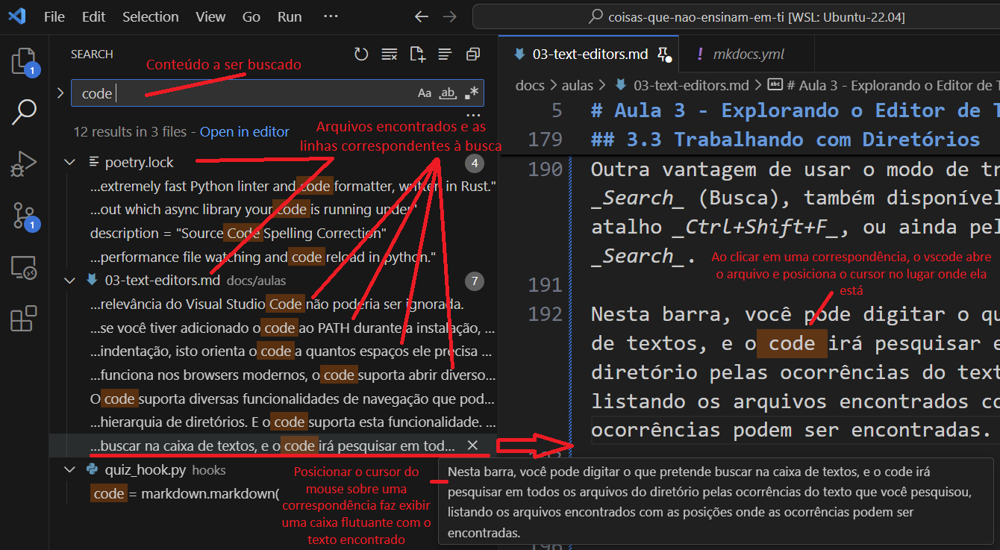

Um dos maiores benefícios de usar um editor de código é que ele suporta abrir espaços de trabalho baseados em uma hierarquia de diretórios. E o vscode suporta esta funcionalidade. Você pode abrir um diretório a partir do Menu File, na opção `Open Folder...`, ou usando o atalho _Ctrl+K_ e, logo em seguida _Ctrl+O_. Mas, o mais comum para quem trabalha a partir do shell, é usar o CLI do vscode para abrir o editor e trabalhar no diretório. Para isto, basta usar o nome do ditetório como argumento:

```bash
code foo # abre o vscode com o diretório `foo`
```

O mais comum é chamar o code já a partir do diretório em que se está trabalhando:

 ```bash
 code .
 ```

A partir do momento em que se trabalha num ambiente de diretório, todos os arquivos com os quais trabalhamos são tratados usando o diretório aberto como referência. Podemos criar diretórios e posicionar arquivos em qualquer lugar da hierarquia.

A primeira funcionalidade útil que podemos verificar usando o modo de trabalho em diretório é o _Explorer_, uma visualização da hierarquia de diretórios a partir do diretório aberto, normalmente situado na Barra Lateral, à esquerda. Se o Explorer não estiver visível pra você neste momento, você pode abrí-lo usando o atalho _Ctrl+Shift+E_, ou acessando o menu _View_ e clicando na opção _Explorer_.



Você pode abrir novos arquivos através do explorer, ou através do atalho _Ctrl+P_, que abrirá um menu suspenso onde você pode selecionar entre os arquivos listados ou digitar o nome do arquivo que você pretende abrir.

Outra vantagem de usar o modo de trabalho em diretórios, é o _Search_ (Busca), também disponível na barra lateral, ou pelo atalho _Ctrl+Shift+F_, ou ainda pelo menu _View_ na opção _Search_.

Nesta barra, você pode digitar o que pretende buscar na caixa de textos, e o vscode irá pesquisar em todos os arquivos do diretório pelas ocorrências do texto que você pesquisou, listando os arquivos encontrados com as posições onde as ocorrências podem ser vistas.



Além disso, esta barra permite fazer substituições, da mesma forma como é possível fazer usando a função _Search/Replace_ no editor individual de um arquivo.
