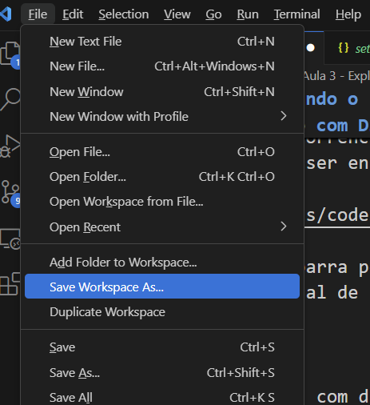

Quando trabalhamos com diretórios, podemos fazer uso de um recurso chamado _Workspace_ (Espaço de Trabalho). O vscode oferece esta funcionalidade para organizarmos configurações que são aplicadas e compartilhadas por todos os arquivos que pertencem a um espaço.

Ao trabalhar em um _Workspace_, o vscode memoriza o layout da janela (quais arquivos estão abertos, o estado dos painéis e barras laterais, etc), configurações específicas daquele _Workspace_ (para o editor, extensões, etc), definições de Tarefas (tasks) e Configurações de Depuração.

As configurações do _Workspace_, quando estamos trabalhando com um diretório, ficam armazenadas em um arquivo _json_ situado em `.vscode/settings.json`, a partir do endereço do diretório aberto.

### 3.6.1 - Workspaces com Múltiplos Diretórios Raízes

É possível, também, organizar um Workspace composto por mais de um diretório raiz. A qualquer momento você pode adicionar novos diretórios ao Workspace atual através do menu `File`, clicando na opção `Add Folder to Workspace...`. Quando tiver o Workspace aberto, você pode salvar as configurações clicando no menu `File`, e escolhendo a opção `Save Workspace As...`. Isto irá criar um arquivo com a estensão `.code-workspace`, que é o arquivo que você irá usar quando quiser abrir o workspace novamente, além de ser onde serão mantidas as configurações correspondentes a este workspace.

