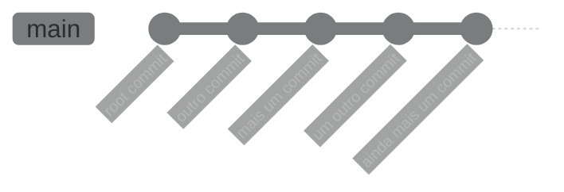

Então, o que é um commit?

No git, nossos commits são registros de mudanças no nosso repositório ao longo do tempo, contendo os metadados que apresentamos recentemente e, junto com eles, uma representação do estado do diretório raiz do projeto, representado por uma estrutura chamada "Árvore" (_Tree_). Uma árvore é composta por elementos que podem ser _blobs_ (_Binary Large OBject_, ou Grande Objeto Binário), que representam os arquivos e outras árvores (representando os subdiretórios), contendo outros blobs e árvores, de acordo com a estrutura de diretórios do projeto.

Desta forma, o commit é capaz de, a qualquer momento, reconstruir o estado do diretório como estava quando ele foi criado.

Vamos testar um exemplo disto. Apague o arquivo `README.md` que acabamos de criar e incluir no commit.

```bash
rm README.md
git status
```

Para variar, o `git status` nos informa sobre coisas que aconteceram no diretório, e que ainda não foram registradas no repositório. Supondo que você se dê conta de que apagou o arquivo por acidente, o git permite que você desfaça este acidente.

```bash
git restore README.md
ls -lh
```

Note que o arquivo voltou a estar presente no diretório, como se você nunca o tivesse excluído. Mas vamos supor um cenário ainda mais problemático: você excluiu o arquivo e, confiante de que estava tudo certo, criou um commit para registrar a exclusão dele no repositório.

```bash
git rm README.md
git status
```

Desta vez removemos o arquivo com o comando `git rm`, que não apenas o remove disco como ainda adiciona a alteração na área de _staging_. O comando `git status` também orienta como você pode desfazer esta operação sem efetuar o commit, usando o comando `git restore --staged README.md`. Fique à vontade para testar o comando se quiser, mas não se esqueça de voltar a fazer a remoção novamente antes de prosseguir.

Então, vamos criar um commit registrando a remoção. Desta vez, vamos digitar a mensagem do commit pela própria linha de comando através da opção `-m`:

```bash
git commit -m "Removendo o arquivo README.md"
git log
```

E agora vamos analisar o log:
```
commit bf417792cc6fd15b428a9ce466c7bb2e8a812942 (HEAD -> main)
Author: Daniel Moreira Yokoyama <792153+moreirayokoyama@users.noreply.github.com>
Date:   Sat Aug 10 23:43:08 2024 -0300

	Removendo o README.md

commit e1c705034ed7eb64cf9305f360f36fe0ba94a0f6
Author: Daniel Moreira Yokoyama <792153+moreirayokoyama@users.noreply.github.com>
Date:   Sat Aug 10 10:58:38 2024 -0300

	Criação do arquivo README.md, descrevendo projeto.
```

Vemos agora dois commits. O primeiro que fizemos anteriormente aparece mais abaixo, mas no topo da lista está o commit que acabamos de fazer. O histórico exibido pelo `git log` é exibido na ordem decrescente, com os commits mais recentes no topo. Note que, neste momento, a marcação `(HEAD -> main)` se encontra no commit mais recente.

_HEAD_ (cabeça em inglês), é um termo usado para indicar com qual commit do repositório o seu diretório está sendo comparado como referência para acompanhar as mudanças no momento. Na maior parte do tempo você vai querer que o HEAD aponte para o commit mais recente. Mas haverão situações em que você pode querer que este não seja o caso, como é o exemplo que estamos tentando simular agora.

Da mesma forma, a marcação da `main` também indica para em qual estado a branch main se encontra. Isto vai ficar um pouco mais claro quando estivermos trabalhando com branches. Por ora, vamos apenas seguir tentando entender como o histórico funciona.

Vamos olhar para ambos os commits que temos em mãos e entender como podemos obter mais informações deles a partir do git. O comando `git log` pode nos informar os commits em diversos níveis de detalhes. O nível mais detalhado que temos é o `raw`, que mostra todos os metadados de um commit. Para isto, podemos rodar o comando novamente com a seguinte opção:

```bash
git log --pretty=raw
```

E vamos observar como isto altera a saída do log:
```
commit bf417792cc6fd15b428a9ce466c7bb2e8a812942
tree 4b825dc642cb6eb9a060e54bf8d69288fbee4904
parent e1c705034ed7eb64cf9305f360f36fe0ba94a0f6
author Daniel Moreira Yokoyama <792153+moreirayokoyama@users.noreply.github.com> 1723344188 -0300
committer Daniel Moreira Yokoyama <792153+moreirayokoyama@users.noreply.github.com> 1723344188 -0300

	Removendo o README.md

commit e1c705034ed7eb64cf9305f360f36fe0ba94a0f6
tree f93e3a1a1525fb5b91020da86e44810c87a2d7bc
author Daniel Moreira Yokoyama <792153+moreirayokoyama@users.noreply.github.com> 1723298318 -0300
committer Daniel Moreira Yokoyama <792153+moreirayokoyama@users.noreply.github.com> 1723298318 -0300

	Criação do arquivo README.md, descrevendo projeto.
```

Não é tão diferente do que havíamos visto anteriormente. Mas existem algumas informações novas: `tree`, `parent` e `committer`.

O campo `tree` indica o id da versão da árvore contida no commit. O campo `parent` indica o commit "pai" (o gênero aqui é uma mera questão de tradução) do commit que estamos analisando. Note que o primeiro commit que fizemos não possui um _parent_. Isto por que ele foi o primeiro commit que fizemos, considerado _root-commit_ (commit raiz). Mas o segundo commit registra as mudanças que fizemos a partir do primeiro, ou seja, usando o primeiro como um referencial para onde as mudanças que o novo commit foram aplicadas. Podemos conferir que o valor do campo _parent_ no segundo commit é idêntico ao id do primeiro commit.

Isso nos leva a uma outra informação sobre como o git organiza os dados do repositório. Os commits apontam para árvores, mas eles também apontam para um commit "pai", que é basicamente a "foto" do estado anterior à mudança que este commit está registrando. Os commits formam uma estrutura de dados chamada Grafo Acíclico Dirigido (do inglês _Directed Acyclic Graph_, ou _DAG_). A princípio, por hora, você pode imaginar este grafo apenas como uma linha do tempo marcando os commits:



O campo `comitter`, por outro lado, é algo um pouco mais complexo, que iremos falar melhor quando conversarmos sobre o uso de git em times de desenvolvimento. Na maior parte dos casos _comitter_ terá o mesmo valor do campo _author_. Ao longo deste curso este vai ser sempre o caso. O valor numérico que vemos abaixo de autor e _commiter_ é a informação de data/hora no [formato Unix](https://pt.wikipedia.org/wiki/Era_Unix): um valor numérico representando a data/hora em quantos segundos se passaram desde o dia 1/1/1970 às 0:00 no meridiano de Greenwich, e a informação -0300 indica em que fuso-horário o commit foi feito, fazendo a adaptação para a localização da data/hora.

Uma outra forma de obtermos mais detalhes a respeito de um commit, é através do comando `git show`. Para isto, precisamos passar como argumento o id do commit que pretendemos pesquisar.

```bash
git show bf417792cc6fd15b428a9ce466c7bb2e8a812942
```

Que nos trás estas informações:
```
commit bf417792cc6fd15b428a9ce466c7bb2e8a812942 (HEAD -> main)
Author: Daniel Moreira Yokoyama <792153+moreirayokoyama@users.noreply.github.com>
Date:   Sat Aug 10 23:43:08 2024 -0300

	Removendo o README.md

diff --git a/README.md b/README.md
deleted file mode 100644
index e69de29..0000000
```

Aqui já tem algumas informações úteis, mas antes de analisá-las, me deixe dizer que o comando show também suporta formatação raw:

```bash
git show bf417792cc6fd15b428a9ce466c7bb2e8a812942 --pretty=raw
```

Que trás algo parecido com isto:
```
commit bf417792cc6fd15b428a9ce466c7bb2e8a812942
tree 4b825dc642cb6eb9a060e54bf8d69288fbee4904
parent e1c705034ed7eb64cf9305f360f36fe0ba94a0f6
author Daniel Moreira Yokoyama <792153+moreirayokoyama@users.noreply.github.com> 1723344188 -0300
committer Daniel Moreira Yokoyama <792153+moreirayokoyama@users.noreply.github.com> 1723344188 -0300

	Removendo o README.md

diff --git a/README.md b/README.md
deleted file mode 100644
index e69de29..0000000
```

Podemos ver já uma série de informações conhecidas: id do commit, autor e _commiter_ com as informações de data/hora no formato Unix e a descrição do commit. A principal novidade que podemos observar agora está logo abaixo: uma descrição de qual a diferença aplicada neste commit:

```
diff --git a/README.md b/README.md
deleted file mode 100644
index e69de29..0000000
```

A linha `diff --git a/README.md b/README.md` indica que o trecho a seguir fala de diferenças envolvendo o arquivo README.md, e sinaliza que a versão anterior será indicada por `a/README.md` e a nova versão será indicada por `b/README.md`. `a` e `b` são apenas uma convenção para tratar as versões do arquivo, sendo `a` para a versão antes das alteração, e `b` para a versão com as modificações aplicadas. Isto ficará mais útil quando estivermos discutindo modificações nos arquivos.

A linha `deleted file mode 100644`, indica que o arquivo em questão foi deletado. O modo 100644 é só uma forma do git de dizer que era um arquivo (100), que estava no modo de acesso 644 (equivalente a `rw-r--r--` em octetos).

Por fim, temos o `index e69de29..0000000` que é basicamente o índice que o blob tinha antes da operação (`e69de29`), e que foi movido para o índice `0000000`, que é vazio, pois o arquivo foi removido.

Vamos rodar o mesmo comando sobre o primeiro commit para fazer uma comparação com quando o arquivo foi criado:

```bash
git show e1c705034ed7eb64cf9305f360f36fe0ba94a0f6 --pretty=raw
```

E ele nos dá os dados:
```
commit e1c705034ed7eb64cf9305f360f36fe0ba94a0f6
tree f93e3a1a1525fb5b91020da86e44810c87a2d7bc
author Daniel Moreira Yokoyama <792153+moreirayokoyama@users.noreply.github.com> 1723298318 -0300
committer Daniel Moreira Yokoyama <792153+moreirayokoyama@users.noreply.github.com> 1723298318 -0300

	Criação do arquivo README.md, descrevendo projeto.

diff --git a/README.md b/README.md
new file mode 100644
index 0000000..e69de29
```

Observe as duas últimas linhas:
- `new file mode 100644`: Na ocasião, ele estava criando um arquivo novo no repositório
- `index 0000000..e69de29`: Ele estava movendo o índice do blob vazio (`0000000`) para o índice do arquivo (`e69de29`)
