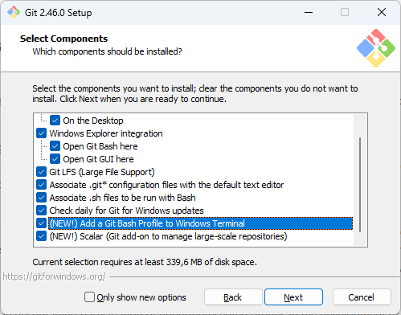
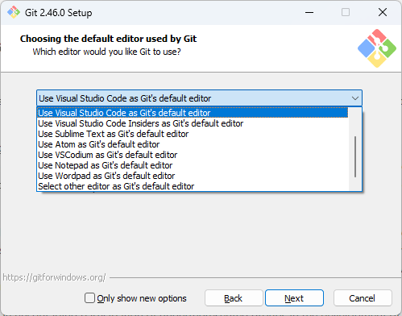
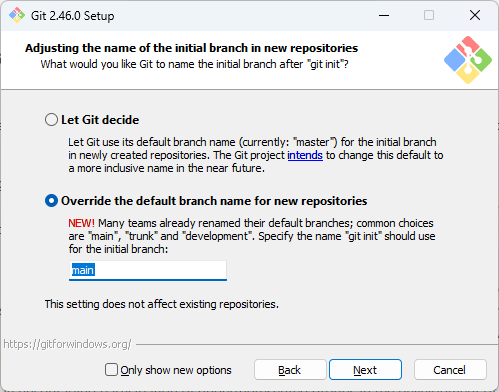
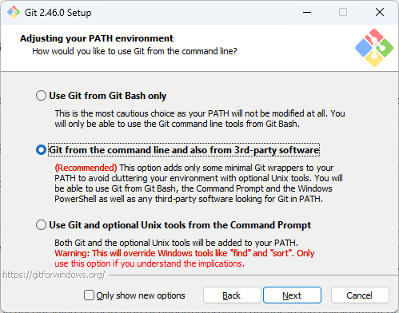
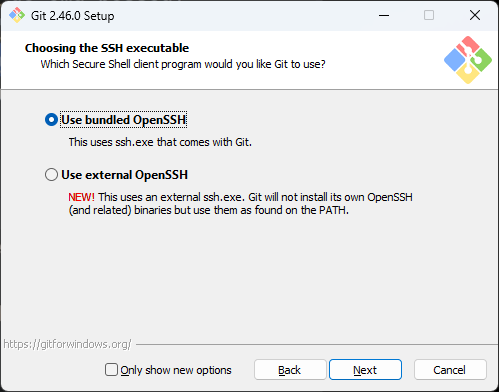
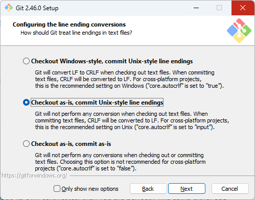
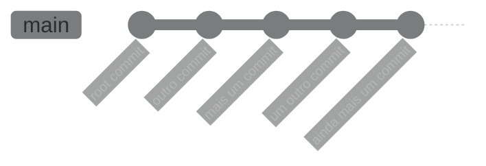

# Aula 04 - Sistema de Controle de Versionamento de Código - Git
Trabalhar com código requer organização, e muito do que aprendemos sobre como organizamos o nosso código se dá com um trabalho iterativo e incremental, ou seja, o código está em constante mudança. Parte da nossa rotina no trabalho com código é de fazer, desfazer e refazer partes dele ao longo do desenvolvimento de uma tarefa, à medida que testamos e percebemos oportunidades de melhoria, ou até mesmo, problemas que não foram antecipados e que requerem mudanças na forma como havíamos elaborado a solução anteriormente.

Para ter algum controle sobre como estas alterações acontecem, e que possamos visualizá-las em um contexto histórico que torne essa organização possível, usamos um sistema de controle de versionamento de código. Existem diversas ferramentas para este fim disponíveis no mercado, mas uma delas se tornou um padrão de uso entre profissionais de TI nas últimas décadas: o Git.

O Git é um Sistema de Controle de Versionamento de Código (_SVC_), criado pelo Linus Torvalds enquanto ele desenvolvia o Kernel do Linux, disponível como software livre de código aberto sob a licença GPL, compatível com várias plataformas (Linux, MacOS e Windows). Ele é utilizado pela vasta maioria dos profissionais de tecnologia atualmente, tanto para projetos de Código Aberto quanto em organizações privadas.

Ele funciona através da criação de um repositório de código em um diretório no sistema de arquivos para acompanhar as mudanças que este código sofre ao longo do tempo. Neste repositório você é capaz de criar marcações do estado dos arquivos, e a partir destas marcações você tem a possibilidade de visualizar e navegar pelo histórico de como estes arquivos foram alterados, restaurar o estado em que eles se encontravam em um determinado momento no passado e reescrever a história deles a partir de uma marcação específica, além de diversas capacidades que veremos a seguir.

Nesta aula vamos explorar o uso de Git, tanto para organização pessoal, quanto para contribuição em projetos colaborativos.

## 4.1 - Instalando o Git
Para instalar o Git, basta acessar o [site oficial](https://git-scm.org), fazer o download para a plataforma do seu dispositivo e seguir as instruções de instalação.

- Linux

    A forma mais fácil de instalar Git no linux é através gerenciadores de pacotes. Usuários de Debian/Ubuntu, por exemplo, podem usar o `apt` para isto:

    ```bash
    sudo apt update
    sudo add-apt-repository ppa:git-core/ppa
    sudo apt install git
    ```

    Ele também está disponível para outros gerenciadores de pacote. Há uma [lista de gerenciadores suportados](https://git-scm.com/download/linux) no site oficial, ou você pode baixar o [tarball com o código fonte](https://mirrors.edge.kernel.org/pub/software/scm/git/) e seguir as instruções no arquivo `INSTALL`.

- macOS

    A forma mais fácil de instalar Git no macOS é instalando o Xcode Command Line Tools. A partir da versão 10.9, se você digitar qualquer comando git no Terminal pela primeira vez, você será perguntado se quier instalá-lo. Mas também é possível instalá-lo via _Homebrew_:

    ```bash
    brew install git
    ```

    Para consultar sobre outras formas de instalá-lo no macOS, acesse a [página com instruçoes detalhadas](https://git-scm.com/download/mac).

- Windows

    Existe uma [página com os downloads para Windows](https://git-scm.com/download/win). Como de praxe, o processo de instalação é assistido por algumas etapas exibidas pelo instalador. Durante estas etapas, descrevemos aqui alguns ajustes importantes que precisam ser feitos durante o processo:
    - Na etapa _**Select Components**_, você pode achar interessante se certificar de que a opção "_Add a Git Bash Profile to Windows Terminal_" está marcada.
    
    
    - Na etapa _**Choosing the default editor used by Git**_, você pode escolher o Visual Studio Code.
    

    - Na etapa _**Adjusting the name of the initial branch in new repositories**_, é de bom tom marcar a opção "_Override the default branch name for new repositories_" e preencher o campo de texto com `main`. Isto se dá por que o nome da branch padrão na instalação do git é visto como uma palavra que pode ser ofensiva para grupos minoritários, e `main` tem sido a alternativa inclusiva usada pela comunidade.
    

        - Importante dizer que os próprios mantenedores do Git [pretendem mudar isto](https://sfconservancy.org/news/2020/jun/23/gitbranchname/) em algum momento no futuro. Mas enquanto a discussão de como isto será implementado definitivamente continua em progresso, eles já dispoinibilizaram a opção para fazer este ajuste manualmente.

    - Na etapa _**Adjusting your PATH environment**_ é recomendável selecionar ao opção "_Git from the command line and also from 3rd-party-software_", que faz com que o Git possa ser usado tanto através do _Git Bash_, quanto também a partir dos Shells do Windows, colocando o CLI do Git como parte do PATH nas variáveis de ambiente do Windows.
    

    - Na etapa _**Choosing the SSH executable**_ é recomendável manter a primeira opção selecionada, "_Use bundled OpenSSH_". Isso te poupa de ter que usar uma outra ferramenta de _SSH_ (falaremos mais de SSH durante o curso).
    

    - Na etapa _**Choosing HTTPS transport backend**_, é recomendável manter a primeira opção selecionada, "_Use the OpenSSL library_". Você só vai precisar escolher a outra opção ("_Use the native Windows Secure Channel Library_") se você estiver trabalhando em uma empresa ou em uma organização que gerencie seus prórios certificados.

    - Na etapa _**Configuring the line ending conversions**_, selecione "_Checkout as-is, commit Unix-style line endings_. Esta opção tem a ver com como o git irá lidar com a compatibilidade do formato da quebra-de-linha. Por padrão, o git usa o estilo do Unix como símbolo para quebra de linhas, o _Line Feed_ (`LF`). Mas o Windows trabalha de forma diferente: _Carriage Return_ e _Line Feed_ (`CRLF`). Nós falamos um pouco sobre isso na [Aula sobre vscode](./03-text-editors.md).
    

    As demais opções podem ser mantidas com o valor padrão.

    Após a instalação, abra um Shell do Windows no terminal e digite o seguinte comando:

    ```cmd
    git --version
    ```

    Se o git estiver devidamente instalado, uma mensagem comunicando a versão do git será exibida. Se uma mensagem de erro for exibida no lugar, você precisa rever o processo.

!!! Importante

    Se você usa Windows, mas está acompanhando o curso pelo _WSL_, você precisa efetuar a instalação do Git no WSL, seguindo os passos de instalação no Linux.

- Configurando a instalação do Git
    
    Agora que temos o git instalado, precisamos fazer algumas configurações iniciais antes de começarmos a usá-lo. A primeira é configurar os seus dados, que serão usados pra te identificar quando você começar a usá-lo para acompanhar as alterações que você faz nos seus projetos.

    Para isto usamos o comando `git config`, e parametrizamos as configurações `user.name` e `user.email`. Mas faremos isso como configuração global, usando a flag `--global`. O Git permite você ter ajustes globais que funcionarão para todos os repositórios por padrão, embora você também possa alterar as alterações específicas em cada repositório. Por exemplo, em repositórios de projetos para organizações específicas você pode preferir configurar seu e-mail naquela organização.

    ```bash
    git config --global user.name "Tio Dani" # Configura a forma como você quer ser identificado
    git config --global user.email "mail@tiodani.com" # Configura o seu e-mail
    ```

Tudo pronto. Agora que temos o git devidamente instalado e configurado, podemos finalmente começar a brincar com ele. É o que faremos a seguir.

## 4.2 - Iniciando um Repositório
Vamos agora entender como começamos a trabalhar com Git. O primeiro conceito que precisamos aprender sobre Git é o Repositório (informalmente chamado de _repo_). Sempre que você quiser trabalhar com o Git, você vai precisar criar um repositório. Um repositório é, de certa forma, um repositório no seu sistema de arquivos. Isto é conveniente, já que normalmente nós colocamos usamos diretórios como forma de organizar nossos projetos, então é natural que pensemos que, toda vez que criamos um diretório para trabalhar em um projeto, este mesmo diretório é um candidato em potencial para se tornar o repositório Git daquele projeto.

Se você já tem um projeto em andamento ou se vai começar um do zero, não importa, para criar um repo você só precisa entrar na pasta e iniciar o repositório:

```bash
mkdir novo_projeto && cd novo_projeto
git init
```

Uma mensagem será exibida dizendo que um repositório iniciado no diretório `.git` dentro do diretório do projeto. Como vimos na [aula de shell](./01-shell.md), diretórios e arquivos cujo nome começam com `.`, não são exibidos por padrão quando listamos o conteúdo do diretório. Para visualizar o diretório criado, podemos usar o `ls --all` (ou `ls -a`).

Exceto pela presença deste subdiretório, a criação repo parece não ter tido efeito nenhum no diretório do projeto em si. E é assim mesmo que um repositório funciona. Ele não interfere na forma como você interage com seus arquivos e subdiretórios de projeto. O único indício real de que estamos em um repositório git é a presença do subdiretório `.git`.

Não é recomendável que você altere manualmente o conteúdo de qualquer um dos artefatos dentro do diretório `.git`. Este subdiretório deve ser usado somente pelo próprio git. O conteúdo deste subdiretório é o banco de dados que o git irá usar pra fazer o acompanhamento das mudanças que você faz no seu projeto. Qualquer modificação feita manualente nestes dados pode comprometer a confiabilidade da ferramenta.

Mais adiante falaremos sobre como esse banco de dados funciona, mas por hora vamos compreender como trabalhamos com o repositório que temos em mãos.

### 4.2.1 - Primeiras Interações com o Repositório.
A forma mais básica de interação com um repositório é através do comando `git status`, que nos trás informações de qual a sua situação atual. Como acabamos de criá-lo, o comando nos mostrará as seguintes informações:

```
On branch main

No commits yet

nothing to commit (create/copy files and use "git add" to track)
```

Basicamente o que ele diz é:
- Em que branch estamos: `main` (falaremos sobre branches mais adiante)
- Não existem commits ainda (falaremos sobre commits a seguir)
- Não há nada pronto para criar um commit
    - Crie ou copie arquivos e use `git add` para acompanhar

!!! Importante

    Se você tiver criado um repositório em um diretório que já possuia arquivos, a mensagem exibida será diferente por este motivo, mencionando de que existem arquivos ainda não acompanhados pelo git.

Vamos criar um arquivo para ver como o git reage com as modificações que fazemos no nosso repositório.

```bash
touch teste.txt
git status
```

Note como a mensagem exibida está diferente agora. Ela nos avisa de que existe um arquivo no diretório que não está sendo acompanhado pelo git (_Untracked files_). Se removermos este arquivo, e, mais uma vez, consultarmos o status do repositório, observamos que a mensagem exibida é identica a que tivemos anteriormente.

```bash
rm teste.txt
git status
```

O git consegue reconhecer quando existem diferenças entre o conhecimento que ele tem do repositório e a situação atual do diretório, e se baseia na comparação entre ambos para te informar a respeito do status. Ou seja, quando você desfaz as alterações, o git entende que repositório está em sincronia com a situação do diretório.

### 4.2.2 - Adicionando Arquivos ao Repositório
Vamos criar um arquivo para incluirmos no repositório. Em repositórios git, é muito comum criar-se um arquivo descritivo chamado README.md. A extensão `md` indica que o arquivo está no formato _Markdown_, que é um arquivo de texto redigido usando marcações simples para formatar o seu conteúdo, como criar títulos, subtítulos, links, listas formatadas, etc.

```bash
touch README.md
git status
```

Agora, vamos entender melhor o que o git está tentando nos dizer quando exibe esta mensagem sobre arquivos não acompanhados.

```
On branch main

No commits yet

Untracked files:
  (use "git add <file>..." to include in what will be committed)
        README.md

nothing added to commit but untracked files present (use "git add" to track)
```

A mensagem diz: use "git add <arquivo>..." para incluir no commit. Para incluir arquivos ao nosso repositório, precisamos entender como o git gerencia o estado do repositório primeiro.

Nós começamos a criar alterações no repositório através de uma operação chamada _commit_. Commit, em português, significa "comprometer" em uma tradução literal, mas o que queremos dizer é que estamos efetuando um _registro_ das alterações que estamos fazendo.

Na prática, porém, um commit é análogo a uma "fotografia" da situação do repositório em um determinado momento. O processo de criar um commit é, seguindo a analogia, o processo de criar uma composição da fotografia que queremos registrar.

Nós montamos esta composição através de uma etapa intermediária chamada "staging". À medida que entendemos que o diretórios está pronto pra ter seu estado registrado em um commit, nós podemos montar este commit, colocando as alterações que fizemos nesta estapa intermediária, através do comando `git add`.

```bash
git add README.md
git status
```

Observe a saída do comando `git status` agora:
```
On branch main

No commits yet

Changes to be committed:
  (use "git rm --cached <file>..." to unstage)
        new file:   README.md
```

Neste momento, o git nos informa que o arquivo README.md (que está indicado como um novo arquivo), está entre as mudanças que estão prontas para serem registradas em um commit (_Changes to be committed_). Nesta situação, o git entende que o arquivo README.md faz parte do repositório e, portanto, precisa ser acompanhado (_tracked_) a partir de agora.

A mensagem também nos mostra como podemos, se quisermos, remover o README.md do _staging_. Isto faria com que o arquivo voltasse à situação anterior, ou seja, voltasse a ser um arquivo desconhecido (_untracked_) para o repositório.

```bash
git rm --cached README.md
git status
```

Isto, como descrito na mensagem impressa, colocou o arquivo README.md na mesma situação que ele se encontrava anteriormente. O que faz certo sentido, visto que o arquivo ainda se encontra vazio. Vamos colocar algum conteúdo nele para criarmos nosso primeiro commit.

```markdown
# Novo Projeto
Este repositório foi criado para explorar a ferramenta git sendo usada num projeto.
```

Assumindo que este seja o estado ideal do arquivo README.md para termos um primeiro registro no histórico do nosso repositório, vamos finalmente criar nosso primeiro commit. Para isto, precisaremos novamente adicioná-lo à etapa de _staging_.

```bash
git add README.md
```

Na analogia da fotografia, a etapa de _staging_ se compara à forma como posicionamos as coisas antes de fotofrafá-las. A área de staging é a forma como podemos "montar" o commit que desejamos criar. Isso nos dá a flexibilidade de manter outras alterações pendentes fora do commit que estamos montando.

O próximo passo é, finalmente, criarmos o commit, registrando a criação do arquivo README.md no nosso repositório.

```bash
git commit
```

No momento em que executamos este comando, um editor de textos será aberto (de acordo com a configuração que fizemos, será o vscode) com um arquivo chamado *COMMIT_EDITMSG* para digitarmos uma descrição do commit que estamos criando. O comando no shell não será finalizado até que salvemos uma mensagem e fechemos o editor do arquivo.

É uma boa prática fazermos uma mensagem descritiva sobre as alterações feitas no repositório registradas em um commit. E isto, normalmente, é um acordo feito entre as pessoas que contribuem com o projeto.

Existem times que adotam a um modelo de mensagem, contendo uma estrutura acordada sobre como a descrição deve ser feita. Isto é muito frequente em projetos de código aberto mantidos por uma comunidade, a ponto de ser comum haver, no repositório, um arquivo contendo as diretrizes que os contribuidores do projeto precisam seguir para criar novos commits.

Além disso, existem também convenções criadas ao redor de certas práticas nas mensagens dos commits, como [_Conventional Commits_](https://www.conventionalcommits.org/), criado para ter automações que serão executadas baseadas nas mensagens dos commits, e [GitMoji](https://gitmoji.dev/), uma convenção de Emojis que podem ser usados para serem associados com tipos específicos de alterações registradas no commit, que ajudam a ter uma comunicação visual mais eficiente a respeito do mesmo.

Para os fins deste tutorial, podemos usar uma mensagem simples, como:

```
Criação do arquivo README.md, descrevendo projeto.
```

Salve e feche o editor deste arquivo, para ver o comando ser concluído no shell. Uma mensagem confirmando o commit é exibida, mostrando a descrição que demos ao commit e um relatório resumido do seu conteúdo.

Note que ele exibe algumas informações interessantes:
- `[main (root-commit) e1c7050]`: 
    - `main`: indica que este commit foi feito na branch `main`
    - `root-commit`: indica que este é o commit raiz do repositório.
    - `e1c7050`: Esta sequência de caracteres é uma versão curta do identificador do commit, como veremos a seguir.
- `1 file changed, 0 insertions(+), 0 deletions(-)`: Este é um relatório resumido das alterações que este commit fez ao repositório
    - `1 file changed`: O primeiro valor deste relatório diz respeito a alterações feitas envolvendo um arquivo como um todo (como a criação de um arquivo, ou a remoção dele). No caso, ele contou a criação do arquivo README.md
    - `0 insertions(+), 0 deletions(-)`: Aqui o relatório se refere a inserções e deleções dentro de arquivos, e nós veremos como isso funciona em breve.

Se executarmos o comando `git status` novamente, teremos uma mensagem diferente.

```bash
git status
```
```
On branch main
nothing to commit, working tree clean
```

A mensagem `No commits yet` não é mais exibida, pois agora existe um commit no nosso repositório. Além disso, ele também diz que não há nenhuma mudança atual no diretório. O arquivo README.md está devidamente registrado.

Uma forma de conferirmos o commit que acabamos de criar é através do comando `git log`. Ele produz uma lista do histórico de commits em nosso repositório, que por ora, possui apenas um commit, o que acabamos de fazer.

```bash
git log
```
```
commit e1c705034ed7eb64cf9305f360f36fe0ba94a0f6 (HEAD -> main)
Author: Daniel Moreira Yokoyama <792153+moreirayokoyama@users.noreply.github.com>
Date:   Sat Aug 10 10:58:38 2024 -0300
    Criação do arquivo README.md, descrevendo projeto.
```

Aqui podemos ver algumas informações já conhecidas a respeito do commit que acabamos de fazer, além de algumas outras informações novas. O identificador do commit, que vimos na forma curta logo após o commit ter sido feito, agora aparece na sua forma completa. Temos também os metadados conhecidos para o commit: o autor (com o seu nome e mail conforme configurmos anteriormente nesta aula), a data e hora em que ele foi criado e a descrição dada a ele.

Mas existe também esta informação nova: `(HEAD -> main)`. Você já sabe que `main` é o nome da branch atual (embora, talvez, você já esteja se perguntando sobre o que é uma branch há algum tempo), mas o que é `HEAD`?

Vamos conversar um pouco sobre como o git faz o acompanhamento (_tracking_) do estado do repositório, aprendendo um pouco sobre seu modelo de dados e seu funcionamento.

## 4.3 - Como o git acompanha o estado do repositório
Então, o que é um commit?

No git, nossos commits são registros de mudanças no nosso repositório ao longo do tempo, contendo os metadados que apresentamos recentemente e, junto com eles, uma representação do estado do diretório raiz do projeto, representado por uma estrutura chamada "Árvore" (_Tree_). Uma árvore é composta por elementos que podem ser _blobs_ (_Binary Large OBject_, ou Grande Objeto Binário), que representam os arquivos e outras árvores (representando os subdiretórios), contendo outros blobs e árvores, de acordo com a estrutura de diretórios do projeto.

Desta forma, o commit é capaz de, a qualquer momento, reconstruir o estado do diretório como estava quando ele foi criado.

Vamos testar um exemplo disto. Apague o arquivo `README.md` que acabamos de criar e incluir no commit.

```bash
rm README.md
git status
```

Para variar, o `git status` nos informa sobre coisas que aconteceram no diretório, e que ainda não foram registradas no repositório. Supondo que você se dê conta de que apagou o arquivo por acidente, o git permite que você desfaça este acidente.

```bash
git restore README.md
ls -lh
```

Note que o arquivo voltou a estar presente no diretório, como se você nunca o tivesse excluído. Mas vamos supor um cenário ainda mais problemático: você excluiu o arquivo e, confiante de que estava tudo certo, criou um commit para registrar a exclusão dele no repositório.

```bash
git rm README.md
git status
```

Desta vez removemos o arquivo com o comando `git rm`, que não apenas o remove disco como ainda adiciona a alteração na área de _staging_. O comando `git status` também orienta como você pode desfazer esta operação sem efetuar o commit, usando o comando `git restore --staged README.md`. Fique à vontade para testar o comando se quiser, mas não se esqueça de voltar a fazer a remoção novamente antes de prosseguir.

Então, vamos criar um commit registrando a remoção. Desta vez, vamos digitar a mensagem do commit pela própria linha de comando através da opção `-m`:

```bash
git commit -m "Removendo o arquivo README.md"
git log
```

E agora vamos analisar o log:
```
commit bf417792cc6fd15b428a9ce466c7bb2e8a812942 (HEAD -> main)
Author: Daniel Moreira Yokoyama <792153+moreirayokoyama@users.noreply.github.com>
Date:   Sat Aug 10 23:43:08 2024 -0300

    Removendo o README.md

commit e1c705034ed7eb64cf9305f360f36fe0ba94a0f6
Author: Daniel Moreira Yokoyama <792153+moreirayokoyama@users.noreply.github.com>
Date:   Sat Aug 10 10:58:38 2024 -0300

    Criação do arquivo README.md, descrevendo projeto.
```

Vemos agora dois commits. O primeiro que fizemos anteriormente aparece mais abaixo, mas no topo da lista está o commit que acabamos de fazer. O histórico exibido pelo `git log` é exibido na ordem decrescente, com os commits mais recentes no topo. Note que, neste momento, a marcação `(HEAD -> main)` se encontra no commit mais recente.

_HEAD_ (cabeça em inglês), é um termo usado para indicar com qual commit do repositório o seu diretório está sendo comparado como referência para acompanhar as mudanças no momento. Na maior parte do tempo você vai querer que o HEAD aponte para o commit mais recente. Mas haverão situações em que você pode querer que este não seja o caso, como é o exemplo que estamos tentando simular agora.

Da mesma forma, a marcação da `main` também indica para em qual estado a branch main se encontra. Isto vai ficar um pouco mais claro quando estivermos trabalhando com branches. Por ora, vamos apenas seguir tentando entender como o histórico funciona.

Vamos olhar para ambos os commits que temos em mãos e entender como podemos obter mais informações deles a partir do git. O comando `git log` pode nos informar os commits em diversos níveis de detalhes. O nível mais detalhado que temos é o `raw`, que mostra todos os metadados de um commit. Para isto, podemos rodar o comando novamente com a seguinte opção:

```bash
git log --pretty=raw
```

E vamos observar como isto altera a saída do log:
```
commit bf417792cc6fd15b428a9ce466c7bb2e8a812942
tree 4b825dc642cb6eb9a060e54bf8d69288fbee4904
parent e1c705034ed7eb64cf9305f360f36fe0ba94a0f6
author Daniel Moreira Yokoyama <792153+moreirayokoyama@users.noreply.github.com> 1723344188 -0300
committer Daniel Moreira Yokoyama <792153+moreirayokoyama@users.noreply.github.com> 1723344188 -0300

    Removendo o README.md

commit e1c705034ed7eb64cf9305f360f36fe0ba94a0f6
tree f93e3a1a1525fb5b91020da86e44810c87a2d7bc
author Daniel Moreira Yokoyama <792153+moreirayokoyama@users.noreply.github.com> 1723298318 -0300
committer Daniel Moreira Yokoyama <792153+moreirayokoyama@users.noreply.github.com> 1723298318 -0300

    Criação do arquivo README.md, descrevendo projeto.
```

Não é tão diferente do que havíamos visto anteriormente. Mas existem algumas informações novas: `tree`, `parent` e `committer`.

O campo `tree` indica o id da versão da árvore contida no commit. O campo `parent` indica o commit "pai" (o gênero aqui é uma mera questão de tradução) do commit que estamos analisando. Note que o primeiro commit que fizemos não possui um _parent_. Isto por que ele foi o primeiro commit que fizemos, considerado _root-commit_ (commit raiz). Mas o segundo commit registra as mudanças que fizemos a partir do primeiro, ou seja, usando o primeiro como um referencial para onde as mudanças que o novo commit foram aplicadas. Podemos conferir que o valor do campo _parent_ no segundo commit é idêntico ao id do primeiro commit.

Isso nos leva a uma outra informação sobre como o git organiza os dados do repositório. Os commits apontam para árvores, mas eles também apontam para um commit "pai", que é basicamente a "foto" do estado anterior à mudança que este commit está registrando. Os commits formam uma estrutura de dados chamada Grafo Acíclico Dirigido (do inglês _Directed Acyclic Graph_, ou _DAG_). A princípio, por hora, você pode imaginar este grafo apenas como uma linha do tempo marcando os commits:



O campo `comitter`, por outro lado, é algo um pouco mais complexo, que iremos falar melhor quando conversarmos sobre o uso de git em times de desenvolvimento. Na maior parte dos casos _comitter_ terá o mesmo valor do campo _author_. Ao longo deste curso este vai ser sempre o caso. O valor numérico que vemos abaixo de autor e _commiter_ é a informação de data/hora no [formato Unix](https://pt.wikipedia.org/wiki/Era_Unix): um valor numérico representando a data/hora em quantos segundos se passaram desde o dia 1/1/1970 às 0:00 no meridiano de Greenwich, e a informação -0300 indica em que fuso-horário o commit foi feito, fazendo a adaptação para a localização da data/hora.

Uma outra forma de obtermos mais detalhes a respeito de um commit, é através do comando `git show`. Para isto, precisamos passar como argumento o id do commit que pretendemos pesquisar.

```bash
git show bf417792cc6fd15b428a9ce466c7bb2e8a812942
```

Que nos trás estas informações:
```
commit bf417792cc6fd15b428a9ce466c7bb2e8a812942 (HEAD -> main)
Author: Daniel Moreira Yokoyama <792153+moreirayokoyama@users.noreply.github.com>
Date:   Sat Aug 10 23:43:08 2024 -0300

    Removendo o README.md

diff --git a/README.md b/README.md
deleted file mode 100644
index e69de29..0000000
```

Aqui já tem algumas informações úteis, mas antes de analisá-las, me deixe dizer que o comando show também suporta formatação raw:

```bash
git show bf417792cc6fd15b428a9ce466c7bb2e8a812942 --pretty=raw
```

Que trás algo parecido com isto:
```
commit bf417792cc6fd15b428a9ce466c7bb2e8a812942
tree 4b825dc642cb6eb9a060e54bf8d69288fbee4904
parent e1c705034ed7eb64cf9305f360f36fe0ba94a0f6
author Daniel Moreira Yokoyama <792153+moreirayokoyama@users.noreply.github.com> 1723344188 -0300
committer Daniel Moreira Yokoyama <792153+moreirayokoyama@users.noreply.github.com> 1723344188 -0300

    Removendo o README.md

diff --git a/README.md b/README.md
deleted file mode 100644
index e69de29..0000000
```

Podemos ver já uma série de informações conhecidas: id do commit, autor e _commiter_ com as informações de data/hora no formato Unix e a descrição do commit. A principal novidade que podemos observar agora está logo abaixo: uma descrição de qual a diferença aplicada neste commit:

```
diff --git a/README.md b/README.md
deleted file mode 100644
index e69de29..0000000
```

A linha `diff --git a/README.md b/README.md` indica que o trecho a seguir fala de diferenças envolvendo o arquivo README.md, e sinaliza que a versão anterior será indicada por `a/README.md` e a nova versão será indicada por `b/README.md`. `a` e `b` são apenas uma convenção para tratar as versões do arquivo, sendo `a` para a versão antes das alteração, e `b` para a versão com as modificações aplicadas. Isto ficará mais útil quando estivermos discutindo modificações nos arquivos.

A linha `deleted file mode 100644`, indica que o arquivo em questão foi deletado. O modo 100644 é só uma forma do git de dizer que era um arquivo (100), que estava no modo de acesso 644 (equivalente a `rw-r--r--` em octetos).

Por fim, temos o `index e69de29..0000000` que é basicamente o índice que o blob tinha antes da operação (`e69de29`), e que foi movido para o índice `0000000`, que é vazio, pois o arquivo foi removido.

Vamos rodar o mesmo comando sobre o primeiro commit para fazer uma comparação com quando o arquivo foi criado:

```bash
git show e1c705034ed7eb64cf9305f360f36fe0ba94a0f6 --pretty=raw
```

E ele nos dá os dados:
```
commit e1c705034ed7eb64cf9305f360f36fe0ba94a0f6
tree f93e3a1a1525fb5b91020da86e44810c87a2d7bc
author Daniel Moreira Yokoyama <792153+moreirayokoyama@users.noreply.github.com> 1723298318 -0300
committer Daniel Moreira Yokoyama <792153+moreirayokoyama@users.noreply.github.com> 1723298318 -0300

    Criação do arquivo README.md, descrevendo projeto.

diff --git a/README.md b/README.md
new file mode 100644
index 0000000..e69de29
```

Observe as duas últimas linhas:
- `new file mode 100644`: Na ocasião, ele estava criando um arquivo novo no repositório
- `index 0000000..e69de29`: Ele estava movendo o índice do blob vazio (`0000000`) para o índice do arquivo (`e69de29`)

## 4.4 - Usando o git para viajar no tempo
Voltemos ao cenário que estamos tentando simular: O arquivo README.md foi excluído em um commit, e descobrimos que isto foi um erro. Ele não deveria ter sido removido. Neste exato momento, o `git log` nos diz que o _HEAD_ está apontando para o commit que fez a alteração. Mover o _HEAD_ é a operação que nos permite caminhar pela linha do tempo e desfazer a história que o repositório conhece. Fazemos isso usando o comando `git reset`, passando como argumento o id do commit para o qual queremos voltar.

```bash
git reset e1c705034ed7eb64cf9305f360f36fe0ba94a0f6
git log
```

Observe o que o git log nos diz agora. O commit que removia o arquivo README.md desapareceu da história. E agora o _HEAD_ (junto com a branch  `main`) estão apontando para o commit inicial.

Mas se executarmos o comando `ls`, não vemos lá o arquivo README.md. O diretório continua vazio. Mas se você usar o comando `git status` vai reparar que existem mudanças prontas para serem registradas em um commit. E a mudança é justamente a exclusão do arquivo.

É como se o comando `git reset` tivesse nos enviado devolta exatamente para o momento anterior ao último commit que fizemos, quando a alteração já estava na área de staging. Tudo o que precisamos fazer agora, é cancelar o staging, e mudamos a história:

```bash
git restore README.md
```

E lá está o arquivo de volta, como se nunca tivesse sido excluído.

Mas e o commit que tínhamos feito? O que aconteceu com ele?

Ele ainda existe, e ainda está no banco de dados do repositório. E você poderia, se quisesse, usar novamente o comando `git reset` para fazer o _HEAD_ voltar a apontar para ele. Ou você poderia simplesmente ignorá-lo e voltar a trabalhar no seu diretório, reconstruindo a história a partir do ponto onde está agora.

## 4.5 - Fazendo modificações mais complexas em arquivos e subdiretórios
Vamos começar a fazer algumas coisas um pouco mais complexas, como costuma ser o caso em projetos. Para isto, vamos criar alguns arquivos com resultados de comandos para simular um projeto em andamento. Na vida real, como você deve imaginar, as alterações no dia-a-dia de um projeto não são tão triviais, e iremos discutir isso um pouco olhando para projetos reais em breve. Então, tenha em mente que este exercício é só para nos ajudar a compreender cenários mais complexos.

Vamos criar um subdiretório chamado `estudos`, e nele um arquivo chamado `sugestoes-de-estudo.md`, e inserir alguns assuntos que temos interesse em estudar.
```Markdown
# Sugestões de Estudo

- [Python Funcional (Dunossauro)](https://dunossauro.github.io/python-funcional/)
- [FastAPI do Zero (Dunossauro)](https://fastapidozero.dunossauro.com/)
- [Curso básico de Bash (Blau Araújo)](https://www.youtube.com/watch?v=ZM--I3NJ2jY&list=PLXoSGejyuQGpf4X-NdGjvSlEFZhn2f2H7)
- [Além do Bash (Blau Araújo)](https://www.youtube.com/watch?v=_W51nj5JTwk&list=PLXoSGejyuQGpen1lAlhngkpuldmot8DV0)
```

Salve o arquivo e vamos registrar um commit no repositório:
```bash
git add estudos/sugestoes-de-estudo.md
git commit -m "Criando o arquivo para sugestões de estudo"
```

Agora, vamos criar um outro subdiretório chamado `projetos`, e igualmente um arquivo chamado `sugestoes-de-projeto.md`, e inserir alguns projetos interessantes que podemos criar para treinar nossas habilidades.

```Markdown
# Sugestões de Projeto

- Blog Pessoal
    - MkDocs
    - Blog Plugin
- Aplicação de Organização Financeira
```

Da mesma forma, salve o arquivo e faça um commit.

Vamos fazer uma alteração no arquivo README.md, para que ele tenha um link para os arquivos que acabamos de criar:
```Markdown

- [Sugestões de estudo](./estudos/sugestoes-de-estudo.md)
- [Sugestões de projeto](./projetos/sugestoes-de-projeto.md)
```

E faça o commit da alteração.   


Não são apenas commits que o `git show` pode dar detalhes a respeito quando o usamos. De fato, nós podemos obter detalhes de quais quer artefatos armazenados pelo banco de dados do repositório git. Por exemplo, os commits nos informam o id da Árvore para o qual apontam. Se usarmos o comando `git show` para dar detalhes sobre a árvore do nosso primeiro commit, é isso que ele nos mostra:

```bash
git show f93e3a1a1525fb5b91020da86e44810c87a2d7bc
```
```
tree f93e3a1a1525fb5b91020da86e44810c87a2d7bc

README.md
```

Ele mostra o conteúdo da árvore (no caso, apenas o blob do arquivo README.md). Outra forma útil de listar o conteúdo de uma árvore, é através do comando `git ls-tree`.

```bash
git ls-tree f93e3a1a1525fb5b91020da86e44810c87a2d7bc
```
```
100644 blob e69de29bb2d1d6434b8b29ae775ad8c2e48c5391    README.md
```

Observe que estamos consultando o repositório baseado num blob registrado por um commit anterior, e que foi apagado num outro commit, mas os dados continuam disponíveis.


Com o git e um histórico de commits em mãos, nós podemos "viajar no tempo", e resgatar momentos da história do nosso repositório.


- git diff
- git checkout
- git reset
- git tag
## 4.6 - Trabalhando com Branches
- git branch
- git switch
- git checkout
## 4.7 - Merge
- git merge
- Conflitos
## 4.8 - Repositórios Remotos
- clone
- fetch
- pull
- push
## 4.9 - Serviços de Colaboração - CodeBerg
- fork
- Pull request
## 4.10 - Rebase
- git rebase

## 4.11 - Conclusão


