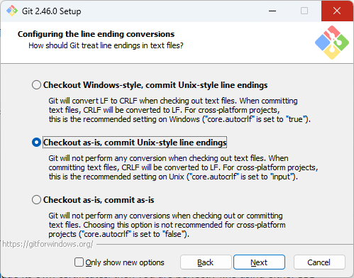

Para instalar o Git, basta acessar o [site oficial](https://git-scm.org), fazer o download para a plataforma do seu dispositivo e seguir as instruções de instalação.

- Linux

	A forma mais fácil de instalar Git no linux é através gerenciadores de pacotes. Usuários de Debian/Ubuntu, por exemplo, podem usar o `apt` para isto:

	```bash
	sudo apt update
	sudo add-apt-repository ppa:git-core/ppa
	sudo apt install git
	```

	Ele também está disponível para outros gerenciadores de pacote. Há uma [lista de gerenciadores suportados](https://git-scm.com/download/linux) no site oficial, ou você pode baixar o [tarball com o código fonte](https://mirrors.edge.kernel.org/pub/software/scm/git/) e seguir as instruções no arquivo `INSTALL`.

- macOS

	A forma mais fácil de instalar Git no macOS é instalando o Xcode Command Line Tools. A partir da versão 10.9, se você digitar qualquer comando git no Terminal pela primeira vez, você será perguntado se quier instalá-lo. Mas também é possível instalá-lo via _Homebrew_:

	```bash
	brew install git
	```

	Para consultar sobre outras formas de instalá-lo no macOS, acesse a [página com instruçoes detalhadas](https://git-scm.com/download/mac).

- Windows

	Existe uma [página com os downloads para Windows](https://git-scm.com/download/win). Como de praxe, o processo de instalação é assistido por algumas etapas exibidas pelo instalador. Durante estas etapas, descrevemos aqui alguns ajustes importantes que precisam ser feitos durante o processo:

	- Na etapa _**Select Components**_, você pode achar interessante se certificar de que a opção "_Add a Git Bash Profile to Windows Terminal_" está marcada.

	

	- Na etapa _**Choosing the default editor used by Git**_, você pode escolher o Visual Studio Code.

	

	- Na etapa _**Adjusting the name of the initial branch in new repositories**_, é de bom tom marcar a opção "_Override the default branch name for new repositories_" e preencher o campo de texto com `main`. Isto se dá por que o nome da branch padrão na instalação do git é visto como uma palavra que pode ser ofensiva para grupos minoritários, e `main` tem sido a alternativa inclusiva usada pela comunidade.

	

		- Importante dizer que os próprios mantenedores do Git [pretendem mudar isto](https://sfconservancy.org/news/2020/jun/23/gitbranchname/) em algum momento no futuro. Mas enquanto a discussão de como isto será implementado definitivamente continua em progresso, eles já dispoinibilizaram a opção para fazer este ajuste manualmente.

	- Na etapa _**Adjusting your PATH environment**_ é recomendável selecionar ao opção "_Git from the command line and also from 3rd-party-software_", que faz com que o Git possa ser usado tanto através do _Git Bash_, quanto também a partir dos Shells do Windows, colocando o CLI do Git como parte do PATH nas variáveis de ambiente do Windows.

	

	- Na etapa _**Choosing the SSH executable**_ é recomendável manter a primeira opção selecionada, "_Use bundled OpenSSH_". Isso te poupa de ter que usar uma outra ferramenta de _SSH_ (falaremos mais de SSH durante o curso).

	

	- Na etapa _**Choosing HTTPS transport backend**_, é recomendável manter a primeira opção selecionada, "_Use the OpenSSL library_". Você só vai precisar escolher a outra opção ("_Use the native Windows Secure Channel Library_") se você estiver trabalhando em uma empresa ou em uma organização que gerencie seus prórios certificados.

	- Na etapa _**Configuring the line ending conversions**_, selecione "_Checkout as-is, commit Unix-style line endings_. Esta opção tem a ver com como o git irá lidar com a compatibilidade do formato da quebra-de-linha. Por padrão, o git usa o estilo do Unix como símbolo para quebra de linhas, o _Line Feed_ (`LF`). Mas o Windows trabalha de forma diferente: _Carriage Return_ e _Line Feed_ (`CRLF`). Nós falamos um pouco sobre isso na [Aula sobre vscode](../03-text-editors/index.md).

	

	As demais opções podem ser mantidas com o valor padrão.

	Após a instalação, abra um Shell do Windows no terminal e digite o seguinte comando:

	```cmd
	git --version
	```

	Se o git estiver devidamente instalado, uma mensagem comunicando a versão do git será exibida. Se uma mensagem de erro for exibida no lugar, você precisa rever o processo.

!!! Importante

	Se você usa Windows, mas está acompanhando o curso pelo _WSL_, você precisa efetuar a instalação do Git no WSL, seguindo os passos de instalação no Linux.

- Configurando a instalação do Git

	Agora que temos o git instalado, precisamos fazer algumas configurações iniciais antes de começarmos a usá-lo. A primeira é configurar os seus dados, que serão usados pra te identificar quando você começar a usá-lo para acompanhar as alterações que você faz nos seus projetos.

	Para isto usamos o comando `git config`, e parametrizamos as configurações `user.name` e `user.email`. Mas faremos isso como configuração global, usando a flag `--global`. O Git permite você ter ajustes globais que funcionarão para todos os repositórios por padrão, embora você também possa alterar as alterações específicas em cada repositório. Por exemplo, em repositórios de projetos para organizações específicas você pode preferir configurar seu e-mail naquela organização.

	```bash
	git config --global user.name "Tio Dani" # Configura a forma como você quer ser identificado
	git config --global user.email "mail@tiodani.com" # Configura o seu e-mail
	```

Tudo pronto. Agora que temos o git devidamente instalado e configurado, podemos finalmente começar a brincar com ele. É o que faremos a seguir.
